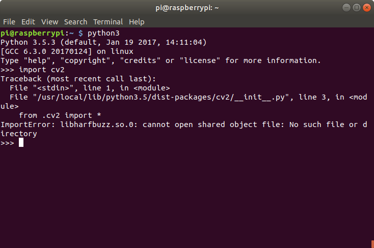
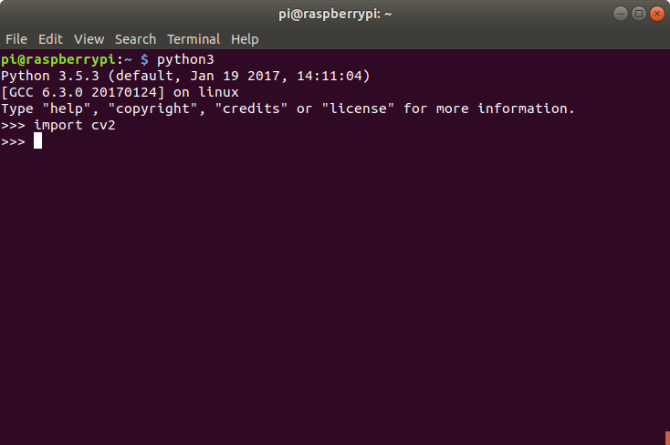

When you install a compiled Python wheel, whether it's from PyPI or piwheels, it will likely depend on some shared libraries, specifically certain <code>.so</code> files (shared object files) in order to be used.

If you've ever been in the situation where you've installed a library but importing it fails, it's a pretty unpleasant experience:

The next step for most people is to Google the error message. But that's a long and slow process that often doesn't lead to a successful import.

The best way to resolve this issue requires a couple of command line tools: <code>ldd</code> and <code>apt-file</code>.

First, navigate to the location of the package installation. This is usually <code>/usr/local/lib/python3.5/dist-packages/&lt;package&gt;/</code>. Note the package directory will be named after the import line, which may differ from the name of the package as you installed it. For example, you <code>pip install numpy</code> and <code>import numpy</code> but you <code>pip install opencv-python</code> and <code>import cv2</code>.

Run <code>ls</code> in that directory and look for an <code>.so</code> file:

<pre>pi@raspberrypi:/usr/local/lib/python3.5/dist-packages/cv2 $ ls
cv2.cpython-35m-arm-linux-gnueabihf.so data __init__.py __pycache__</pre>

Run <code>ldd</code> on that file:

<pre>ldd cv2.cpython-35m-arm-linux-gnueabihf.so</pre>

(tab completion is your friend)

You'll see a lot of <code>.so</code> files. Those are shared objects the Python library source code refers to. Some of them will be available on your system, and will show the location they can be found:

<pre>libpthread.so.0 =&gt; /lib/arm-linux-gnueabihf/libpthread.so.0 (0x74fdb000)</pre>

Others will show "not found". These are the ones you need to make available:

<pre>libhdf5_serial.so.100 =&gt; not found</pre>

You can use grep to filter out the found ones:

<pre>ldd cv2.cpython-35m-arm-linux-gnueabihf.so | grep "not found"</pre>

To find out which apt packages provide this <code>.so</code>, use <code>apt-file</code>. <code>apt-file</code> isn't installed by default, so install it with apt:

<pre>sudo apt install apt-file</pre>

You'll want to update <code>apt-file</code>'s cache:

<pre>sudo apt-file update</pre>

Then use <code>apt-file search</code> on the missing <code>.so</code> file:

<pre>apt-file search libhdf5_serial.so.100</pre>

This will show a list of apt packages (including some duplicates):

<pre>libhdf5-100: /usr/lib/arm-linux-gnueabihf/libhdf5_serial.so.100
libhdf5-100: /usr/lib/arm-linux-gnueabihf/libhdf5_serial.so.100.0.1</pre>

This indicates that the package <code>libhdf5</code> will provide the required <code>.so</code> file opencv refers to. So install it:

<pre>sudo apt install libhdf5-100</pre>

That's it! Just rinse and repeat. Once you've made all the missing shared object files available, you'll be able to import the module no problem:

Note that some shared objects can be provided by multiple packages. Sometimes it's obvious which is the lighter option, i.e. <code>libatlas3-base</code> rather than <code>libatlas-base-dev</code> (avoid <code>-dev</code> packages if possible), or <code>libpango-1.0-0</code> rather than the humongous <code>wolfram-engine</code>. You can see the file size with <code>apt-cache show</code>:

<pre>pi@raspberrypi:~ $ apt-file search libpango-1.0.so.0
libpango-1.0-0: /usr/lib/arm-linux-gnueabihf/libpango-1.0.so.0
libpango-1.0-0: /usr/lib/arm-linux-gnueabihf/libpango-1.0.so.0.4000.5
wolfram-engine: /opt/Wolfram/WolframEngine/11.3/SystemFiles/Libraries/Linux-ARM/libpango-1.0.so.0
pi@raspberrypi:~ $ apt show libpango-1.0 | grep Size

Installed-Size: 515 kB
Download-Size: 305 kB
pi@raspberrypi:~ $ apt show wolfram-engine | grep Size

Installed-Size: 829 MB
Download-Size: 306 MB</pre>

As you can see, the choice here is an easy one: 300 kB vs 300MB!

We're planning to add project pages to piwheels.org, which will feature library dependencies so you don't have to look them up manually. If you were looking for opencv requirements, see our blog post <strong><a href="https://blog.piwheels.org/new-opencv-builds/">New opencv builds</a></strong> which includes the lists of dependencies for the opencv packages.

