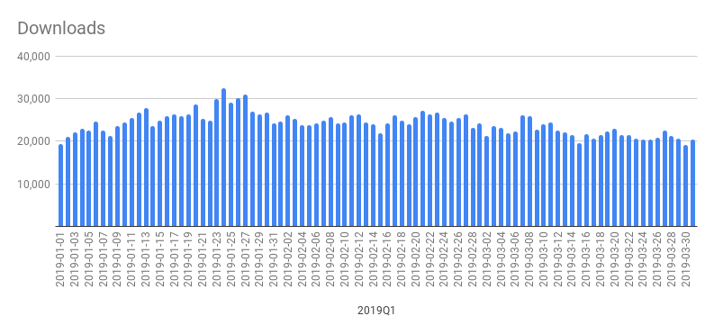
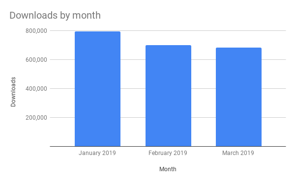
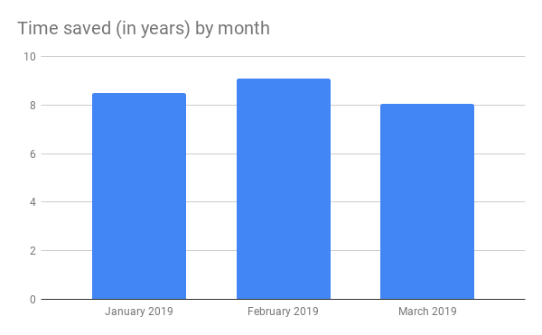
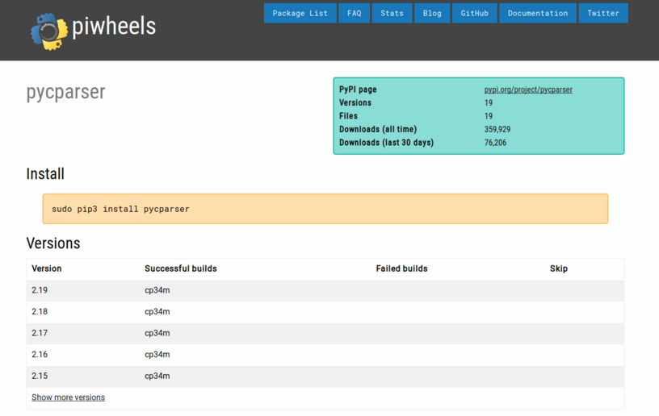
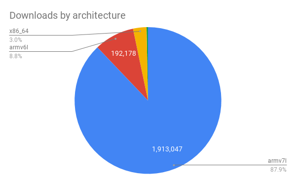
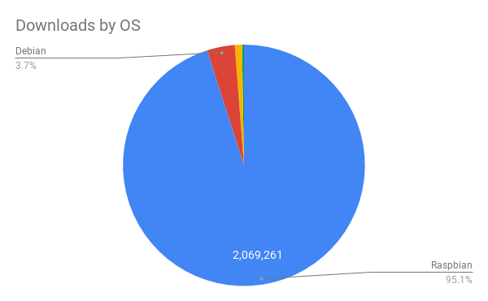
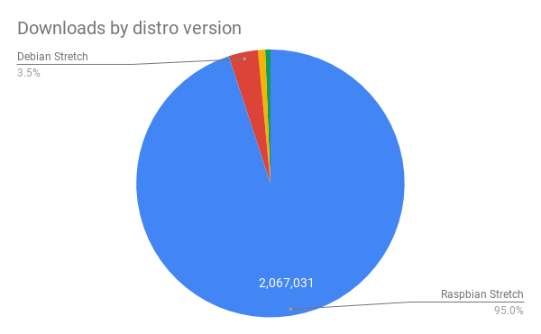
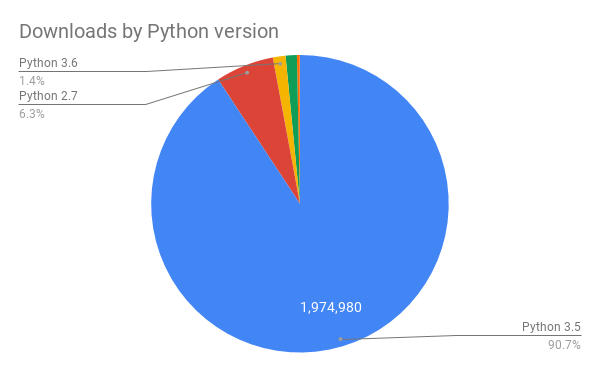

piwheels had a great start to 2019, with our biggest month in terms of downloads in January, and biggest month in terms of time saved in February! Headline stats for the quarter:

<ul class="wp-block-list"><li>Downloads: <strong>2,176,652</strong></li><li>Build time saved: <strong>25 years 7 months 23 days</strong></li></ul>

This brings our totals so far to:

<ul class="wp-block-list"><li>Downloads: <strong>7,703,358</strong></li><li>Build time saved: <strong>67 years 2 months 3 days</strong></li></ul>

The number of downloads in this period is <em>more than double</em> the same period in 2018.

<figure class="wp-block-image"></figure>

There was a record breaking number of downloads in the month of January:

<ul class="wp-block-list"><li>January: <strong>793,294</strong></li><li>February: <strong>700,246</strong></li><li>March: <strong>683,112</strong></li></ul>
<figure class="wp-block-image"></figure>

However, February saved users the most time:

<ul class="wp-block-list"><li>January: <strong>8 years 6 months</strong></li><li>February: <strong>9 years 1 month</strong></li><li>March: <strong>8 years</strong></li></ul>
<figure class="wp-block-image"></figure>
<h2 class="wp-block-heading">Project pages</h2>

We also recently deployed new project pages so users have a nicer interface when browsing information about which packages and versions we have:

<figure class="wp-block-image"></figure>
<h2 class="wp-block-heading">Popular packages</h2>

The top 30 most downloaded packages of the quarter:

<ol class="wp-block-list"><li><strong><a href="https://www.piwheels.org/project/pycparser">pycparser</a></strong> (73,736)</li><li><strong><a href="https://www.piwheels.org/project/cffi">cffi</a></strong> (54,483)</li><li><strong><a href="https://www.piwheels.org/project/cryptography">cryptography</a></strong> (52,436)</li><li><strong><a href="https://www.piwheels.org/project/PyYAML">PyYAML</a></strong> (50,047)</li><li><strong><a href="https://www.piwheels.org/project/numpy">numpy</a></strong> (49,988)</li><li><strong><a href="https://www.piwheels.org/project/MarkupSafe">MarkupSafe</a></strong> (47,950)</li><li><strong><a href="https://www.piwheels.org/project/aiohttp">aiohttp</a></strong> (47,875)</li><li><strong><a href="https://www.piwheels.org/project/ruamel.yaml">ruamel.yaml</a></strong> (45,296)</li><li><strong><a href="https://www.piwheels.org/project/bcrypt">bcrypt</a></strong> (45,248)</li><li><strong><a href="https://www.piwheels.org/project/SQLAlchemy">SQLAlchemy</a></strong> (42,998)</li><li><strong><a href="https://www.piwheels.org/project/future">future</a></strong> (41,061)</li><li><strong><a href="https://www.piwheels.org/project/multidict">multidict</a></strong> (34,581)</li><li><strong><a href="https://www.piwheels.org/project/yarl">yarl</a></strong> (34,163)</li><li><strong><a href="https://www.piwheels.org/project/home-assistant-frontend">home-assistant-frontend</a></strong> (34,057)</li><li><strong><a href="https://www.piwheels.org/project/voluptuous-serialize">voluptuous-serialize</a></strong> (33,573)</li><li><strong><a href="https://www.piwheels.org/project/idna_ssl">idna_ssl</a></strong> (33,110)</li><li><strong><a href="https://www.piwheels.org/project/python-slugify">python-slugify</a></strong> (33,047)</li><li><strong><a href="https://www.piwheels.org/project/paho-mqtt">paho-mqtt</a></strong> (31,360)</li><li><strong><a href="https://www.piwheels.org/project/mutagen">mutagen</a></strong> (29,544)</li><li><strong><a href="https://www.piwheels.org/project/ifaddr">ifaddr</a></strong> (28,433)</li><li><strong><a href="https://www.piwheels.org/project/gTTS-token">gTTS-token</a></strong> (26,500)</li><li><strong><a href="https://www.piwheels.org/project/pycryptodome">pycryptodome</a></strong> (24,949)</li><li><strong><a href="https://www.piwheels.org/project/RPi.GPIO">RPi.GPIO</a></strong> (24,513)</li><li><strong><a href="https://www.piwheels.org/project/opencv-python">opencv-python</a></strong> (24,032)</li><li><strong><a href="https://www.piwheels.org/project/PyQRCode">PyQRCode</a></strong> (23,259)</li><li><strong><a href="https://www.piwheels.org/project/Pillow">Pillow</a></strong> (21,652)</li><li><strong><a href="https://www.piwheels.org/project/user-agents">user-agents</a></strong> (21,486)</li><li><strong><a href="https://www.piwheels.org/project/Adafruit-PureIO">Adafruit-PureIO</a></strong> (20,759)</li><li><strong><a href="https://www.piwheels.org/project/docopt">docopt</a></strong> (20,385)</li><li><strong><a href="https://www.piwheels.org/project/kiwisolver">kiwisolver</a></strong> (18,443)</li></ol>
<h2 class="wp-block-heading">Environmental stats</h2>

Armv7 is still by far our most used architecture, getting almost 88% versus less than 9% for Armv6. Remember, Armv7 means Pi 2, 3, and 3+; and Armv6 means Pi 1 and Pi Zero. There's still a small (3%) record of x86_64 downloads, and a trace of a few others. But since we only provide Arm platform wheels (not x86 ones), the only x86 (&amp; etc) downloads recorded are pure Python wheels only.

<figure class="wp-block-image"><figcaption> </figcaption></figure>

Raspbian users make up over 95% of our downloads, followed by a 3.7% Debian base, and a tiny slither of Ubuntu users and so on. It's notable that until recently, Ubuntu MATE only had 16.04 images. Now they're shipping 18.04 images, but neither of these ship with piwheels pre-configured. Also Canonical have started work on officially supporting Ubuntu Desktop and Server for the Pi, so I'm sure we'll see a rise in usage in 2019.

<figure class="wp-block-image"></figure>

Similarly, Raspbian Stretch has a 95% share of downloads, followed by Debian Stretch (3.5%) and Ubuntu 18.04 (&lt;1%). Unsurprising as Raspbian is so popular and the only OS pre-configured to use piwheels. Jessie had very few downloads, and Buster (testing) had almost as many. We do actually have Python 3.4 wheels, but Jessie is not configured to use piwheels. We don't get have Python 3.7 wheels for Buster, but we will by the time it's released.

<figure class="wp-block-image"></figure>

Again, unexpectedly, the Python 3 version found in Raspbian Stretch (3.5) sticks out with over 90% of the share. There's a small but significant presence of Python 2, and this is only the pure Python pakcages that explicitly state in their setup that they are universal (compatible with 2 and 3), but don't release wheels on PyPI. It's a small proportion of packages, but includes the most popular package of all, <a href="https://www.piwheels.org/project/pycparser/">pycparser</a>.

I see a lot of Stack Exchange and forum questions from people installing out-of-distribution versions of Python on their Pis (particularly when following guides that say they require Python 3.6 or 3.7). I don't see a lot of success in this, and generally advise people to stick with the distribution, or try upgrading to Buster. But it seems we have a 1.4% hit for Python 3.6 despite not providing wheels for it. These could be Ubuntu 18.04 users, or Raspbian users who have built Python 3.6 themselves.

<figure class="wp-block-image"></figure>
<h2 class="wp-block-heading">What next?</h2>

Since deploying the new project pages and some other updates, we had some issues with communication across Pis, and we've halted building for the time being. Dave's working on a new C-based implementation of <a href="https://cbor.io/">CBOR</a> (called <a href="https://github.com/waveform80/cboar">cboar</a>) which we think will resolve these issues, and we expect to be building again very soon. This means we'll catch up with any recent releases, and we'll be able to start building Python 3.7 wheels in time for Buster's release. We have also deployed dependency calculation to solve the <a href="https://blog.piwheels.org/how-to-work-out-the-missing-dependencies-for-a-python-package/">missing shared object problem</a>, so now when wheels are built, their apt dependencies will be calculated. We'll need to do this for all existing wheels too.

Debian and Raspbian Buster are expected around June, possibly, so we'll be in a position where both stable (Buster) and oldstable (Stretch) provide configuration for piwheels, and I have a strong suspicion that a more stable Ubuntu 18.04 or later might also pre-configure for piwheels too. This will show a much more varied and informative view of which distributions and Python versions are being used. I imagine Q2 will be similar to Q1 but Q3 and Q4 will be more interesting.

For regular updates, follow <a href="https://twitter.com/piwheels">@piwheels</a> on Twitter!

