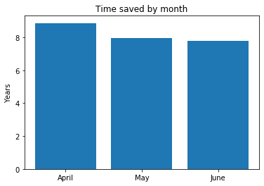
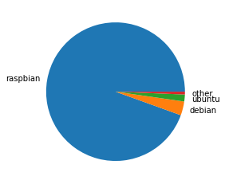
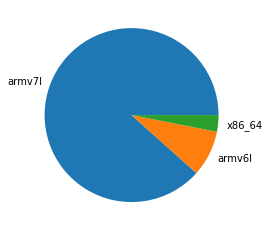
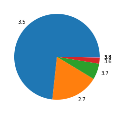

In the period of April — June 2019, **1,681,550** packages were downloaded from piwheels, bringing
the total to **9,384,908**. This has saved **24 years 8 months** in the period, and **94 years 1
month** in total!

Each month had over 500,000 downloads :

<figure class="aligncenter">

</figure>

which saved around 8 years:

<figure class="aligncenter">

</figure>

**9 April** had the highest number of downloads with **23,719**.

The top 10 downloads were:

1.  [pycparser](https://www.piwheels.org/project/pycparser) (242,475)
2.  [tensorflow](https://www.piwheels.org/project/tensorflow) (46,592)
3.  [MarkupSafe](https://www.piwheels.org/project/MarkupSafe) (38,233)
4.  [future](https://www.piwheels.org/project/future) (35,954)
5.  [opencv-python](https://www.piwheels.org/project/opencv-python) (33,262)
6.  [paho-mqtt](https://www.piwheels.org/project/paho-mqtt) (30,222)
7.  [aiohttp](https://www.piwheels.org/project/aiohttp) (28,105)
8.  [PyYAML](https://www.piwheels.org/project/PyYAML) (27,831)
9.  [RPi.GPIO](https://www.piwheels.org/project/RPi.GPIO) (25,723)
10. [voluptuous-serialize](https://www.piwheels.org/project/voluptuous-serialize) (25,465)

Raspbian still dominates usage with over 94%:

<figure class="aligncenter">

</figure>

armv7l (Pi 2/3 platform) is still a majority architecture with over 88% usage, with armv6l (Pi
1/Zero) taking just 8.5%. The combined Arm architecture takes over 91% of all usage:

<figure class="aligncenter">

</figure>

Python version usage changes more over time. As Q2 ended before the release of Raspbian Buster
(bringing Python 3.7), Stretch's 3.5 still shows dominance with nearly 3/4 of the share of
downloads, leaving 3.7 trailing behind even 2.7:

<figure class="aligncenter">

</figure>

This was a reasonably quiet period due to piwheels builders being out-of-action for most of the
period, as detailed in [these](https://blog.piwheels.org/raspbian-buster-builds-in-progress/)
[posts](https://blog.piwheels.org/raspbian-buster-builds-complete/).
