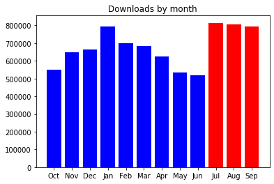
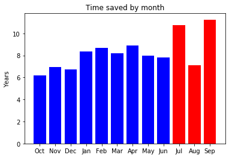
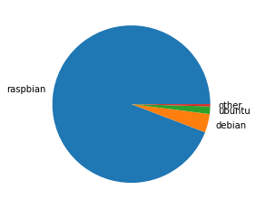
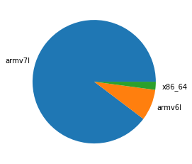

In the period of July – September 2019, <strong>2,414,682</strong> packages were downloaded from piwheels, bringing the total to <strong>11,799,590</strong>. This has saved <strong>29 years</strong> in the period, and <strong>123 years</strong> in total!

Each month had around 800,000 downloads:

<figure class="wp-block-image"></figure>

which saved around between 7 and 11 years per month:

<figure class="wp-block-image"></figure>

<strong>18 July</strong> had the highest (ever) number of downloads with <strong>36,275</strong>.

The top 10 downloads were:

<ol class="wp-block-list"><li><a href="https://www.piwheels.org/project/pycparser">pycparser</a> (156,507)</li><li><a href="https://www.piwheels.org/project/numpy">numpy</a> (76,970)</li><li><a href="https://www.piwheels.org/project/PyYAML">PyYAML</a> (65,887)</li><li><a href="https://www.piwheels.org/project/cffi">cffi</a> (56,522)</li><li><a href="https://www.piwheels.org/project/tensorflow">tensorflow</a> (49,508)</li><li><a href="https://www.piwheels.org/project/cryptography">cryptography</a> (48,071)</li><li><a href="https://www.piwheels.org/project/MarkupSafe">MarkupSafe</a> (44,944)</li><li><a href="https://www.piwheels.org/project/future">future</a> (42,133)</li><li><a href="https://www.piwheels.org/project/homeassistantfrontend">home-assistant-frontend</a> (38,750)</li><li><a href="https://www.piwheels.org/project/pahomqtt">paho-mqtt</a> (36,273)</li></ol>

Raspbian still dominates usage with over 94%:

<figure class="aligncenter"></figure>

armv7l (Pi 2/3 platform) is still a majority architecture with almost 90% usage, with armv6l (Pi 1/Zero) taking just 8.1%. The combined Arm architecture takes nearly 92% of all usage:

<figure class="aligncenter"></figure>

Python version usage changes more over time. As Raspbian Buster was released during the month of July, Python 3.7 usage quickly overtook Python 3.5:

<figure class="aligncenter"></figure>

This was the busiest period for piwheels so far, due to the launch of Pi 4 and Raspbian Buster (introducing Python 3.7), as detailed in <a href="https://blog.piwheels.org/raspberry-pi-4-and-raspbian-buster/">these</a> <a href="https://blog.piwheels.org/raspbian-buster-builds-complete/">posts</a>.

