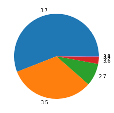

In the period of July — September 2019, **2,414,682** packages were downloaded from piwheels,
bringing the total to **11,799,590**. This has saved **29 years** in the period, and **123 years**
in total!

Each month had around 800,000 downloads:

<figure class="wp-block-image">

</figure>

which saved around between 7 and 11 years per month:

<figure class="wp-block-image">

</figure>

**18 July** had the highest (ever) number of downloads with **36,275**.

The top 10 downloads were:

1.  [pycparser](https://www.piwheels.org/project/pycparser) (156,507)
2.  [numpy](https://www.piwheels.org/project/numpy) (76,970)
3.  [PyYAML](https://www.piwheels.org/project/PyYAML) (65,887)
4.  [cffi](https://www.piwheels.org/project/cffi) (56,522)
5.  [tensorflow](https://www.piwheels.org/project/tensorflow) (49,508)
6.  [cryptography](https://www.piwheels.org/project/cryptography) (48,071)
7.  [MarkupSafe](https://www.piwheels.org/project/MarkupSafe) (44,944)
8.  [future](https://www.piwheels.org/project/future) (42,133)
9.  [home-assistant-frontend](https://www.piwheels.org/project/homeassistantfrontend) (38,750)
10. [paho-mqtt](https://www.piwheels.org/project/pahomqtt) (36,273)

Raspbian still dominates usage with over 94%:

<figure class="aligncenter">

</figure>

armv7l (Pi 2/3 platform) is still a majority architecture with almost 90% usage, with armv6l (Pi
1/Zero) taking just 8.1%. The combined Arm architecture takes nearly 92% of all usage:

<figure class="aligncenter">

</figure>

Python version usage changes more over time. As Raspbian Buster was released during the month of
July, Python 3.7 usage quickly overtook Python 3.5:

<figure class="aligncenter">

</figure>

This was the busiest period for piwheels so far, due to the launch of Pi 4 and Raspbian Buster
(introducing Python 3.7), as detailed in
[these](https://blog.piwheels.org/raspberry-pi-4-and-raspbian-buster/)
[posts](https://blog.piwheels.org/raspbian-buster-builds-complete/).
