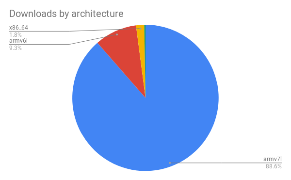

piwheels was launched in mid-2017, and we started counting downloads in November of that year, so
now we have over a year's worth of data on which packages have been downloaded, and how much time
has been saved.

*If you're not familiar, piwheels.org is a Python package repository providing natively compiled
wheels for the Raspberry Pi's Arm architecture, making pip installations fast for Raspberry Pi
users.*

In 2018, a total of **5,154,233** packages were downloaded, saving users **39 years, 10 months and
29 days**. Some more stats for the year:

- Average daily downloads: **14,519**
- Average monthly downloads: **429,519**
- Most downloads in one day: **25,389** on 30 November
- Most downloads in one month: **662,621** in December (**21,445** daily average)

Usage was steady throughout the year, with a rise in the final quarter:

<figure class="wp-block-image">

</figure>

<figure class="wp-block-image">

</figure>

Interestingly, the top 50 download days on record have all been since late October!

## Packages

The top 30 most downloaded packages of the year are:

1.  **[pycparser](https://pypi.org/project/pycparser)** (203,432)
2.  **[home-assistant-frontend](https://pypi.org/project/home-assistant-frontend)** (157,924)
3.  **[PyYAML](https://pypi.org/project/PyYAML)** (153,907)
4.  **[cffi](https://pypi.org/project/cffi)** (143,998)
5.  **[MarkupSafe](https://pypi.org/project/MarkupSafe)** (138,488)
6.  **[SQLAlchemy](https://pypi.org/project/SQLAlchemy)** (133,629)
7.  **[multidict](https://pypi.org/project/multidict)** (132,226)
8.  **[numpy](https://pypi.org/project/numpy)** (130,044)
9.  **[aiohttp](https://pypi.org/project/aiohttp)** (129,322)
10. **[future](https://pypi.org/project/future)** (121,117)
11. **[cryptography](https://pypi.org/project/cryptography)** (109,670)
12. **[idna_ssl](https://pypi.org/project/idna_ssl)** (109,317)
13. **[mutagen](https://pypi.org/project/mutagen)** (100,491)
14. **[user-agents](https://pypi.org/project/user-agents)** (81,608)
15. **[netifaces](https://pypi.org/project/netifaces)** (79,248)
16. **[pycryptodome](https://pypi.org/project/pycryptodome)** (78,503)
17. **[gTTS-token](https://pypi.org/project/gTTS-token)** (75,068)
18. **[yarl](https://pypi.org/project/yarl)** (73,824)
19. **[voluptuous-serialize](https://pypi.org/project/voluptuous-serialize)** (71,656)
20. **[paho-mqtt](https://pypi.org/project/paho-mqtt)** (63,925)
21. **[bcrypt](https://pypi.org/project/bcrypt)** (58,017)
22. **[RPi.GPIO](https://pypi.org/project/RPi.GPIO)** (50,246)
23. **[Pillow](https://pypi.org/project/Pillow)** (48,757)
24. **[docopt](https://pypi.org/project/docopt)** (43,908)
25. **[psutil](https://pypi.org/project/psutil)** (40,205)
26. **[PyQRCode](https://pypi.org/project/PyQRCode)** (39,436)
27. **[matplotlib](https://pypi.org/project/matplotlib)** (38,412)
28. **[tensorflow](https://pypi.org/project/tensorflow)** (38,335)
29. **[opencv-python](https://pypi.org/project/opencv-python)** (37,274)
30. **[ifaddr](https://pypi.org/project/ifaddr)** (36,804)

## Architectures

The Pi 2 and Pi 3 both identify as armv7l, and that's by far the most common architecture, followed
by armv6l which is the architecture of Pi 1 and Pi Zero. Note that the time saved is much higher for
Pi 1/Zero users as they don't contain the quad-core CPU found in the Pi 2/3.

1.  **armv7l** (4,564,317)
2.  **armv6l** (481,616)
3.  **x86_64** (93,142)
4.  **armv8l** (6,666)
5.  **i686** (6,550)
6.  **aarch64** (606)
7.  **AMD64** (185)
8.  **x86** (2)

<figure class="wp-block-image">

</figure>

Pi 3 users running a 64-bit operating system (not Raspbian) identify as armv8l, which is fourth in
the list. We don't provide armv8l wheels, so this number only includes pure Python packages. Higher
than armv8l in third place is x86_64, which is 64-bit non-Pi platforms, i.e. PC running
Windows/Mac/Linux, but again, this (as with all other architecture) only counts pure Python
packages. These users will not really see any benefit to using piwheels to install packages. Pure
Python wheel downloads may be slightly faster than source distribution but it's nothing compared to
packages which require compilation.

## Operating systems

By far, most downloads come from Raspbian, particularly Raspbian Stretch. The next highest are
Debian Stretch and then various Ubuntu distributions (each significantly smaller):

<figure class="wp-block-image">

</figure>

<figure class="wp-block-image">

</figure>

Since Raspbian Stretch comes pre-configured with settings for piwheels, but Jessie doesn't, Jessie
users have to update pip and manually set the config to use piwheels. There may be a significant
number of Raspberry Pi users using Raspbian Jessie who are not aware of the piwheels project, but we
would never know. There are also plenty of other random distributions appearing with just a few
downloads each.

## Python versions

Currently we provide wheels for the default Python 3 version in Raspbian Jessie (Python 3.4) and
Stretch (Python 3.5), we don't build Python 2 wheels, but pure Python packages are often available
for both 2 and 3, so Python 2 users can pick up those packages, and hence Python 2.7 is present in
our download stats. We've started to build Python 3.6 wheels using unreleased Raspbian Buster
(testing), and by the time that's released, it will probably ship with Python 3.7 and hopefully
without Python 2.

The vast majority of our downloads are for Python 3.5 (Stretch). However, the number of Python 2
downloads (though limited to pure Python packages) is larger than any other Python 3 version which
indicates a large Python 2 user base. Remember, kids, [Python 2 EOL](https://pythonclock.org/) is
now **less than a year away**!

<figure class="wp-block-image">

</figure>

## Time saved

Since we record how long a build takes, and we log every download, we can calculate the amount of
time saved:

- January — 1 year 7 months
- February — 1 year 8 months
- March — 2 years 1 month
- April — 1 year 11 months
- May — 2 years 2 months
- June — 2 years 8 months
- July — 3 years 1 month
- August — 4 years 6 months
- September — 4 years 4 months
- October — 5 years
- November — 4 years 10 months
- December — 6 years 1 month

This totals nearly 40 years saved in just one year. The most time saved in a single day was on 28
December (over 90 days).

It's worth noting that for the only package we don't build ourselves, Tensorflow (built by Google
and uploaded to piwheels), we don't record a build time, so this package is effectively excluded
from the time saved stats. Pete Warden estimates it would take a whole day to build it yourself on a
Pi 3, and this is our 28th most popular package (and climbing — 25th in the last month), so if we
were to add this to the time saved stat it would increase immensely (by an estimated 141 years),
which would heavily skew the stat.

## Energy saved

Similarly, we can calculate how much energy has been saved by reducing the need for compilation.
Roughly speaking, we estimate we've saved at least **276KWh** of electricity, based on the idle
draw of a Pi 2 for the Armv7 downloads, and a Pi Zero for the Armv6 downloads.

## Downloads through the day

So what does an average day look like on piwheels? Well here's a graph showing the number of
downloads per hour throughout our busiest day of the year:

<figure class="wp-block-image">

</figure>

## On to 2019

Debian and Raspbian Buster are expected to arrive in mid-2019, so we'll see the arrival of Python
3.6 or 3.7 (whichever is in Buster), and will provide wheels for all packages in due course.

We have been working on a few new features, including HTML project pages ([like PyPI
does](https://pypi.org/project/numpy/)) so you don't have to use the [simple
index](https://www.piwheels.org/simple/numpy/) to see which packages and versions we have. We have
also made it possible to calculate apt dependencies for a wheel based on packages providing required
shared object files, as described in a [previous
post](https://blog.piwheels.org/how-to-work-out-the-missing-dependencies-for-a-python-package/).

If you're interested in following piwheels project updates, we tweet daily and monthly stats at
[@piwheels](https://twitter.com/piwheels). You can also follow me
[@ben_nuttall](https://twitter.com/ben_nuttall) and Dave
[@waveform80](https://twitter.com/waveform80).

*The piwheels project wouldn't be possible without considerable support from* [*Mythic
Beasts*](https://www.mythic-beasts.com/)*, who provide storage and cloud Pis. The Pi platform is so
straightforward, it's been a pleasure to use, allowing us to scale up builder Pis with ease. We
highly recommend using this (very affordable) service for real* [*Pi
testing*](https://www.mythic-beasts.com/order/rpi) *for your projects.*
