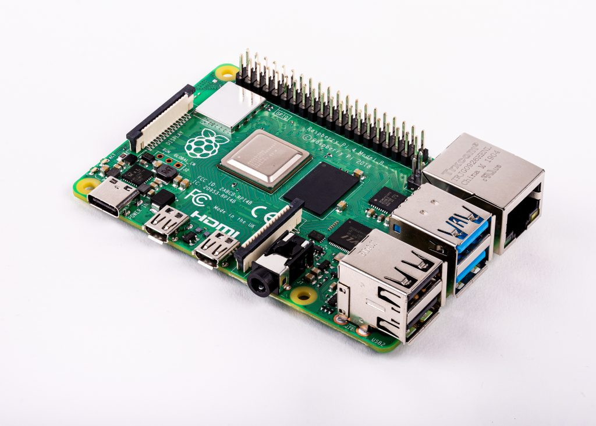

Big news today: the <a href="https://www.raspberrypi.org/blog/raspberry-pi-4-on-sale-now-from-35">Raspberry Pi 4 is out</a> – and slightly ahead of the <a href="https://twitter.com/debian/status/1138715072841146370">official release of Debian Buster</a>, <a href="https://www.raspberrypi.org/downloads/raspbian/">Raspbian Buster is released</a> too.

So what does this mean for piwheels?

<h2 class="wp-block-heading">Raspberry Pi 4</h2>

The Raspberry Pi 4 is a huge step forward in performance. It's a much faster computer. However, it's not a new architecture. Like the Pi3/3+ it contains an Armv8 CPU which generally runs a 32-bit (Armv7) operating system in Pi-1 compatible userland (Armv6). This means Armv7-optimised (NEON) code will work on it, but so will Armv6 code, just like the Pi 2 and 3.

<figure class="wp-block-image"></figure>
<h2 class="wp-block-heading">Raspbian Buster</h2>

Whether you're on a Pi 1, 2, 3, 4 or Zero, you can and should use Raspbian Buster. It's now the recommended and supported operating system for all Raspberry Pi models.

<figure class="wp-block-image"></figure>

Raspbian Buster ships <strong>Python 3.7</strong> – which means a whole new set of wheels is required for pip installs to be fast.

We had hoped to have them all ready by now, but we've been busy dealing with a series of issues related to a piwheels system upgrade. It's a long story, which involves Dave following a <a href="https://github.com/agronholm/cbor2/pull/51">rabbit hole</a>. We've still been operational the whole time, serving hundreds of thousands of downloads, but not building any new package releases for a while, and have not been able to start building Python 3.7 wheels yet.

As a temporary measure, I've manually built all the most popular packages for Jessie, Stretch and Buster, and imported them into piwheels.

There's still a bit of work to do to get piwheels building again, but we're nearly there. Watch this space!

<strong>Update 27 June: we are now building again. It will probably take a couple of weeks to catch up.</strong> 

