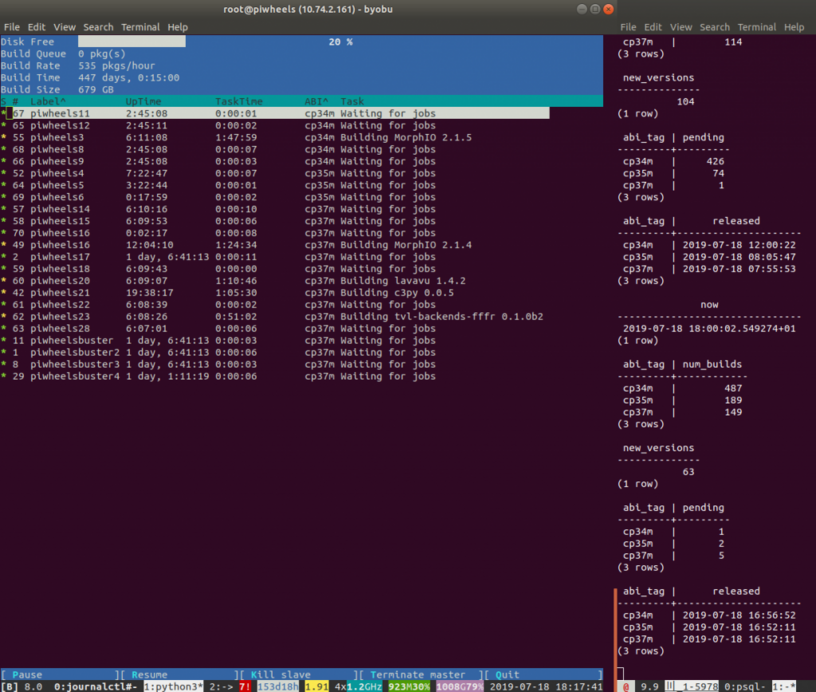

An update on our [last post](https://blog.piwheels.org/raspbian-buster-builds-in-progress/), we have
now completed a run of builds for Python 3.7 wheels for Raspbian Buster. Now, when you pip install
something on Raspbian Buster, you'll generally get a wheel for it, to the same extent you do for
Jessie and Stretch.

We now host 40k Python 3.4 wheels (Jessie), 46k Python 3.5 wheels (Stretch) and 43k Python 3.7
wheels (Buster). We also host 1.1 million pure Python wheels, which work on any Python version.
It's amazing how few packages actually require compilation, but for the ones that do, having a
wheel makes a big difference.

<figure class="wp-block-image">

<figcaption>Staring at these two terminal screens has been my life for the last few
weeks</figcaption>
</figure>

## New issue tracker

We've now moved the piwheels project source from my personal github account bennuttall/piwheels to
a new organisation — [piwheels/piwheels](https://github.com/piwheels/piwheels). GitHub is good at
redirecting, so old links should generally work.

We also created a new repository for issues related to packages on piwheels.org, and moved any
existing package issues to it, to separate them from issues with the piwheels source code. Now,
issues related to packages should be filed at
[piwheels/packages](https://github.com/piwheels/packages/). The links from project pages currently
point at the old location, but the issue templates refer people to the right place. We'll push an
update soon and the project pages will be regenerated with the new URLs.

<figure class="wp-block-image">

</figure>

## Python 3.8?

[Python 3.8](https://www.python.org/dev/peps/pep-0569/) is on the horizon. It's in beta now, and
expected to be released in October 2019. However, the piwheels project tends to only stick with
what's stable in Debian (i.e. 3.4 in Jessie, 3.5 in Stretch and 3.7 in Buster).

[Debian Bullseye](https://wiki.debian.org/DebianBullseye) follows Buster, but it's two years away
(let's say July 2021). As well as Python 3.8, [3.9](https://www.python.org/dev/peps/pep-0596/) is
also planned, with a scheduled release date in June 2020, plus the proposed introduction of a
9-month release cycle, potentially putting Python 3.10 at March 2021, perhaps in time for Debian
Bullseye. But that's two years away, so let's wait and see.

<figure class="aligncenter">

<figcaption>Debian 11 – Bullseye – but what snake will be in Woody's boot?</figcaption>
</figure>

In the 2 year period a Debian release is "current stable", new Python versions are released, and
people naturally want to use those straight away. It's not recommended that you install an
out-of-distribution Python version, as everything Python related in the distribution is built to
match the system Python ABI, and things tend to break if you go against that. For that reason we
won't be building Python 3.8/3.9 wheels until they're in a stable Debian release.

Having said that, now that Ubuntu are building OS images for the Pi, we may see newer Python
versions in future Ubuntu releases (which are 6-monthly). If Python 3.8 is released in October,
maybe Ubuntu 19.10 or 20.04 will include it. piwheels.org doesn't build wheels for Ubuntu, so
Ubuntu would need its own instance of piwheels providing wheels for Python versions supported in
Ubuntu. I can image such a project arising in not-too-distant future.

## Python 3.4?

Python 3.4 is pretty old hat now. pip, and many other projects don't support it any more. However,
[Debian Jessie](https://www.debian.org/releases/jessie/)'s EOL is a year away (June 2020), so I
think we should continue to build packages with Jessie until that date. We'll probably still host
cp34m wheels after that but not build anything new. It'll be the first ABI we deprecate.

## Python 2.7?

[No](https://pythonclock.org/).

## Thanks

Thanks to [Dave](https://github.com/waveform80) for the incredible work on
[cbor2](https://github.com/agronholm/cbor2/pull/51) as detailed in my [last
post](https://blog.piwheels.org/raspbian-buster-builds-in-progress/), as well as his SQL expertise.

Thanks to Pete and the team at [Mythic Beasts](https://twitter.com/Mythic_Beasts/) for providing
hardware, bandwidth and support. Please check out my [tooling tuesday
post](https://tooling.bennuttall.com/mythic-beasts-pi-cloud/) on their awesome [pi
cloud](https://www.mythic-beasts.com/order/rpi) platform.
