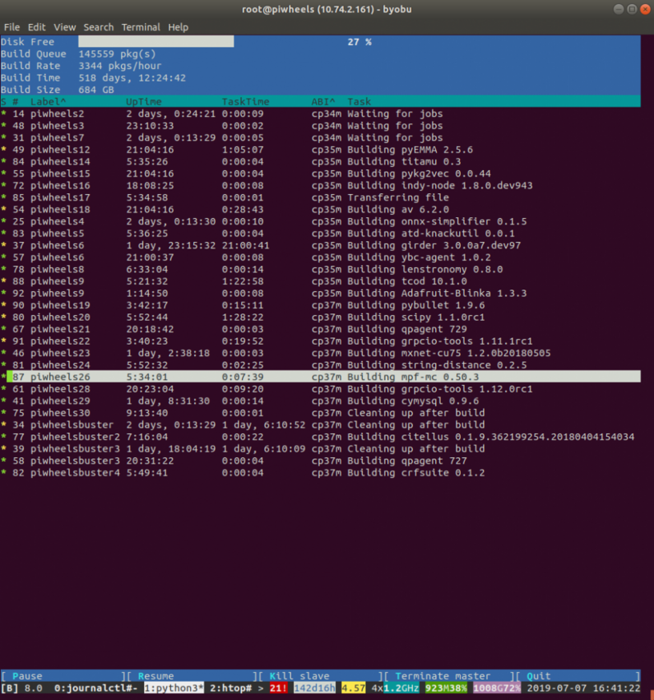

A while ago we had to stop building packages when we discovered an issue with our use of the
[cbor2](https://pypi.org/project/cbor2/) library. When packages were built by a builder Pi, we'd
serialise the build info and send it in a message to the piwheels master, which would then send a
message to the database. After suffering what we thought were networking issues at Mythic (sorry,
Pete), we eventually found that the sluggish speed of cbor2's encoding was causing timeouts, and
the master thought that the builders were going AWOL, and so successful builds and logged built
attempts were disappearing, no work was getting recorded in the database.

It took about 3 months for us to resolve the issue, which involved Dave's adventures down a rabbit
hole. It boiled down to cbor2 being implemented in Python, not C. First he tried swapping to
[cbor](https://pypi.org/project/cbor) (a C implementation). Unfortunately for a number of reasons it
wasn't good enough, so Dave ended up writing his own implementation of cbor2 in C. He initially
forked the project and named it cboar, but the maintainers of cbor2 were happy to accept his pull
request merging the two. Now (once it's released) Python 3 users of cbor2 will benefit from Dave's
C implementation.

Now that we have a fast cbor2 implementation, piwheels is back up-and-running. We had 3 months of
new releases to catch up on, and a repeat of the entire backlog for Python 3.7 on Buster.

The way piwheels works out what to build is that we attemp to build a package on the lowest ABI
(cp34m — Python 3.4 in Jessie). The build will output one of three things: it could successfully
build a pure Python wheel tagged with `none` as the ABI; it could successfully build a wheel with
compiled extensions, with `cp34m` as the ABI tag; or it could fail. If it builds a `none` ABI
wheel, we don't need to rebuild it, as it'll work on any Python 3 version. If it's tagged with
cp34m, it'll need rebuilding for the next ABI. If it fails, it needs attempting on the next ABI. It
might fail there too, depending on the reason for failure, but it's worth trying as it could easily
be that it has a minimum Python version requirement of, say, 3.5. Here's a diagram of the logic:

<figure class="aligncenter">

</figure>

Once we got piwheels up and running again, we had a lot to catch up on. There were nearly 200,000
builds pending for `cp34m` builders. We fired up a lot of builder Pis (about 35 — thanks
[Mythic](https://www.mythic-beasts.com/order/rpi)) split between Jessie, Stretch and Buster. We
prioritised on clearing the Jessie queue, as some of these jobs would be passed on to higher ABIs. A
couple of weeks later now, we've cleared Jessie, and we're another 24 hours or so from clearing
the Stretch queue, all the while chugging away at the Buster builds. Once Stretch is complete,
we'll reimage most of the builders to Buster to finish up, and then retire them, keeping 3 Jessie,
2 Stretch and 2 Buster to keep up with new releases moving forward. I imagine it will be finished
within a week.

<figure class="wp-block-image">

</figure>

If you want to see how far through we've got, looking at the project page of a package with regular
releases, like [numpy](https://www.piwheels.org/project/numpy/) or
[pillow](https://www.piwheels.org/project/pillow) and if you see `cp34m`, `cp35m` and `cp37m` in the
`successful builds` or `failed builds` column in the versions table, you know it's been built (or
attempted) on those ABIs. If `cp34m` and `cp35m` is there for a version, but `cp37m` isn't, then the
Buster builders haven't reached it yet.
