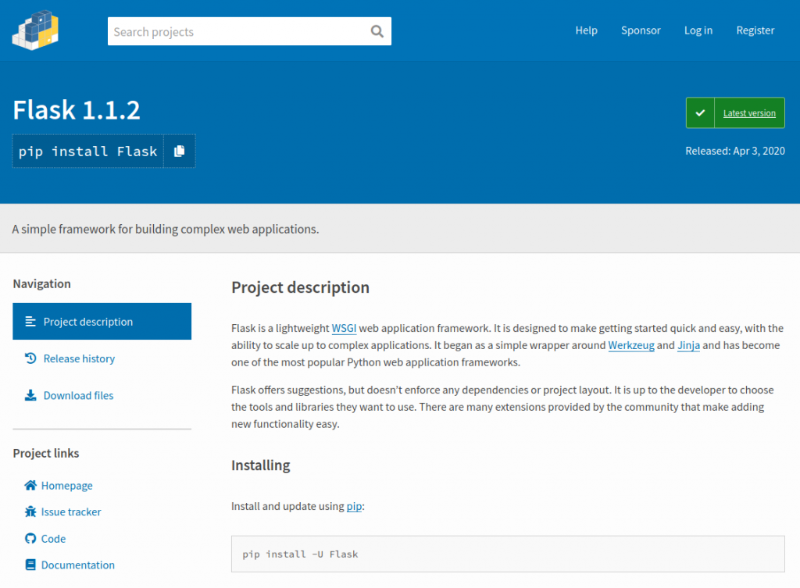
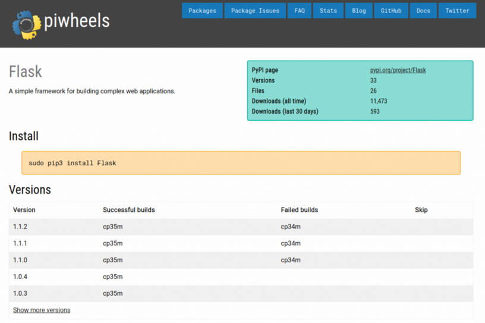

Running a PyPI mirror must sound pretty straightforward. Every action you see on PyPI, you copy it. There's a list of packages, each with a list of versions. Packages and versions can be created and deleted, sure, but that's easily manageable, surely?

<h2 class="wp-block-heading">When you assume…</h2>

Sounds easy, but we made the following assumptions, all of which turned out to be flawed in some way:

<ul class="wp-block-list"><li><code>SomePackage</code> is a different package to <code>somepackage</code> (it isn't)</li><li>Even if it isn't, having your index include both <code>SomePackage</code> and <code>somepackage</code> is ok (one will be invisible to pip)</li><li><code>Some-Package</code> is a different package to <code>Some.Package</code> and s<code>ome_package</code> (it isn't)</li><li>Even if it isn't, each package will use a single name format and stick to it (they won't)</li><li><code>pip install SomePackage</code> searches for <code>SomePackage</code> (it doesn't)</li><li><code>pip install some.package</code> searches for <code>some.package</code> (it doesn't)</li><li><code>pip install some_package</code> searches for <code>some_package</code> (it doesn't)</li><li>Building a wheel will result in a filename containing the name of the package (it usually does)</li><li>Even if it doesn't, the package tag will canonicalise to the same name as the package (it almost always does)</li><li>The events in the PyPI event log appear in chronological order (haha not even close)</li></ul>

We were aware of the idea of there being a "canonical" form of a package name, and what the algorithm for canonicalisation is (lowercase and replace any number of sequential <code>-</code>, <code>_</code> or <code>.</code> with a single <code>-</code>). But the way we set up piwheels originally assumed that if a package was created in one form, any future releases would use the same form, and that any other forms seen were distinct packages. That means we ended up with versions missing (because they belonged to what we thought were different packages).

This flawed assumption also means that if a package was created with one name, deleted with another, your system thinks it's not been deleted.

<h2 class="wp-block-heading">How pip works</h2>

PyPI provides both a simple index (used by pip) and a set of human-browsable project pages. Contrast <a href="https://pypi.org/simple/gpiozero/">pypi.org/simple/gpiozero</a> with <a href="https://pypi.org/project/gpiozero/">pypi.org/project/gpiozero</a>. piwheels aims to mirror this functionality, so we also provide both. The part of the index that's used by pip is simply a directory at <strong>piwheels.org/simple</strong> containing a directory per package, each containing any files associated with that package.

<figure class="aligncenter size-large"></figure>

<figure class="aligncenter size-large"></figure>

If a package used a non-canonical form (like <code>Flask</code>), we'd create a symlink from <code>Flask</code> to <code>flask</code> and pip would find it. But sometimes we'd end up with a directory in both cases, thinking pip would distinguish the capitalisation and use the one requested. It seems obvious, now I'm explaining it with facts we've discovered since setting up the project. But when you build a proof-of-concept and it "seems to work", you're happy to accept your assumptions were correct.

The command <code>pip install flask</code> searches the configured indexes, specifically <code>/simple/flask/</code>, as you'd expect. However, <code>pip install Flask</code> also searches <code>/simple/flask/</code> not <code>/simple/Flask/</code>. Similarly, <code>pip install RPi.GPIO</code> searches <code>/simple/rpi-gpio/</code> not <code>/simple/RPi.GPIO/</code>. But because we'd created symlinks from <code>Flask</code> to <code>flask</code> and from <code>RPi.GPIO</code> to <code>rpi-gpio</code>, it generally works. We'd just not considered that the non-canonical directories were <em>never</em> hit. And we'd not realised that if we were hosting files at <code>/simple/Something/</code> and an empty index at <code>/simple/something</code>, nobody would ever be able to each those files with pip.

The fact that PyPI project pages use the "display name" of a package (i.e. potentially non-canon name like <a href="https://pypi.org/project/Flask/">Flask</a> or <a href="https://pypi.org/project/RPi.GPIO/">RPi.GPIO</a>) in the URL is probably what led us down this path. We just hadn't realised that the simple index didn't do the same, so we aimed to replicate it.

<h2 class="wp-block-heading">Deleting stuff</h2>

Until recently, we didn't actually delete deleted packages. If a package (or a version) had been deleted in PyPI, we left it in piwheels. If it was deleted before we tried to build it, then there was nothing on PyPI for us to build, so any attempts would fail and it would simply be a failed build attempt. If it got deleted after we built it, we'd keep it online. At one point we updated it to show them as "deleted" on the project page, but didn't actually remove the files or references to removed versions.

Eventually, we decided to process deletions, but this opened a can of worms, explained in the <a href="https://blog.piwheels.org/new-features-deletion-yanking-and-more/">previous post</a>. We discovered that iterating through PyPI's history in order would lead to confusion, as ordering of events is not guaranteed, and demonstrably wrong, particularly the first few years. So we had to buffer the events and sort them properly in order to process them safely. Then we discovered the canon/non-canon name clashes. There were a couple of weeks where we'd get a couple of reports a day complaining that a package had 404'd in pip. And annoyingly, a 404 in a pip request is fatal. These were from edge cases where the canon name had been deleted, and the package had been later re-created with a non-canon name. Easy enough to fix each one, by creating a symlink in place of the deleted directory, but that would require knowing where the gaps were (likely waiting for a report).

<h2 class="wp-block-heading">the-new-normal</h2>

It became clear that dealing with packages using their canonical name only would make things much easier. So we deleted duplicates and renamed everything else using the canonical name pattern. We also created a table recording any non-canon aliases seen, timestamped so that we could identify the most recently used name as the "display name" shown as the package name on the project page, like <a href="https://pypi.org/project/Flask/">Flask</a>.

This meant we could (well, had to) remove all symlinks in <code>/simple/</code> and just use the canon form every time. There's no need for a symlink from <code>Flask</code> to <code>flask</code> because pip never looks at <code>Flask</code>. And for project pages we'd use the canon name as the project page directory and create symlinks from any known aliases. The deletion process would know where everything was and take down the files and any symlinks, so we should be future-proof too.

<h2 class="wp-block-heading">Edge cases</h2>

The final point in my list of assumptions was blown up yesterday when we discovered a wheel file unknown by the database: <code>GSAS_II_WONDER_linux-1.0.0-py3-none-any.whl</code>

It turned out that this filename was duplicated. There are three packages:

<ul class="wp-block-list"><li><code>GSAS_II_WONDER_linux</code></li><li><code>GSAS_II_WONDER_mac</code></li><li><code>GSAS_II_WONDER_win</code></li></ul>

If you build a wheel of numpy, you'll end up with a filename such as: <code>numpy-1.19.2-cp37-cp37m-linux_armv7l.whl</code> – which can be broken up into the following tags:

<ul class="wp-block-list"><li>package tag: <code>numpy</code></li><li>version tag: <code>1.19.2</code></li><li>python version tag: <code>cp37</code></li><li>ABI tag: <code>cp37m</code></li><li>platform tag: <code>linux_armv7l</code></li></ul>

Often the package tag will match the style used by the package maintainers (like numpy or Flask) – so it's not that it's always canonicalised. However, since tags are separated by a hyphen, the package name can't contain hyphens (these are replaced with underscores). So it's ok to say it won't necessarily match the format of the package name, but we had assumed that it would at least canonicalise to the same name as the package. This one hadn't. Each attempt at building the different platform variations of this package succeeded, but built wheels which were tagged with <code>GSAS_II_WONDER_linux</code> as the package tag. How could this happen? <code>setup.py</code> is to blame.

<code>setup.py</code> allows package maintainers to declare the metadata for their releases using Python. This allows arbitrary code execution to determine what that metadata is. So the version number can be calculated at runtime, the description can be read from a file. These actions are common. Less common but not unseen are things like using a subprocess to run a git command to add the latest commit hash to the version number. Which <a href="https://github.com/nmichlo/tonic-config/issues/1">breaks</a> if the user isn't in your git repository and/or doesn't have git installed. It also might seem like a good idea to determine your dependencies at runtime, depending on the platform. But if you build a pure Python wheel on a Linux machine and publish it on PyPI, users on other platforms won't be running that conditional, <a href="https://xkcd.com/221/">you ran it for them</a>.

So what happened in this case was that the package name was determined by the platform. So building the sdist of <code>GSAS_II_WONDER_mac</code> and <code>GSAS_II_WONDER_win</code> from PyPI would always produce a wheel file that thought it was the package <code>GSAS_II_WONDER_linux</code>.

<h2 class="wp-block-heading">What now?</h2>

We had some new features lined up but had to prioritise getting this sorted out. Having processed deletions properly, reviving the undiscoverable files of duplicate packages, and moving to a system which only uses canonicalised package names feels like a mountain has been climbed. I've rebased two important branches on top of these new changes now they've been deployed, so we plan to deploy them very soon. That'll be:

<ul class="wp-block-list"><li><a href="https://github.com/piwheels/piwheels/issues/241">New style project pages</a></li><li><a href="https://github.com/piwheels/piwheels/issues/16">Project JSON API</a></li><li><a href="https://github.com/piwheels/piwheels/issues/208">Requires-Python</a></li></ul>

And then we can finally begin to look at adding <a href="https://github.com/piwheels/piwheels/issues/220">aarch64 support</a> to piwheels, and closing <a href="https://github.com/piwheels/piwheels/issues/1">issue #1</a> by providing build output. See the <a href="https://github.com/piwheels/piwheels/issues">issue tracker</a> for more info on what's planned.

As always, if you come across a missing package/version/file or have another issue using piwheels, please report it by opening an issue using the links on the package's <a href="https://www.piwheels.org/packages.html">project page</a>. And check out the source code at <a href="https://github.com/piwheels/piwheels">github.com/piwheels/piwheels</a>.

