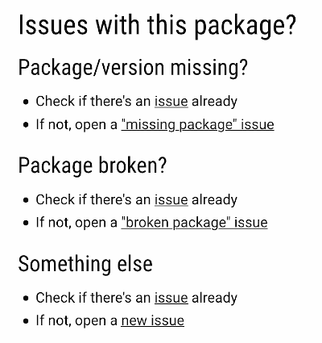
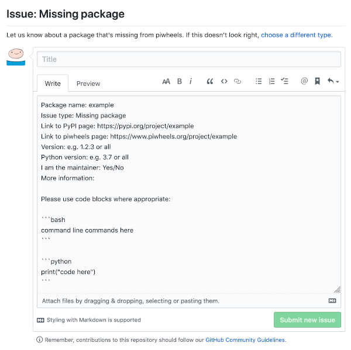

piwheels is an automated system which attempts to build every version of every package on PyPI on
all supported Raspbian versions (Jessie, Stretch and Buster). There's a whole
[codebase](https://github.com/piwheels/piwheels) and database to manage this process and it works
really well. Maintaining this is a reasonable job in itself, but another part of the process is to
identify failed builds, and try and fix them.

Fixing a missing package usually boils down to finding out which Debian package is required to build
it. For example, you can't install or build the latest version of
[scipy](https://www.piwheels.org/project/scipy/) without having
[`pybind11-dev`](https://packages.debian.org/buster/pybind11-dev) installed. Once we identify this,
we can install the package on the builders and it'll build successfully.

We don't automatically investigate every failed build, that would be an impossible task, and not
every failed build is fixable. For example a package that's made to work on Windows only will
obviously fail, and we don't need to fix it. Even if a failed build *could* be fixed, maybe it's
not worth the effort because nobody is using it. To put this in perspective, at the time of writing,
1,517,404 builds have succeeded, and 1,381,282 have failed. That's a 52% success rate.

**We rely on people reporting missing packages to us on GitHub**. Since package issues are separate
from issues with the codebase, we keep them in a separate repo. The codebase lives at
**[piwheels/piwheels](https://github.com/piwheels/piwheels)** and the package issues are at
[**piwheels/packages**](https://github.com/piwheels/packages).

We provide links on each package's [project page](https://www.piwheels.org/project/numpy/) to
create a GitHub issue if they find a missing package:

<figure class="block-image">
<a href="https://www.piwheels.org/project/numpy/"></a>
</figure>

We provide issue templates for people to fill out, to give us all the information we need:

<figure class="block-image">
<a href="https://github.com/piwheels/packages/issues/new/choose"></a>
</figure>

But most people don't fill these out, which is really unhelpful.

When a user reports a missing package, we investigate the cause of failure. It's really helpful to
have the links to the piwheels page and the PyPI page handy. Investigation involves looking in the
database to see the output from the build attempt, which is what you'd see if you ran "pip
install" yourself on a Pi and it failed. **Most people don't know this, but error messages usually
contain information to help you fix the error.** I know, right?

Build output is usually full of garbage from the compiler. We scroll through the output looking for
the point of failure, which usually ends up being something like:

```
2020-01-17T16:10:26   scipy/fft/_pocketfft/pypocketfft.cxx:15:10: fatal error: pybind11/pybind11.h: No such file or directory
2020-01-17T16:10:26    #include 
2020-01-17T16:10:26             ^~~~~
2020-01-17T16:10:26   compilation terminated.
```

The key part being fatal error: `pybind11/pybind11.h`

Googling this error will show that the system is missing the
[`pybind11-dev`](https://packages.debian.org/buster/pybind11-dev) Debian package. Knowing that, we
can test this by installing the package on a Pi, and seeing if `pip3 install <package>` or
`pip3 wheel <package>` work.

Once we have a solution, we can install this package on the builders and kick off new builds, which
should then yield successful builds, and the issue can be closed.

Unfortunately, finding the time to investigate issues like this is the hard part. piwheels is a
2-person project, and we both have day jobs.

## Hold the source

One reason a package might fail to build on Raspberry Pi is that there's no source distribution
available on PyPI. Projects like [tensorflow](https://pypi.org/project/tensorflow/) don't provide
source (zip or tarball) — only binary distributions (wheels) for all the platforms they support.
This means there's nothing for piwheels to build from, and this isn't fixable unless they upload a
source distribution or send Raspberry Pi wheels directly to us. We manually import wheels for
[tensorflow](https://piwheels.org/project/tensorflow/) and
[opencv](https://piwheels.org/project/opencv-python), and we don't plan to extend this much further
— these packages are an exception.

## Try it yourself

If you want to try and help, you can pick an issue and try building the package. If it fails:

- Read the output and figure out the point of failure
- See if you can find out which Debian package provides the library needed
- Install this package on [Raspbian Lite](https://www.raspberrypi.org/downloads/raspbian/) on a
    Raspberry Pi at home (or a [Mythic Beasts Cloud Pi](https://www.mythic-beasts.com/order/rpi))
- Try to build the wheel with `pip3 wheel <package>`
- If it succeeds, let us know by replying to the GitHub issue
- If it fails, repeat the above

We're working on being able to provide access to failed build logs publicly, but they're not
available yet.

Take a look at the [existing issues](https://github.com/piwheels/packages/issues) on GitHub, and use
the labels and the [project board](https://github.com/piwheels/packages/projects/1) to find your way
around if necessary.

## Summary — how can you help?

- If you find a missing package, open an issue and complete the issue template.
- If you see a missing package issue, you can help by trying to build it yourself, and try to
    identify the cause of the failure. Report your findings to us by replying to the GitHub issue.
- If you want to seek out missing packages, refer to the [project
    board](https://github.com/piwheels/packages/projects/1) or [issue
    list](https://github.com/piwheels/packages/issues).

*Just as I was about to publish this article, someone posted a missing package issue. I looked at
the output log in the database, identified the missing dependency, installed it, tested building a
wheel, and it worked. [Issue #91](https://github.com/piwheels/packages/issues/91) closed in a matter
of minutes.*
