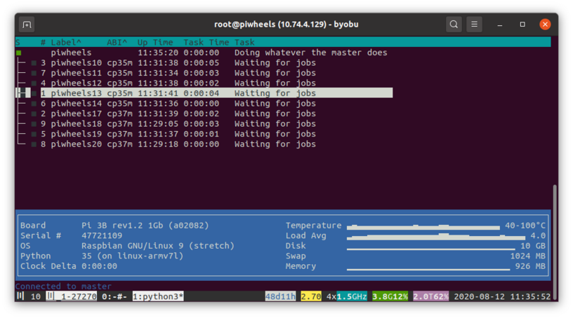

First of all, I should say a big thanks to our hosts Mythic Beasts for their continued support. They recently rolled out Pi 4s to their hosted Pi platform, and we've upgraded our main host – the one hosting piwheels.org – from a 3B running Jessie to a (4GB) 4B running Buster, and it has a 2TB disk allocation which is enough (for now) to host all our wheels.

Secondly, a reminder that we have now stopped building wheels for the cp34m ABI (Python 3.4 on Jessie) as it's <a href="https://blog.piwheels.org/debian-jessie-eol/">EOL</a>. The old files are still available, we're just not building any new ones.

Anyway – on to what's new.

<h2 class="wp-block-heading">Deletion</h2>

It's possible to delete packages on PyPI; it's possible to delete individual versions; it's possible to register a new package that was previously deleted (whether you owned it or not); it's possible to then release versions which may or may not have previously existed; and it's possible to release versions with a lower version number than existed before. It's also possible to register a new package with a unique name, which has the same canonicalized name (e.g. <code>Package-Name</code> == <code>package.name</code>) as a package that was previously deleted. These possibilities and more mean that honouring deletion is <em>complicated</em>.

The way piwheels works is we run through PyPI's historical logs. These include every package registration, version release, file upload, deletion and so on. We try to create our own version of the truth from these logs. So if – as far as we can tell – a package exists, has versions, and the versions have source files uploaded, we try and build it. If – as far as we know – a package or version was deleted, we don't. Occasionally someone will notice we're hosting a file for a version which has since been deleted, or that we're not building for a package which (as far as they can tell) hasn't been deleted from PyPI, but the PyPI log says it was. We can usually quickly work out what went on, and alter the database accordingly (delete files or un-skip a series of builds).

It would be relatively easy to maintain deletions by following the PyPI logs directly, except for two things:

<ul class="wp-block-list"><li> the piwheels system is essentially asynchronous, leaving the door wide open for race conditions to make things <em>go wrong</em></li><li>the first 8 years or so of the PyPI history is in <em>the wrong order</em></li></ul>

PyPI's xmlrpc service is based on every event having a serial number, and the subsequent event has the next incremental serial number. So you'd expect the serial numbers for a package creation on 1 January, version creation on 2 January and package deletion on 3 January to appear in that order. But they don't.

Although the dates are correct, look at the order of events for the package <em>chai</em> as they appear (with ascending serial numbers):

<pre class="wp-block-preformatted">2011-11-08 19:13:53 # 256850: chai 0.1.18 new release
2011-11-08 21:49:04 # 256914: chai 0.1.19 new release
2011-11-04 14:20:29 # 258871: chai 0.1.17 new release
2011-11-03 23:07:19 # 259151: chai 0.1.16 new release
2011-03-02 01:30:02 # 264082: chai None create
2011-03-02 01:30:02 # 264084: chai 0.1.0 new release
...
2011-03-02 01:29:57 # 264426: chai None remove</pre>

So the 0.1.16 – 0.1.19 releases appear first (out of order), and then the package creation appears, back-dated to earlier in the year. So if you have some code which applies these events in the order received, you'd start by trying to add a version for a package that doesn't exist, maybe you'd create it anyway, then add a few more versions before being told the package has been created. Then a new version. Then deleted. But the deletion was timestamped a minute before its creation. And lots more back-and-forth follows.

With a seemingly functional implementation of deletion I put together, testing from the start of the PyPI logs caused it to fall over within minutes, because before the task for deleting a particular deleted package's files was reached, a new package with the same name had been created.

After a few iterations, we managed to get it working by buffering PyPI logs and reordering them before processing. We've now deleted all packages and versions which were historically deleted from PyPI which annoyingly includes a lot of <a href="https://github.com/piwheels/packages/issues/69">spam packages</a> like <code>1-8OO.385-4895_HP_Printer_Support_Helpdesk_Phone_Number</code> and <code>Kim-Kardashian-Hollywood-Hack-Cheats-tars-Cash-Energy-Genearator-Online-2018</code>.

<em>Unfortunately, more complication has arisen since we rolled out the deletion stuff, so we've more work to do. If you have any pip errors, or find missing versions or anything unusual, please <a href="https://github.com/piwheels/packages/issues">open an issue</a> and we'll look into it.</em>

<h2 class="wp-block-heading">Yanking</h2>
<figure class="wp-block-embed-twitter wp-block-embed is-type-rich is-provider-twitter">

https://twitter.com/di_codes/status/1253166894158417926

</figure>

Back in April, the PyPI team added support for <a href="https://www.python.org/dev/peps/pep-0592/">PEP-592</a> to warehouse (the new PyPI website). This means you can now "yank" a release from PyPI. Yank is a soft-deletion. So, for example, if v1.0.0 was released, then v1.0.1, then v1.0.1 was yanked:

<ul class="wp-block-list"><li><code>pip install package==1.0.1</code> would install v1.0.1 even though it's yanked</li><li><code>pip install package</code> would fall back to v1.0.0</li></ul>

So it doesn't break for users who pinned the version (like it would if it were deleted) but it also prevents users from getting a known flawed version.

Until now, piwheels didn't honour "yank". But now support has been added, we place the appropriate attribute in the simple index (so pip can see it) and added "yanked" badges to project pages. We also "pre-release" badges:

<figure class="aligncenter size-large"></figure>

<h2 class="wp-block-heading">apt dependencies</h2>

If you've ever experienced the pain of having to work out how to resolve the error <code>cannot open shared object file</code> after installing a Python module, you'll understand why this is a life-saver. Basically, it means that there are some missing libraries which are provided by apt packages. A while ago I wrote a <a href="https://blog.piwheels.org/how-to-work-out-the-missing-dependencies-for-a-python-package/">blog post</a> about the process you have to go through, and it still gets a ton of hits. Since then, we automated the process and started to show the apt dependencies on project pages, which is a huge help. In this release, we've added logic for subtracting the apt packages which are preinstalled on Raspberry Pi's Lite images from the set of dependencies, adding logic relating to the distro version for the ABI (i.e. cp37m is Buster) which were previously hard-coded (and Stretch only).

The one thing we have yet to do is make the apt dependencies available per file, not just for the latest released file. That's planned for the next release.

<h2 class="wp-block-heading">Logging searches</h2>

For a long time we've been logging every download, maintaining stats on which packages are popular, looking at trends over time, and analysing usage of Python versions, distro versions and so on. We recently started logging all searches – which means we see which packages are being requested, even if they don't result in a download (for example if they're pure Python, or the user is using a Python version we don't support – or just that we haven't successfully built a package). With this, we can get a better view on true popularity of all packages among Raspberry Pi users, and better analysis of version usage, including Python 2. We already see a significant proportion of Python 2 users downloading universal wheels, but obviously we didn't previously see what the overall usage was. Now we can:

<figure class="wp-block-image size-large"></figure>

See more findings in the <a href="https://blog.piwheels.org/piwheels-stats-2020q2/">2020Q2 stats post</a>.

<h2 class="wp-block-heading">Under the hood</h2>

Most of the work in this release has been under the hood. Dave had a few branches on the go, and he ended up merging them all into "<a href="https://github.com/piwheels/piwheels/pull/234">Dave's Stupid PR</a>" which included 74 commits (spanning over 12 months) and added over 7,000 lines. This resulted in some awesome status monitoring of the main piwheels server and all the builder Pis. We can now see graphs of each Pi's CPU temperature, load average, memory usage and disk usage. This makes it much easier to see when a Pi is suffering under the load of a particularly difficult package build.

<figure class="aligncenter size-large"><figcaption>Inspecting the main piwheels server</figcaption></figure>

<figure class="aligncenter size-large"><figcaption>Inspecting one of the (currently idle) builder Pis</figcaption></figure>

<h2 class="wp-block-heading">What next?</h2>
<ul class="wp-block-list"><li><a href="https://github.com/piwheels/piwheels/issues/198">Resolve deletion and canonicalisation issues</a></li><li><a href="https://github.com/piwheels/piwheels/issues/208">Implement Requires-Python</a></li><li><a href="https://github.com/piwheels/piwheels/issues/241">Project page layout improvements</a> (including per-file dependencies)</li><li><a href="https://github.com/piwheels/piwheels/issues/16">Project JSON API</a></li></ul>

Then we will start to work on <a href="https://blog.piwheels.org/raspberry-pi-os-64-bit-aarch64/">aarch64 support</a>.

