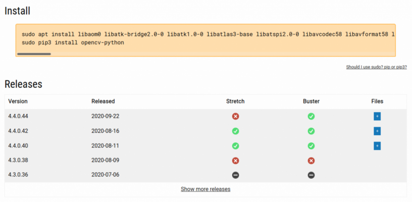

The maintainer of the opencv packages on PyPI recently started uploading source distributions, so we can now build them automatically the way we build everything else, instead of manually, offline, and importing the files (which takes ages and can be prone to <a href="https://github.com/piwheels/packages/issues/59">issues</a>). So now we have armv6 and armv7 wheels up to version 4.4.0.44 on Buster and 4.4.0.42 on Stretch:

<ul class="wp-block-list"><li><a href="https://www.piwheels.org/project/opencv-python">opencv-python</a></li><li><a href="https://www.piwheels.org/project/opencv-python-headless">opencv-python-headless</a></li></ul>
<figure class="wp-block-image size-large"></figure>

There's currently no source distribution provided for the contrib packages.

When you pip install an opencv package, you'll need various apt packages installed to provide make it work. These are now provided on the project pages linked above, and as of <a href="https://blog.piwheels.org/requires-python-support-new-project-page-layout-and-a-new-json-api/">recent upgrades</a>, you can now view dependencies per file for the first time (not just the latest one):

<figure class="wp-block-image size-large"></figure>
<h2 class="wp-block-heading">opencv-python</h2>

<strong>Buster:</strong>

<pre class="wp-block-preformatted">sudo apt install libaom0 libatk-bridge2.0-0 libatk1.0-0 libatlas3-base libatspi2.0-0 libavcodec58 libavformat58 libavutil56 libbluray2 libcairo-gobject2 libcairo2 libchromaprint1 libcodec2-0.8.1 libcroco3 libdatrie1 libdrm2 libepoxy0 libfontconfig1 libgdk-pixbuf2.0-0 libgfortran5 libgme0 libgraphite2-3 libgsm1 libgtk-3-0 libharfbuzz0b libilmbase23 libjbig0 libmp3lame0 libmpg123-0 libogg0 libopenexr23 libopenjp2-7 libopenmpt0 libopus0 libpango-1.0-0 libpangocairo-1.0-0 libpangoft2-1.0-0 libpixman-1-0 librsvg2-2 libshine3 libsnappy1v5 libsoxr0 libspeex1 libssh-gcrypt-4 libswresample3 libswscale5 libthai0 libtheora0 libtiff5 libtwolame0 libva-drm2 libva-x11-2 libva2 libvdpau1 libvorbis0a libvorbisenc2 libvorbisfile3 libvpx5 libwavpack1 libwayland-client0 libwayland-cursor0 libwayland-egl1 libwebp6 libwebpmux3 libx264-155 libx265-165 libxcb-render0 libxcb-shm0 libxcomposite1 libxcursor1 libxdamage1 libxfixes3 libxi6 libxinerama1 libxkbcommon0 libxrandr2 libxrender1 libxvidcore4 libzvbi0
sudo pip3 install opencv-python==4.4.0.44</pre>

<strong>Stretch:</strong>

<pre class="wp-block-preformatted" id="block-7c19f128-946e-451e-b976-dfe4be0368a2">sudo apt install libatk-bridge2.0-0 libatk1.0-0 libatlas3-base libatspi2.0-0 libavcodec57 libavformat57 libavresample3 libavutil55 libbluray1 libcairo-gobject2 libcairo2 libchromaprint1 libdatrie1 libepoxy0 libfontconfig1 libgdk-pixbuf2.0-0 libgfortran3 libgme0 libgraphite2-3 libgsm1 libgtk-3-0 libharfbuzz0b libilmbase12 libjbig0 libmp3lame0 libmpg123-0 libogg0 libopenexr22 libopenjp2-7 libopenmpt0 libopus0 libpango-1.0-0 libpangocairo-1.0-0 libpangoft2-1.0-0 libpixman-1-0 libshine3 libsnappy1v5 libsoxr0 libspeex1 libssh-gcrypt-4 libswresample2 libswscale4 libthai0 libtheora0 libtiff5 libtwolame0 libva-drm1 libva-x11-1 libva1 libvdpau1 libvorbis0a libvorbisenc2 libvorbisfile3 libvpx4 libwavpack1 libwebp6 libwebpmux2 libx264-148 libx265-95 libxcb-render0 libxcb-shm0 libxcomposite1 libxcursor1 libxdamage1 libxfixes3 libxi6 libxinerama1 libxrandr2 libxrender1 libxvidcore4 libzvbi0
sudo pip3 install opencv-python==4.4.0.42</pre>
<h3 class="wp-block-heading">opencv-python-headless</h3>

<strong>Buster:</strong>

<pre class="wp-block-preformatted">sudo apt install libaom0 libatlas3-base libavcodec58 libavformat58 libavutil56 libbluray2 libcairo2 libchromaprint1 libcodec2-0.8.1 libcroco3 libdatrie1 libdrm2 libfontconfig1 libgdk-pixbuf2.0-0 libgfortran5 libgme0 libgraphite2-3 libgsm1 libharfbuzz0b libilmbase23 libjbig0 libmp3lame0 libmpg123-0 libogg0 libopenexr23 libopenjp2-7 libopenmpt0 libopus0 libpango-1.0-0 libpangocairo-1.0-0 libpangoft2-1.0-0 libpixman-1-0 librsvg2-2 libshine3 libsnappy1v5 libsoxr0 libspeex1 libssh-gcrypt-4 libswresample3 libswscale5 libthai0 libtheora0 libtiff5 libtwolame0 libva-drm2 libva-x11-2 libva2 libvdpau1 libvorbis0a libvorbisenc2 libvorbisfile3 libvpx5 libwavpack1 libwebp6 libwebpmux3 libx264-155 libx265-165 libxcb-render0 libxcb-shm0 libxfixes3 libxrender1 libxvidcore4 libzvbi0
sudo pip3 install opencv-python-headless==4.4.0.44</pre>

<strong>Stretch:</strong>

<pre class="wp-block-preformatted" id="block-7a4f961b-a927-4c73-9988-12871bd6bc28">sudo apt install libatlas3-base libavcodec57 libavformat57 libavresample3 libavutil55 libbluray1 libcairo2 libchromaprint1 libfontconfig1 libgfortran3 libgme0 libgsm1 libilmbase12 libjbig0 libmp3lame0 libmpg123-0 libogg0 libopenexr22 libopenjp2-7 libopenmpt0 libopus0 libpixman-1-0 libshine3 libsnappy1v5 libsoxr0 libspeex1 libssh-gcrypt-4 libswresample2 libswscale4 libtheora0 libtiff5 libtwolame0 libva-drm1 libva-x11-1 libva1 libvdpau1 libvorbis0a libvorbisenc2 libvorbisfile3 libvpx4 libwavpack1 libwebp6 libwebpmux2 libx264-148 libx265-95 libxcb-render0 libxcb-shm0 libxfixes3 libxrender1 libxvidcore4 libzvbi0
sudo pip3 install opencv-python-headless==4.4.0.42</pre>

The <a href="https://blog.piwheels.org/requires-python-support-new-project-page-layout-and-a-new-json-api/">recent upgrades</a> I mentioned also included a <a href="https://www.piwheels.org/json.html">JSON API</a>. This seems like a good opportunity to show how the API can be useful (I used it to retrieve the apt dependencies for this blog post):

<pre class="wp-block-preformatted">import requests

def get_install(package, abi):
    url = 'https://piwheels.org/project/{}/json'.format(package)
    r = requests.get(url)
    data = r.json()
    for version, release in sorted(data['releases'].items(), reverse=True):
        for filename, file in release['files'].items():
            if abi in filename:
                deps = ' '.join(file['apt_dependencies'])
                print("sudo apt install {}".format(deps))
                print("sudo pip3 install {}=={}".format(package, version))
                return

get_install('opencv-python', 'cp37m')
get_install('opencv-python', 'cp35m')
get_install('opencv-python-headless', 'cp37m')
get_install('opencv-python-headless', 'cp35m')</pre>
