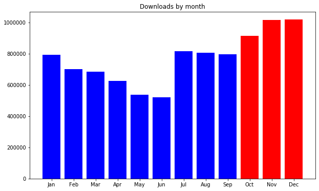
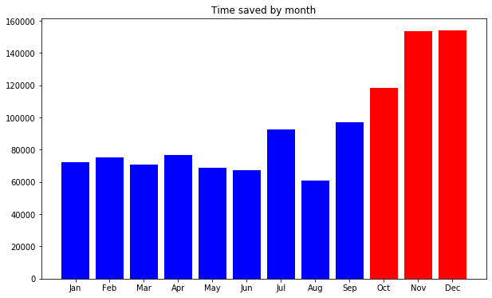
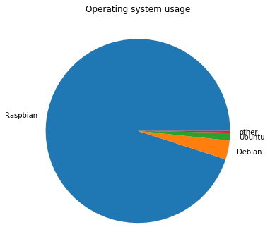
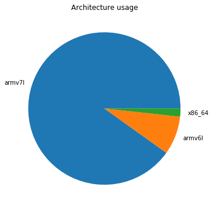
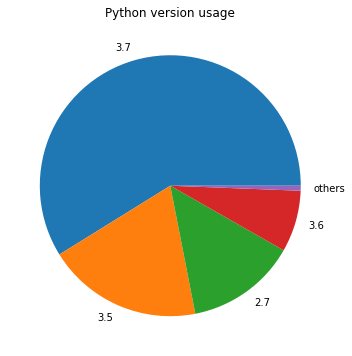

In the period of October – December 2019, <strong>2,945,938</strong> packages were downloaded from piwheels, bringing the total to <strong>14,745,528</strong>. This has saved <strong>49 years</strong> in the period, and <strong>172 years</strong> in total!

Each month had around a million downloads:

<figure class="aligncenter size-large"></figure>

which saved around between 13 and 18 years per month:

<figure class="aligncenter size-large"></figure>

<strong>4 December</strong> had the highest (ever) number of downloads with <strong>39,153</strong>.

The top 10 downloads were:

<ol class="wp-block-list"><li><strong><a href="https://www.piwheels.org/project/pycparser">pycparser</a></strong> (156,319)</li><li><strong><a href="https://www.piwheels.org/project/numpy">numpy</a></strong> (78,388)</li><li><strong><a href="https://www.piwheels.org/project/PyYAML">PyYAML</a></strong> (64,732)</li><li><strong><a href="https://www.piwheels.org/project/cffi">cffi</a></strong> (59,786)</li><li><strong><a href="https://www.piwheels.org/project/cryptography">cryptography</a></strong> (49,101)</li><li><strong><a href="https://www.piwheels.org/project/opencv-python">opencv-python</a></strong> (47,531)</li><li><strong><a href="https://www.piwheels.org/project/paho-mqtt">paho-mqtt</a></strong> (46,780)</li><li><strong><a href="https://www.piwheels.org/project/future">future</a></strong> (43,206)</li><li><strong><a href="https://www.piwheels.org/project/MarkupSafe">MarkupSafe</a></strong> (42,008)</li><li><strong><a href="https://www.piwheels.org/project/tensorflow">tensorflow</a></strong> (41,725)</li></ol>

Raspbian still dominates usage with over 95%:

<figure class="aligncenter size-large"></figure>

armv7l (Pi 2/3/4 platform) is still a majority architecture with over 90% usage, with armv6l (Pi 1/Zero) taking just 8.2%. The combined Arm architecture takes over 98% of all usage:

<figure class="aligncenter size-large"></figure>

Python version usage changes more over time. Since Raspbian Buster was released, Python 3.7 usage quickly overtook Python 3.5:

<figure class="aligncenter size-large"></figure>

This was the busiest period for piwheels so far. We're now seeing 30k+ download days almost every day, and kept up a 1 million downloads in a 30 day period for several weeks leading up to Christmas day, where it dipped slightly. I'm sure we'll see a continuation of this in January. The new record of 39k downloads in a single day shows we're likely to break to 40k mark before too long, and if trends continue we might see this become a new regular daily number.

