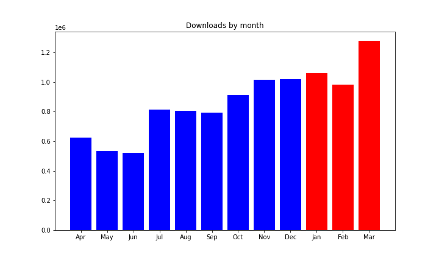
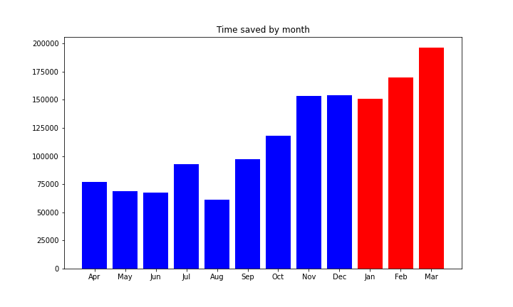
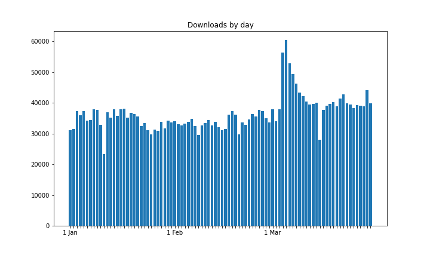
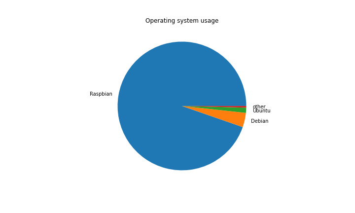
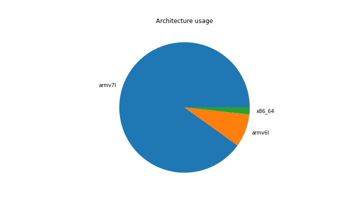
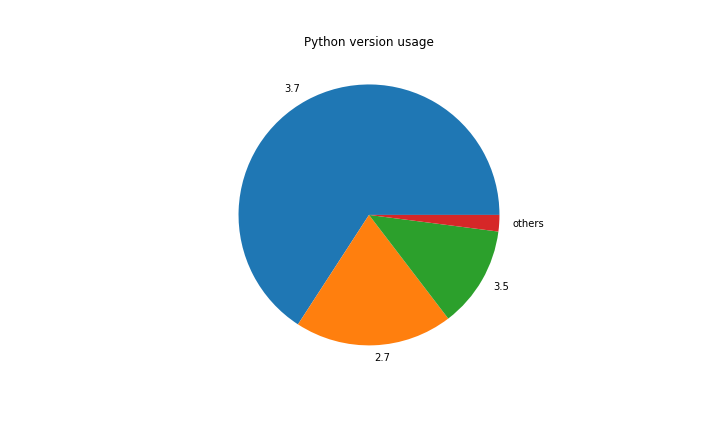
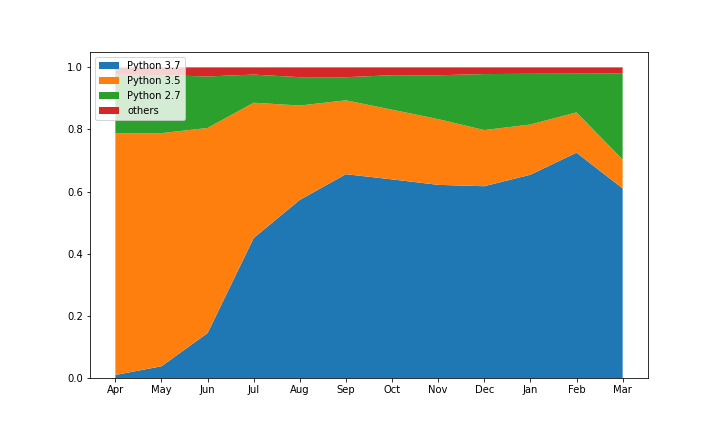

In the period of January — March 2020, **3,317,443** packages were downloaded from piwheels,
bringing the total to **18,062,971**. This has saved nearly **60 years** in the period, and **232
years** in total! This was in no small part to *[The mysterious case of the unexplained downloads
spike](https://blog.piwheels.org/the-mysterious-case-of-the-unexplained-downloads-spike/)* which
turned out to be an upgrade pushed to [octoprint](https://octoprint.org/) users.

Each month had around **1.1 million** downloads:

<figure class="aligncenter size-large">

</figure>

which saved around between **17** and **22 years** per month:

<figure class="aligncenter size-large">

</figure>

**March** had the highest number of downloads ever with **1,276,799**. The highest day was **5
March** with a whopping **60,324**. This was the second day of the spike caused by octoprint. The
next two weeks dropped steadily each day, but left regular daily downloads around 40k, which is
5-10k greater than usual.

<figure class="aligncenter size-large">

</figure>

The top 10 downloads were:

1.  **[pycparser](https://www.piwheels.org/project/pycparser)** (147,532)
2.  **[Flask-Login](https://www.piwheels.org/project/Flask-Login)** (98,382) \*
3.  **[numpy](https://www.piwheels.org/project/numpy)** (83,633)
4.  **[zope.component](https://www.piwheels.org/project/zope.component)** (81,875)
5.  **[PyYAML](https://www.piwheels.org/project/PyYAML)** (75,123)
6.  **[cffi](https://www.piwheels.org/project/cffi)** (62,605)
7.  **[opencv-python](https://www.piwheels.org/project/opencv-python)** (52,953)
8.  **[Markdown](https://www.piwheels.org/project/Markdown)** (52,203) \*
9.  **[sentry-sdk](https://www.piwheels.org/project/sentry-sdk)** (50,927) \*
10. **[semantic-version](https://www.piwheels.org/project/semantic-version)** (50,236) \*

*\* Note that Flask-Login, Markdown, sentry-sdk and semantic version are all dependencies of the
octoprint project upgrade which caused the [massive
spike](https://blog.piwheels.org/the-mysterious-case-of-the-unexplained-downloads-spike/).*

In March alone, these four packages topped the bill, leaving pycparser trailing:

1.  **Flask-Login** (94,457)
2.  **Markdown** (49,957)
3.  **semantic-version** (49,314)
4.  **sentry-sdk** (49,269)
5.  **pycparser** (32,167)

It's still unexplained why Flask-Login got nearly double the downloads of the other two packages.

Raspbian still dominates usage with almost 95%:

<figure class="aligncenter size-large">

</figure>

armv7l (Pi 2/3/4 platform) is still a majority architecture with 89% usage, with armv6l (Pi 1/Zero)
taking just 8%. The combined Arm architecture takes over 97% of all usage:

<figure class="aligncenter size-large">

</figure>

Python version usage changes more over time. Since Raspbian Buster was released, Python 3.7 usage
quickly overtook Python 3.5:

<figure class="aligncenter size-large">

</figure>

Interestingly, there appears to have been a spike in usage of Python 2.7. However this is purely
down to the octoprint upgrades. The four packages affected are universal Python wheels, so they work
with 2 and 3.

<figure class="wp-block-image size-large">

</figure>

This was the busiest period for piwheels so far. The month of March was by a long way the biggest
month. We saw a spike which broke all previous records by far. It's been really interesting to see
just one kind of Raspberry Pi use (octoprint) cause such a significant growth spurt.
