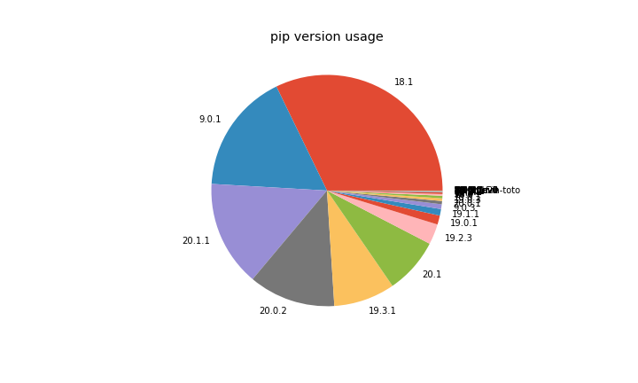

In the period of April — June 2020, **3,631,509** packages were downloaded from piwheels, bringing
the total to **21,694,480**. This has saved **71 years** in the period, and **303 years** in total!
We also started logging searches, regardless of whether the search resulted in a download, which
gives us more insight into which packages are requested, and which distro versions and Python
versions are being used. There were **32,033,978** searches in the period.

Each month had around **1.1 million** downloads and **10 million** searches!

**May** had the highest number of downloads with **1,271,663**, slightly fewer than the peak in
March:

<figure class="wp-block-image size-large">

</figure>

<figure class="wp-block-image size-large">

</figure>

<figure class="wp-block-image size-large">

</figure>

Downloads saved around between **21** and **25** years per month:

<figure class="wp-block-image size-large">

</figure>

The top 10 downloads were:

1.  **[Flask-Login](https://www.piwheels.org/project/Flask-Login/)** (130,830)
2.  **[PyYAML](https://www.piwheels.org/project/PyYAML/)** (94,638)
3.  **[Markdown](https://www.piwheels.org/project/Markdown/)** (93,945)
4.  **[semantic-version](https://www.piwheels.org/project/semantic-version/)** (93,309)
5.  **[sentry-sdk](https://www.piwheels.org/project/sentry-sdk/)** (93,164)
6.  **[cffi](https://www.piwheels.org/project/cffi/)** (86,801)
7.  **[pycparser](https://www.piwheels.org/project/pycparser/)** (81,878)
8.  **[numpy](https://www.piwheels.org/project/numpy/)** (81,279)
9.  **[zope.component](https://www.piwheels.org/project/zope.component/)** (74,446)
10. **[cryptography](https://www.piwheels.org/project/cryptography/)** (57,608)

The top 10 searches were:

1.  **[pip](https://www.piwheels.org/project/pip/)** (2,583,198)
2.  **[setuptools](https://www.piwheels.org/project/setuptools/)** (896,893)
3.  **[wheel](https://www.piwheels.org/project/wheel/)** (759,387)
4.  **[requests](https://www.piwheels.org/project/requests/)** (541,003)
5.  **[youtube-dl](https://www.piwheels.org/project/youtube-dl/)** (502,525)
6.  **[certifi](https://www.piwheels.org/project/certifi/)** (494,112)
7.  **[urllib3](https://www.piwheels.org/project/urllib3/)** (476,375)
8.  **[six](https://www.piwheels.org/project/six/)** (431,755)
9.  **[idna](https://www.piwheels.org/project/idna/)** (362,577)
10. **[pytz](https://www.piwheels.org/project/pytz/)** (350,693)

The following data is usually compiled from downloads, but it's more accurate to use searches, so
I'll be using searches from now on.

Linux makes up 99.7% of all searches so I've discounted the rest. Raspbian still dominates usage
with over 95%, although in June, Raspberry Pi renamed their own distribution, and it now identifies
as "Debian", so from next quarter on, I'll group Debian and Raspbian together. Debian usage is
obviously rising as more people use the latest image, and Ubuntu remains in third place with under
2%.

<figure class="aligncenter size-large">

</figure>

armv7l (Pi 2/3/4 platform) is still a majority architecture with 92% of searches from Arm devices,
with armv6l (Pi 1/Zero) taking under 7%. Raspberry Pi recently released a beta of a 64-bit version
of the official OS, so that's bound to grow in usage from now on. It's currently at almost 1%, and
those users are currently not served by piwheels as we don't build aarch64 platform wheels.

<figure class="aligncenter size-large">

</figure>

For the first time we're able to see the true Python 2 usage stats, since previously reported usage
was heavily skewed to Python 3 due to being based on downloads. Luckily, Python 3 has a reasonable
majority, and 3.7 (the version provided by the current stable distro) has the highest share with
51%. Python 2.7 comes second with 35%, followed by 3.5 (from oldstable), 3.8 and 3.6. Fortunately,
Python 3.4 (in Jessie, now EOL) has an insignificant usage, but it's a shame there's still so much
Python 2 usage.

<figure class="aligncenter size-large">

</figure>

We're now also logging pip and setuptools versions:

<figure class="wp-block-image size-large">

</figure>

Note that 18.1 is pre-installed in Buster, and 9.0.1 is pre-installed in Stretch. 20.1.1 is a
recently released version, so likely the most common for people who update their pip.

<figure class="wp-block-image size-large">

</figure>

Similarly, setuptools 40.8.0 is what's pre-installed in Buster, but the version of pip in Stretch
doesn't send the setuptools version (33.1.1) in the user agent like it does in newer versions.
