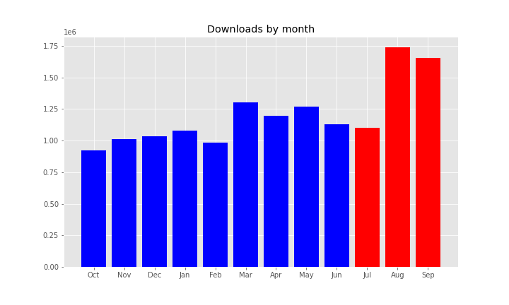
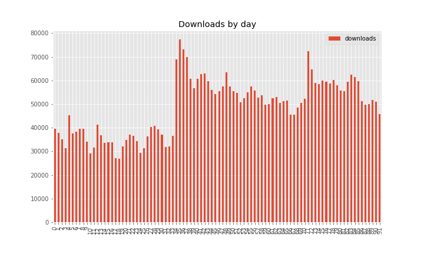
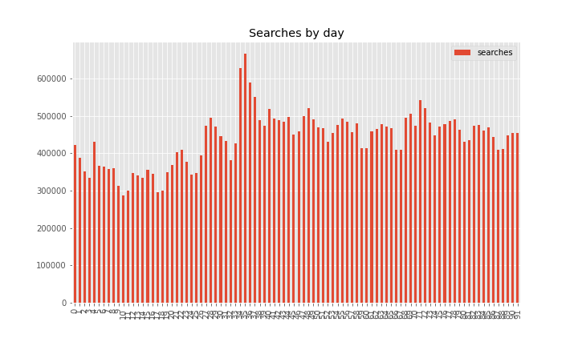
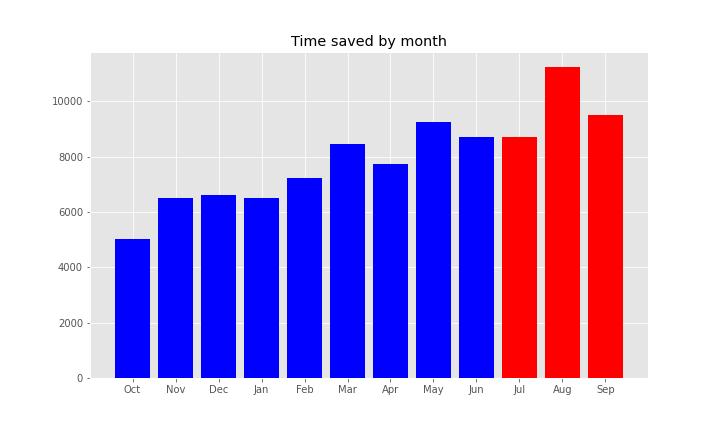
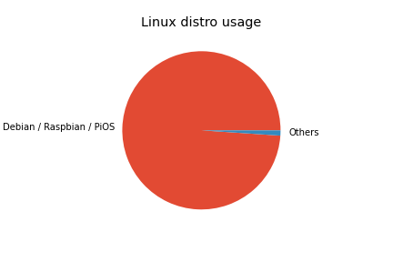
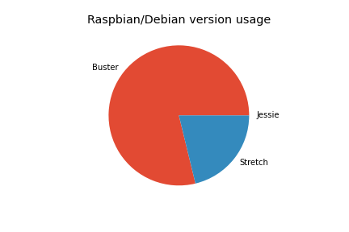
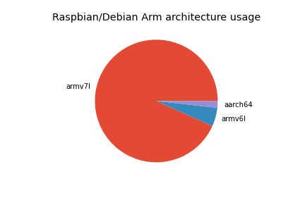
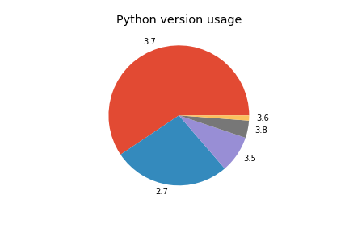
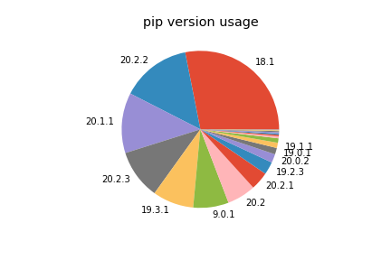
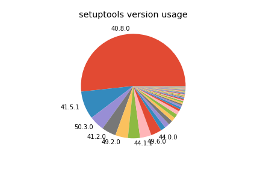

In the period of July — September 2020, **4,492,796** packages were downloaded from piwheels,
bringing the total to **26,171,957**. This has saved **80 years** in the period, and **384 years**
in total! There were **40,435,591** pip searches, **597,675** project page hits and **332,517** web
page hits in the period.

**August** had the highest number of downloads (ever) with **1,737,186**:

<figure class="block-image is-resized">

</figure>

There was a sharp and largely sustained rise in downloads in early August, which seemed to be
fuelled [again](https://blog.piwheels.org/the-mysterious-case-of-the-unexplained-downloads-spike/)
by an OctoPrint upgrade. Downloads jumped from **36,444** on 3 August to a new all-time record of
**77,267** on 5 August:

<figure class="block-image">

</figure>

<figure class="block-image">

</figure>

Downloads saved around between **23** and **30** years per month:

<figure class="block-image">

</figure>

The top 10 downloads were:

1.  **[numpy](https://www.piwheels.org/project/numpy)** (551,732)
2.  **[dogpile-cache](https://www.piwheels.org/project/dogpile-cache)** (388,880)
3.  **[sentry-sdk](https://www.piwheels.org/project/sentry-sdk)** (125,560)
4.  **[requests](https://www.piwheels.org/project/requests)** (106,192)
5.  **[octoprint-firmwarecheck](https://www.piwheels.org/project/octoprint-firmwarecheck)**
    (102,182)
6.  **[filetype](https://www.piwheels.org/project/filetype)** (101,755)
7.  **[semantic-version](https://www.piwheels.org/project/semantic-version)** (94,750)
8.  **[pyyaml](https://www.piwheels.org/project/pyyaml)** (92,459)
9.  **[cython](https://www.piwheels.org/project/cython)** (74,871)
10. **[markdown](https://www.piwheels.org/project/markdown)** (67,303)

numpy is now the second package to surpass 1 million downloads, after pycparser. Incredibly, more
than half of those were in the last three months!

The top 10 pip searches were:

1.  **[pip](https://www.piwheels.org/project/pip)** (5,540,997)
2.  **[wheel](https://www.piwheels.org/project/wheel)** (3,418,343)
3.  **[setuptools](https://www.piwheels.org/project/setuptools)** (1,900,293)
4.  **[numpy](https://www.piwheels.org/project/numpy)** (899,174)
5.  **[pyrogram](https://www.piwheels.org/project/pyrogram)** (700,198)
6.  **[youtube-dl](https://www.piwheels.org/project/youtube-dl)** (610,228)
7.  **[requests](https://www.piwheels.org/project/requests)** (585,098)
8.  **[certifi](https://www.piwheels.org/project/certifi)** (430,260)
9.  **[six](https://www.piwheels.org/project/six)** (408,890)
10. **[urllib3](https://www.piwheels.org/project/urllib3)** (400,772)

The top 10 project page hits were:

1.  **[opencv-python](https://www.piwheels.org/project/opencv-python)** (2,524)
2.  **[opencv-contrib-python](https://www.piwheels.org/project/opencv-contrib-python)** (1,259)
3.  **[numpy](https://www.piwheels.org/project/numpy)** (1,217)
4.  **[scipy](https://www.piwheels.org/project/scipy)** (1,080)
5.  **[tensorflow](https://www.piwheels.org/project/tensorflow)** (1,004)
6.  **[pip](https://www.piwheels.org/project/pip)** (645)
7.  **[opencv-python-headless](https://www.piwheels.org/project/opencv-python-headless)** (430)
8.  **[pillow](https://www.piwheels.org/project/pillow)** (429)
9.  **[grpcio](https://www.piwheels.org/project/grpcio)** (412)
10. **[pandas](https://www.piwheels.org/project/pandas)** (318)

We just
[released](https://blog.piwheels.org/requires-python-support-new-project-page-layout-and-a-new-json-api/)
a new [JSON API](https://www.piwheels.org/json.html) a few days before the end of the quarter, so
there are no interesting figures for that yet, but it'll be interesting to see how that picks up.
The most hit projects so far have been numpy and scipy, but it's very early days.

Linux makes up 99.9% of all searches so I've discounted the rest. Raspbian / Raspberry Pi OS and
Debian are now combined (due to Raspberry Pi OS identifying itself as Debian). This group obviously
dominates with over 95%. Ubuntu remains in third place with under 2%, although we don't officially
support it.

<figure class="block-image is-resized">

</figure>

Buster accounts for 79% of Raspbian/Debian usage, Stretch accounts for 21% and there's practically
no Jessie usage:

<figure class="block-image">

</figure>

armv7l (Pi 2/3/4 platform) is still a majority architecture with 93% of searches from Arm devices,
with armv6l (Pi 1/Zero) taking under 5%. Raspberry Pi recently released a beta of a 64-bit version
of the official OS, so that's bound to grow in usage from now on. It's currently under 2%, and
those users are currently not served by piwheels as we don't build aarch64 platform wheels.

<figure class="block-image">

</figure>

Python 3 has a reasonable majority of usage, and 3.7 (the version provided by the current stable
distro) has the highest share with 51%. Python 2.7 comes second with 35%, followed by 3.5 (from
oldstable), 3.8 and 3.6. Fortunately, Python 3.4 (in Jessie, now EOL) has an insignificant usage,
but it's a shame there's still so much Python 2 usage.

<figure class="block-image">

</figure>

We're now also logging pip and setuptools versions:

<figure class="block-image">

</figure>

Note that 18.1 is pre-installed in Buster, and 9.0.1 is pre-installed in Stretch. 20.1.1 is a
recently released version, so likely the most common for people who update their pip.

<figure class="block-image">

</figure>

Similarly, setuptools 40.8.0 is what's pre-installed in Buster, but the version of pip in Stretch
doesn't send the setuptools version (33.1.1) in the user agent like it does in newer versions.

Check out the source of this post in a Jupyter notebook:
[github.com/piwheels/stats/blob/master/2020q3.ipynb](https://github.com/piwheels/stats/blob/master/2020q3.ipynb)
