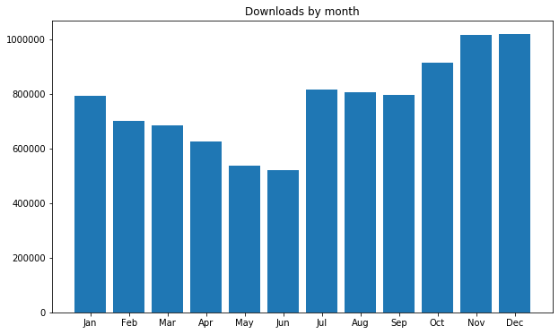
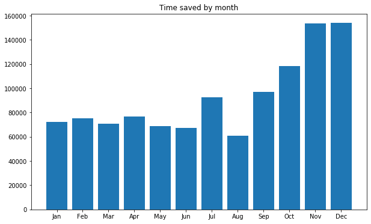
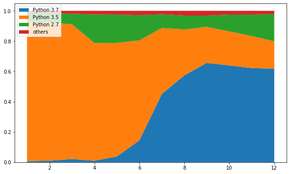
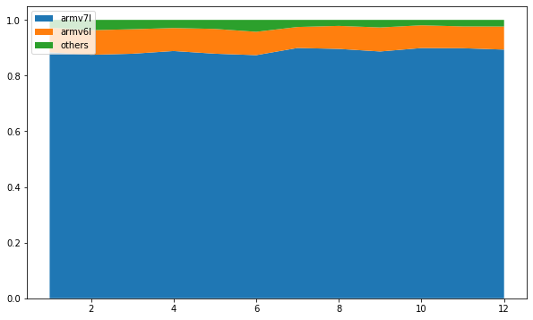
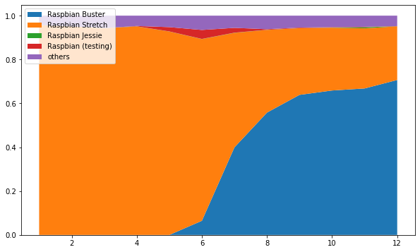

In 2019, a total of <strong>9,218,822</strong> packages were downloaded, taking the total to <strong>14,745,528</strong>. This saved <strong>128 years 5 months</strong> during 2019, taking us to over <strong>172 years</strong> saved overall. <strong>37TB</strong> of files were downloaded, taking the total to <strong>51TB</strong>.

<ul class="wp-block-list"><li>Average daily downloads:<ul><li>2018: <strong>14,519</strong></li><li>2019: <strong>25,257</strong></li></ul></li><li>Average monthly downloads:<ul><li>2018: <strong>429,519</strong></li><li>2019: <strong>768,235</strong></li></ul></li><li>Most downloads in one day:<ul><li>2018: <strong>25,389</strong> on 30 November</li><li>2019: <strong>39,153</strong> on 4 December</li></ul></li><li>Most downloads in one month:<ul><li>2018: <strong>662,621</strong> in December (<strong>21,445</strong> daily average)</li><li>2019: <strong>1,017,563</strong> in December (<strong>32,824</strong> daily average) / <strong>1,014,577</strong> in November (<strong>33,819</strong> daily average)</li></ul></li><li>Bandwidth used from downloads:<ul><li>2018: <strong>12TB</strong></li><li>2019: <strong>37TB</strong></li></ul></li></ul>

Each month had over <strong>500,000</strong> downloads, reaching over <strong>1 million</strong> in November and December:

<figure class="aligncenter size-large"></figure>

Each month saved over 7 years, topping out at 17 years:

<figure class="aligncenter size-large"></figure>

<ul class="wp-block-list"><li>4 December 2019 was the biggest day on record, with <strong>39,153</strong> downloads.</li><li>The month of December recorded the most downloads at <strong>1,017,563</strong> (November had more on average due to Christmas days being lower, but December is a 31 day month).</li><li>December also saw the most time saved with <strong>17 years 9 months 24 days</strong> (again, November had more on average).</li></ul>
<h2 class="wp-block-heading">Top 30 packages</h2>
<ol class="wp-block-list"><li> <strong><a href="https://www.piwheels.org/project/pycparser">pycparser</a></strong> (629,037)</li><li> <strong><a href="https://www.piwheels.org/project/numpy">numpy</a></strong> (230,086)</li><li> <strong><a href="https://www.piwheels.org/project/PyYAML">PyYAML</a></strong> (208,477)</li><li> <strong><a href="https://www.piwheels.org/project/cffi">cffi</a></strong> (190,941)</li><li> <strong><a href="https://www.piwheels.org/project/MarkupSafe">MarkupSafe</a></strong> (172,981)</li><li> <strong><a href="https://www.piwheels.org/project/tensorflow">tensorflow</a></strong> (170,210)</li><li> <strong><a href="https://www.piwheels.org/project/cryptography">cryptography</a></strong> (164,812)</li><li> <strong><a href="https://www.piwheels.org/project/future">future</a></strong> (162,354)</li><li> <strong><a href="https://www.piwheels.org/project/paho-mqtt">paho-mqtt</a></strong> (144,635)</li><li> <strong><a href="https://www.piwheels.org/project/aiohttp">aiohttp</a></strong> (136,185)</li><li> <strong><a href="https://www.piwheels.org/project/opencv-python">opencv-python</a></strong> (129,328)</li><li> <strong><a href="https://www.piwheels.org/project/multidict">multidict</a></strong> (116,325)</li><li> <strong><a href="https://www.piwheels.org/project/yarl">yarl</a></strong> (115,071)</li><li> <strong><a href="https://www.piwheels.org/project/RPi.GPIO">RPi.GPIO</a></strong> (114,513)</li><li> <strong><a href="https://www.piwheels.org/project/voluptuous-serialize">voluptuous-serialize</a></strong> (109,972)</li><li> <strong><a href="https://www.piwheels.org/project/SQLAlchemy">SQLAlchemy</a></strong> (109,169)</li><li> <strong><a href="https://www.piwheels.org/project/docopt">docopt</a></strong> (104,735)</li><li> <strong><a href="https://www.piwheels.org/project/home-assistant-frontend">home-assistant-frontend</a></strong> (102,820)</li><li> <strong><a href="https://www.piwheels.org/project/ruamel.yaml">ruamel.yaml</a></strong> (100,600)</li><li> <strong><a href="https://www.piwheels.org/project/ifaddr">ifaddr</a></strong> (100,573)</li><li> <strong><a href="https://www.piwheels.org/project/Adafruit-PureIO">Adafruit-PureIO</a></strong> (100,051)</li><li> <strong><a href="https://www.piwheels.org/project/python-slugify">python-slugify</a></strong> (99,183)</li><li> <strong><a href="https://www.piwheels.org/project/scipy">scipy</a></strong> (96,895)</li><li> <strong><a href="https://www.piwheels.org/project/gTTS-token">gTTS-token</a></strong> (85,083)</li><li> <strong><a href="https://www.piwheels.org/project/PyNaCl">PyNaCl</a></strong> (84,663)</li><li> <strong><a href="https://www.piwheels.org/project/mutagen">mutagen</a></strong> (82,714)</li><li> <strong><a href="https://www.piwheels.org/project/pycryptodome">pycryptodome</a></strong> (81,741)</li><li> <strong><a href="https://www.piwheels.org/project/spidev">spidev</a></strong> (81,037)</li><li> <strong><a href="https://www.piwheels.org/project/PyQRCode">PyQRCode</a></strong> (78,603)</li><li> <strong><a href="https://www.piwheels.org/project/sysv_ipc">sysv_ipc</a></strong> (77,846) </li></ol>
<h2 class="wp-block-heading">Python version usage</h2>

At the start of the year, most downloads were for Python 3.5 which is in Raspbian Stretch, but as soon as Buster was released, Python 3.7 began to take over:

<figure class="wp-block-image size-large"></figure>

There's a steady trickle of Python 2.7 downloads, but note that this does not fairly represent usage as we do not provide wheels for Python 2, so any downloads are for pure Python packages. There's also a small number of people using out-of-distribution Python versions 3.6 and 3.8 (the red section). We are barely seeing any Python 3.4 downloads, perhaps due to the fact Raspbian Jessie was never configured to use piwheels, and the pip in Jessie needs upgrading to be able to use it. 

<h2 class="wp-block-heading">Architectures</h2>

The Pi 2, 3 and 4 all identify as armv7l, whereas Pi 1 and Zero are armv6l. armv7l usage has always accounted a huge majority of downloads (88% in 2018), and it's pretty much stayed around that mark through 2019:

<figure class="wp-block-image size-large"></figure>
<h2 class="wp-block-heading">Operating systems</h2>

The vast majority of downloads are from Raspbian (over 90%). As observed with Python versions, much of the usage switched from Stretch to Buster after its release in July:

<figure class="wp-block-image size-large"></figure>

There was a noticeable bump of users reporting Raspbian (testing) before Buster was officially launched.

<h2 class="wp-block-heading">Downloads through the day</h2>

Our busiest hour is between 7pm-8pm. All afternoon/evening UTC we are at our busiest:

<figure class="wp-block-image size-large"></figure>
<h2 class="wp-block-heading">2020 vision</h2>

There's no Raspbian release scheduled this year, so we won't be introducing any new Python versions until Raspbian Bullseye arrives mid-2021.

We have been working on a few new features, including a JSON API which dynamically populates our project pages, and which you'll be able to use to programmatically find out info about what packages we provide. We have also made it possible to calculate apt dependencies for a wheel based on packages providing required shared object files, as described in a <a href="https://blog.piwheels.org/how-to-work-out-the-missing-dependencies-for-a-python-package/">previous post</a>, although it's not yet been calculated for older projects. Hopefully we'll get this sorted, and it being included in the project pages JSON API will make it even easier. We're working on deploying these changes very shortly!

If you're interested in following piwheels project updates, we tweet daily and monthly stats at <a href="https://twitter.com/piwheels">@piwheels</a>. You can also follow me <a href="https://twitter.com/ben_nuttall">@ben_nuttall</a> and Dave <a href="https://twitter.com/waveform80">@waveform80</a>.

<em>The piwheels project wouldn't be possible without considerable support from </em><a href="https://www.mythic-beasts.com/"><em>Mythic Beasts</em></a><em>, who provide storage and cloud Pis. The Pi platform is so straightforward, it's been a pleasure to use, allowing us to scale up builder Pis with ease. We highly recommend using this (very affordable) service for real </em><a href="https://www.mythic-beasts.com/order/rpi"><em>Pi testing</em></a><em> for your projects.</em>

