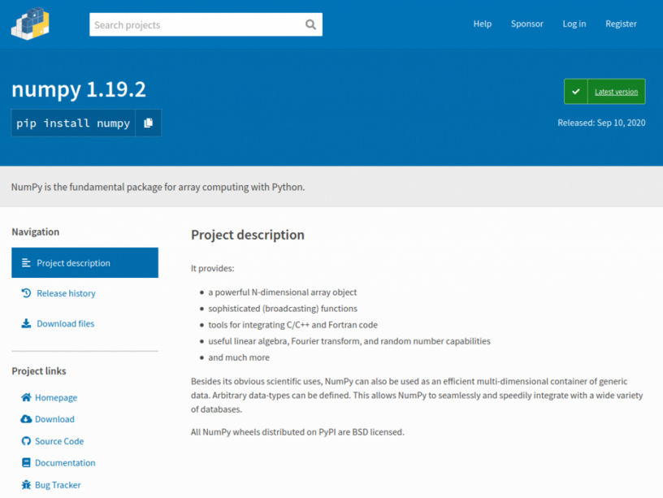

Some really important features have now been deployed to piwheels.org. We are pleased to announce the addition of support for the <code>Requires-Python</code> attribute specified in <a href="https://www.python.org/dev/peps/pep-0503/#id3">PEP-503</a> and <a href="https://www.python.org/dev/peps/pep-0345/#requires-python">PEP-345</a>; a new project page layout; and the launch of the <a href="https://www.piwheels.org/json.html">piwheels JSON API</a>.

<h2 class="wp-block-heading">Requires-Python</h2>

Pure Python wheels (ones which contain only Python code, with no compiled extensions) are tagged only with the major Python version(s) they support (i.e. <code>py2</code>, <code>py3</code> or <code>py2.py3</code>). Since they are not restricted to a particular Python ABI (like <code>cp37m</code>), there's no way of denoting the minimum Python version required in the wheel filename. Therefore, a metadata field is provided in the wheel metadata, specifying the Python version requirements. <a href="https://www.python.org/dev/peps/pep-0345/#id30">PEP-345</a> proposed adding this metadata field to the Simple Repository API so that pip can use this field (if provided in the simple index for the package) to identify compatible wheels, which could mean choosing an older version of the package which supports your version of Python rather than let you download a version you cannot use.

<figure class="wp-block-image size-large"></figure>

An example of this is a Python 3.5 user trying to use the latest version of a package which recently started using <a href="https://www.python.org/dev/peps/pep-0498/">f-strings</a> (which require Python 3.6 or above). Without piwheels support for Requires-Python, the user would be given the latest version, only to be told it's incompatible, leaving them to figure out the solution for themselves. Now, piwheels provides the Python version requirement for each wheel file, so that in this case, pip would identify the file of the newest version that supports Python 3.5.

<h2 class="wp-block-heading">New project pages</h2>

Project pages are not a requirement for a Python package repository, as they are not used by pip. They are intended for users to browse and read, rather than the simple index used by pip. Compare PyPI's <a href="https://pypi.org/simple/numpy/">simple index</a> for numpy with its <a href="https://pypi.org/project/numpy/">project page</a>; and similarly numpy's <a href="https://www.piwheels.org/simple/numpy/">simple index</a> and <a href="https://www.piwheels.org/project/numpy/">project page</a>.

<figure class="aligncenter size-large"><figcaption>PyPI's project page</figcaption></figure>

We added project pages a couple of years ago for parity with PyPI, and even copied the URL structure they started using when they launched the current platform <a href="https://github.com/pypa/warehouse/">warehouse</a>, i.e. <code>/project/</code>. We included the list of versions of a package, and then the list of wheel files we had built.

<figure class="aligncenter size-large"><figcaption>piwheels project page (old style)</figcaption></figure>

The new design combines files within versions, which are expandable. And for the first time, the apt dependencies of each file is available, so you can look up the system requirements for not just the latest version, but any past version on Jessie, Stretch or Buster.

<figure class="aligncenter size-large"><figcaption>piwheels project page (new style)</figcaption></figure>

Now, rather than show which ABI tag a file has (which is obtuse to many users), we show checkbox and cross icons under columns named "Stretch" and "Buster" relating to the Raspbian / Raspberry Pi OS distro names. We also show another icon to represent skipped builds, with the skip reason provided on hover.

You can also search the package issues from a single click using a client-side rendering of results which uses the GitHub API:

<figure class="aligncenter size-large"></figure>

We hope people will find the new project pages more understandable and more useful.

<h2 class="wp-block-heading">piwheels JSON API</h2>

PyPI provides a basic JSON API for packages – just a single JSON file per package containing information about the package, its releases and files. I wanted us to be able to provide something similar, but for the relevant information about which versions we'd built, which had failed, and things like the apt dependencies of files, so people could retrieve such information with code in a nice predictable way, without having to scrape the project page HTML. The old PyPI site used to provide the JSON simply at <code>/json</code> relative to the project page, and although that no longer matches their URL structure, we liked the idea that you could just stick <code>/json</code> on the end of the project page URL, so we followed suit.

I started working on this feature a year ago. I overcomplicated things and ended up abandoning the branch. But recently I picked up the idea again and managed to complete it, alongside the work focused on the new project pages.

<figure class="wp-block-image size-large"><figcaption>The piwheels JSON API</figcaption></figure>

The project pages now include a link to the project's JSON file, which can be found at <code>piwheels.org/project/&lt;package&gt;/json</code>. There's a <a href="https://www.piwheels.org/json.html">page</a> detailing the API structure which includes some code examples. Here's how you access the versions of the numpy package (using Python) and see which ones have successful builds in piwheels:

<pre class="wp-block-preformatted">import requests

url = "https://www.piwheels.org/project/numpy/json"
package = requests.get(url).json()

for version, info in package['releases'].items():
    if info['files']:
        print('{}: {} files'.format(version, len(info['files'])))
    else:
        print('{}: No files'.format(version))</pre>

The project JSON files don't contain download stats, but you can get these from the <code>packages.json</code> file. Read more about the API spec at <a href="https://www.piwheels.org/json.html">piwheels.org/json.html</a>.

We're really interested to see what kind of uses people find for the API, and hope it proves to be useful. If you want to share what you use it for, or have any questions, feel free to get in touch on <a href="https://twitter.com/piwheels">Twitter</a>.

