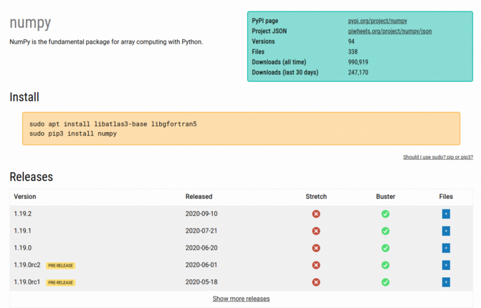

Some really important features have now been deployed to piwheels.org. We are pleased to announce
the addition of support for the `Requires-Python` attribute specified in
[PEP-503](https://www.python.org/dev/peps/pep-0503/#id3) and
[PEP-345](https://www.python.org/dev/peps/pep-0345/#requires-python); a new project page layout; and
the launch of the [piwheels JSON API](https://www.piwheels.org/json.html).

## Requires-Python

Pure Python wheels (ones which contain only Python code, with no compiled extensions) are tagged
only with the major Python version(s) they support (i.e. `py2`, `py3` or `py2.py3`). Since they are
not restricted to a particular Python ABI (like `cp37m`), there's no way of denoting the minimum
Python version required in the wheel filename. Therefore, a metadata field is provided in the wheel
metadata, specifying the Python version requirements.
[PEP-345](https://www.python.org/dev/peps/pep-0345/#id30) proposed adding this metadata field to the
Simple Repository API so that pip can use this field (if provided in the simple index for the
package) to identify compatible wheels, which could mean choosing an older version of the package
which supports your version of Python rather than let you download a version you cannot use.

<figure class="block-image">

</figure>

An example of this is a Python 3.5 user trying to use the latest version of a package which recently
started using [f-strings](https://www.python.org/dev/peps/pep-0498/) (which require Python 3.6 or
above). Without piwheels support for Requires-Python, the user would be given the latest version,
only to be told it's incompatible, leaving them to figure out the solution for themselves. Now,
piwheels provides the Python version requirement for each wheel file, so that in this case, pip
would identify the file of the newest version that supports Python 3.5.

## New project pages

Project pages are not a requirement for a Python package repository, as they are not used by pip.
They are intended for users to browse and read, rather than the simple index used by pip. Compare
PyPI's [simple index](https://pypi.org/simple/numpy/) for numpy with its [project
page](https://pypi.org/project/numpy/); and similarly numpy's [simple
index](https://www.piwheels.org/simple/numpy/) and [project
page](https://www.piwheels.org/project/numpy/).

<figure class="block-image">

<figcaption>PyPI's project page</figcaption>
</figure>

We added project pages a couple of years ago for parity with PyPI, and even copied the URL structure
they started using when they launched the current platform
[warehouse](https://github.com/pypa/warehouse/), i.e. `/project/`. We included the list of versions
of a package, and then the list of wheel files we had built.

<figure class="block-image">

<figcaption>piwheels project page (old style)</figcaption>
</figure>

The new design combines files within versions, which are expandable. And for the first time, the apt
dependencies of each file is available, so you can look up the system requirements for not just the
latest version, but any past version on Jessie, Stretch or Buster.

<figure class="block-image">

<figcaption>piwheels project page (new style)</figcaption>
</figure>

Now, rather than show which ABI tag a file has (which is obtuse to many users), we show checkbox and
cross icons under columns named "Stretch" and "Buster" relating to the Raspbian / Raspberry Pi
OS distro names. We also show another icon to represent skipped builds, with the skip reason
provided on hover.

You can also search the package issues from a single click using a client-side rendering of results
which uses the GitHub API:

<figure class="block-image">

</figure>

We hope people will find the new project pages more understandable and more useful.

## piwheels JSON API

PyPI provides a basic JSON API for packages — just a single JSON file per package containing
information about the package, its releases and files. I wanted us to be able to provide something
similar, but for the relevant information about which versions we'd built, which had failed, and
things like the apt dependencies of files, so people could retrieve such information with code in a
nice predictable way, without having to scrape the project page HTML. The old PyPI site used to
provide the JSON simply at `/json` relative to the project page, and although that no longer matches
their URL structure, we liked the idea that you could just stick `/json` on the end of the project
page URL, so we followed suit.

I started working on this feature a year ago. I overcomplicated things and ended up abandoning the
branch. But recently I picked up the idea again and managed to complete it, alongside the work
focused on the new project pages.

<figure class="block-image">

<figcaption>The piwheels JSON API</figcaption>
</figure>

The project pages now include a link to the project's JSON file, which can be found at
`piwheels.org/project/<package>/json`. There's a [page](https://www.piwheels.org/json.html)
detailing the API structure which includes some code examples. Here's how you access the versions
of the numpy package (using Python) and see which ones have successful builds in piwheels:

```python
import requests

url = "https://www.piwheels.org/project/numpy/json"
package = requests.get(url).json()

for version, info in package['releases'].items():
    if info['files']:
        print('{}: {} files'.format(version, len(info['files'])))
    else:
        print('{}: No files'.format(version))
```

The project JSON files don't contain download stats, but you can get these from the `packages.json`
file. Read more about the API spec at [piwheels.org/json.html](https://www.piwheels.org/json.html).

We're really interested to see what kind of uses people find for the API, and hope it proves to be
useful. If you want to share what you use it for, or have any questions, feel free to get in touch
on [Twitter](https://twitter.com/piwheels).
