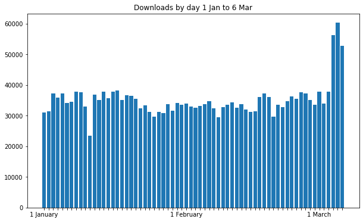
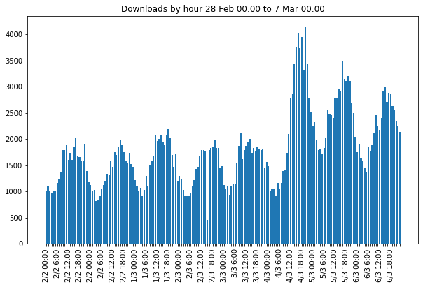
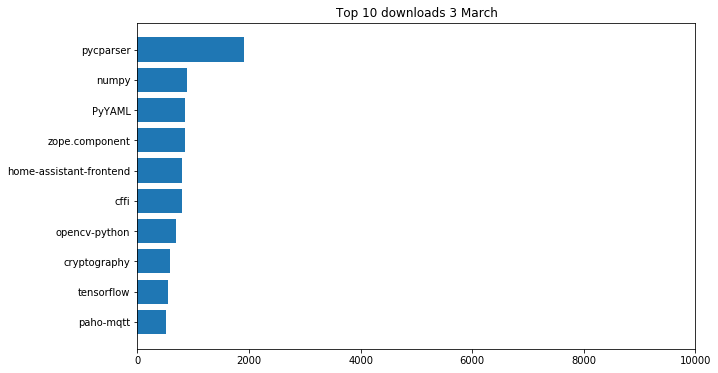
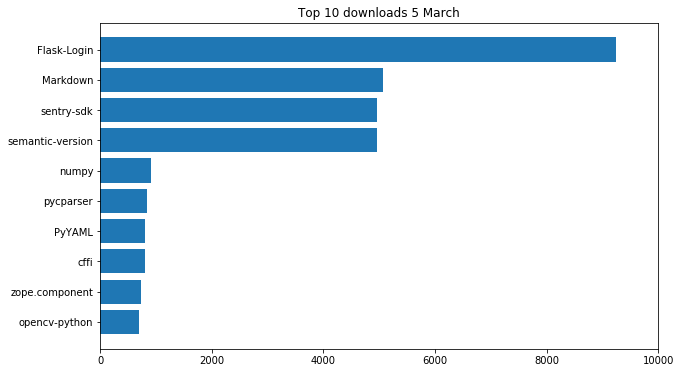
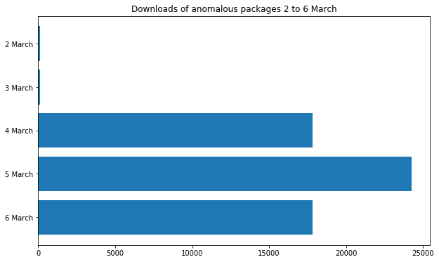
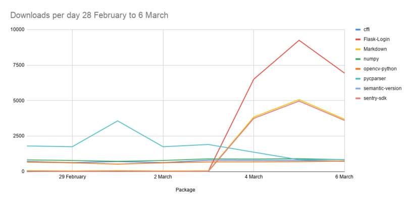
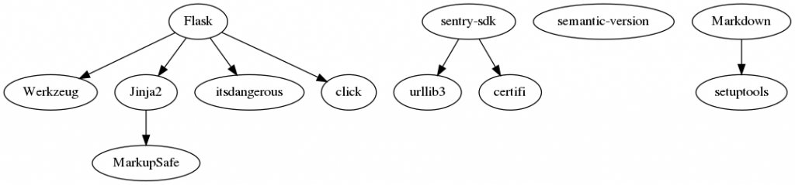

For several months, daily downloads have been fairly constant, and have shown slow and steady
growth. Throughout January and the end of February, the minimum was **23,383** and the maximum was
**38,139**. The highest ever was **39,153**.

All of a sudden, on 4 March, we got **56, 225** downloads, up 48% on the previous day, and up 43% on
the previous highest.

This continued rising. 5 March saw another new record of **60,324**. 6 March saw slightly less at
**52,879**.

<figure class="block-image">

</figure>

Broken down by the hour, you can see each day's bell curve, and the massive increase during those
three days:

<figure class="block-image">

</figure>

## What's being downloaded?

Looking at the top 10 most downloaded packages on 3 March, the day before the spike started, you can
see **pycparser** topped the bill with **1,908** downloads, followed by **numpy** with **896**:

<figure class="block-image">

</figure>

Here are the top 10 on 5 March, on the same scale:

<figure class="block-image">

</figure>

Unexpectedly, four packages appear at the top, overshadowing the usual suspects.
**[Flask-Login](https://www.piwheels.org/project/Flask-Login)**,
**[Markdown](https://www.piwheels.org/project/Markdown)**,
**[sentry-sdk](https://www.piwheels.org/project/sentry-sdk)** and
**[semantic-version](https://www.piwheels.org/project/semantic-version)**.

**Flask-Login** is seeing nearly double the other three, which are all about the same.

On 3 March the total number of downloads for these four packages combined was just **130**. Then
**24,256** on 5 March:

<figure class="block-image">

</figure>

Four of the most popular packages are **[pycparser](https://www.piwheels.org/project/pycparser/)**,
**[numpy](https://www.piwheels.org/project/numpy)**,
**[cffi](https://www.piwheels.org/project/cffi)** and
**[opencv-python](https://www.piwheels.org/project/opencv-python)**. Let's plot those against the
four spiking packages over the last week:

<figure class="block-image">

</figure>

## What about these packages?

- **Flask-Login**
    - Last release: 9 February 2020
    - Wheels on PyPI: yes (previous version didn't)
    - Dependencies: Flask
- **Markdown**
    - Last release: 12 February 2019
    - Wheels on PyPI: yes
    - Dependencies: setuptools
- **sentry-sdk**
    - Last release: 26 February 2020
    - Wheels on PyPI: yes
    - Dependencies: urllib3, certify
- **semantic-version**
    - Last release: 21 December 2019
    - Wheels on PyPI: yes
    - Dependencies: None

So do these packages account for the spike alone?

<figure class="block-image">

</figure>

It certainly seems so. Subtracting those four packages from the totals levels out the graph.

It's also notable that all these additional downloads were for Python 2. Since many pure Python
packages are "universal" wheels (Python 2 and 3 compatible), these wheels work for Python 2 users,
whereas compiled packages like numpy are Python 3 only.

## What about PyPI?

One oddity is that all of these packages are pure Python, so if they have wheels on PyPI, there's
no reason people wouldn't get them from there. They would have to explicitly set piwheels as the
main index, not just the additional index as per the Raspbian default.

## What about dependencies?

Here's a dependency graph I made with
**[pipdeptree](https://www.piwheels.org/project/pipdeptree/)** and
**[graphviz](https://www.graphviz.org/)**:

<figure class="block-image">

</figure>

Another oddity is that none of the dependency packages show up at all. **Flask** had just **16**
downloads on 5 March.

## Why?

We don't know.

It could be that the maintainers of a Raspberry Pi project (perhaps something like OSMC or RetroPiE)
just pushed an update to install or update these packages in particular, explicitly from piwheels,
but not their dependencies. Sentry indicates it could be something related to monitoring.

If you think you might know, let us know on Twitter! [@piwheels](https://twitter.com/piwheels)
[@ben_nuttall](https://twitter.com/ben_nuttall) [@waveform80](https://twitter.com/waveform80)

**Update: it seems the cause is [OctoPrint](https://octoprint.org/) — a web interface controller
for 3D printers. They pushed an [update](https://github.com/foosel/OctoPrint/releases/tag/1.4.0)
recently which included updates to these packages. There are still some unanswered questions like
why Flask-Login had double the number of requests, but hey!**
