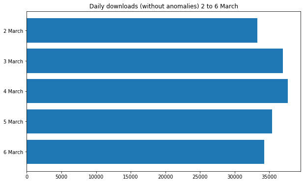
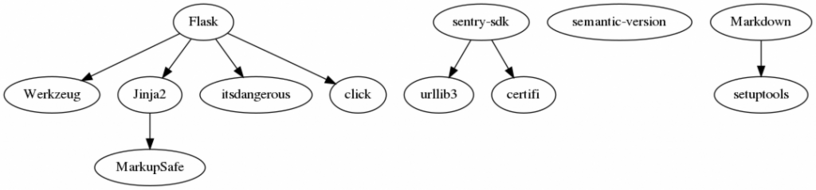

For several months, daily downloads have been fairly constant, and have shown slow and steady growth. Throughout January and the end of February, the minimum was <strong>23,383</strong> and the maximum was <strong>38,139</strong>. The highest ever was <strong>39,153</strong>.

All of a sudden, on 4 March, we got <strong>56, 225</strong> downloads, up 48% on the previous day, and up 43% on the previous highest.

This continued rising. 5 March saw another new record of <strong>60,324</strong>. 6 March saw slightly less at <strong>52,879</strong>.

<figure class="wp-block-image size-large"></figure>

Broken down by the hour, you can see each day's bell curve, and the massive increase during those three days:

<figure class="wp-block-image size-large"></figure>
<h2 class="wp-block-heading">What's being downloaded?</h2>

Looking at the top 10 most downloaded packages on 3 March, the day before the spike started, you can see <strong>pycparser</strong> topped the bill with <strong>1,908</strong> downloads, followed by <strong>numpy</strong> with <strong>896</strong>:

<figure class="wp-block-image size-large"></figure>

Here are the top 10 on 5 March, on the same scale:

<figure class="wp-block-image size-large"></figure>

Unexpectedly, four packages appear at the top, overshadowing the usual suspects. <strong><a href="https://www.piwheels.org/project/Flask-Login">Flask-Login</a></strong>, <strong><a href="https://www.piwheels.org/project/Markdown">Markdown</a></strong>, <strong><a href="https://www.piwheels.org/project/sentry-sdk">sentry-sdk</a></strong> and <strong><a href="https://www.piwheels.org/project/semantic-version">semantic-version</a></strong>.

<strong>Flask-Login</strong> is seeing nearly double the other three, which are all about the same.

On 3 March the total number of downloads for these four packages combined was just <strong>130</strong>. Then <strong>24,256</strong> on 5 March:

<figure class="wp-block-image size-large"></figure>

Four of the most popular packages are <strong><a href="https://www.piwheels.org/project/pycparser/">pycparser</a></strong>,<strong> <a href="https://www.piwheels.org/project/numpy">numpy</a></strong>, <strong><a href="https://www.piwheels.org/project/cffi">cffi</a></strong> and <strong><a href="https://www.piwheels.org/project/opencv-python">opencv-python</a></strong>. Let's plot those against the four spiking packages over the last week:

<figure class="wp-block-image size-large"></figure>
<h2 class="wp-block-heading">What about these packages?</h2>
<ul class="wp-block-list"><li><strong>Flask-Login</strong><ul><li>Last release: 9 February 2020</li><li>Wheels on PyPI: yes (previous version didn't)</li><li>Dependencies: Flask</li></ul></li><li><strong>Markdown</strong><ul><li>Last release: 12 February 2019</li><li>Wheels on PyPI: yes</li><li>Dependencies: setuptools</li></ul></li><li><strong>sentry-sdk</strong><ul><li>Last release: 26 February 2020</li><li>Wheels on PyPI: yes</li><li>Dependencies: urllib3, certify</li></ul></li><li><strong>semantic-version</strong><ul><li>Last release: 21 December 2019</li><li>Wheels on PyPI: yes</li><li>Dependencies: None</li></ul></li></ul>

So do these packages account for the spike alone?

<figure class="wp-block-image size-large"></figure>

It certainly seems so. Subtracting those four packages from the totals levels out the graph.

It's also notable that all these additional downloads were for Python 2. Since many pure Python packages are "universal" wheels (Python 2 and 3 compatible), these wheels work for Python 2 users, whereas compiled packages like numpy are Python 3 only.

<h2 class="wp-block-heading">What about PyPI?</h2>

One oddity is that all of these packages are pure Python, so if they have wheels on PyPI, there's no reason people wouldn't get them from there. They would have to explicitly set piwheels as the main index, not just the additional index as per the Raspbian default.

<h2 class="wp-block-heading">What about dependencies?</h2>

Here's a dependency graph I made with <strong><a href="https://www.piwheels.org/project/pipdeptree/">pipdeptree</a></strong> and <strong><a href="https://www.graphviz.org/">graphviz</a></strong>:

<figure class="wp-block-image size-large"></figure>

Another oddity is that none of the dependency packages show up at all. <strong>Flask</strong> had just <strong>16</strong> downloads on 5 March.

<h2 class="wp-block-heading">Why?</h2>

We don't know. 

It could be that the maintainers of a Raspberry Pi project (perhaps something like OSMC or RetroPiE) just pushed an update to install or update these packages in particular, explicitly from piwheels, but not their dependencies. Sentry indicates it could be something related to monitoring.

If you think you might know, let us know on Twitter! <a href="https://twitter.com/piwheels">@piwheels</a> <a href="https://twitter.com/ben_nuttall">@ben_nuttall</a> <a href="https://twitter.com/waveform80">@waveform80</a>

<strong>Update: it seems the cause is <a href="https://octoprint.org/">OctoPrint</a> – a web interface controller for 3D printers. They pushed an <a href="https://github.com/foosel/OctoPrint/releases/tag/1.4.0">update</a> recently which included updates to these packages. There are still some unanswered questions like why Flask-Login had double the number of requests, but hey!</strong>

