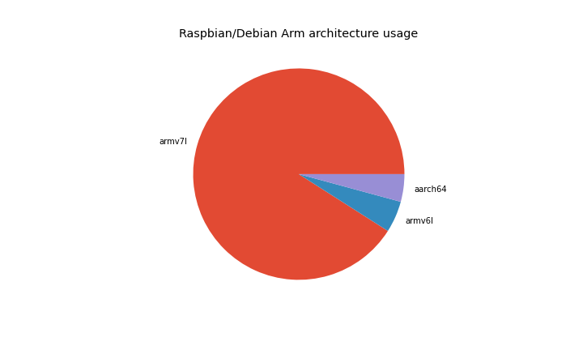

In the period of October — December 2020, **4,643,950** packages were downloaded from piwheels,
bringing the total to **30,815,907**. This has saved **55 years** in the period, and **439 years**
in total! There were **37,578,502** pip searches, **736,605** project page hits, **344,206** web
page hits and **50,894** project JSON downloads in the period.

**October** had the highest number of downloads (ever) with **1,850,781**:

<figure class="aligncenter size-large">

</figure>

Oddly, we experienced a one-day spike surpassing 100k downloads in a single day for the first time.
15 December saw a total of **105,826** downloads:

<figure class="wp-block-image size-large">

</figure>

<figure class="wp-block-image size-large">

</figure>

Downloads saved around between **16** and 22 years per month:

<figure class="wp-block-image size-large">

</figure>

The top 10 downloads were:

1.  **[webrtcvad-wheels](https://www.piwheels.org/project/webrtcvad-wheels)** (356,784)
2.  **[numpy](https://www.piwheels.org/project/numpy)** (284,700)
3.  **[requests](https://www.piwheels.org/project/requests)** (91,968)
4.  **[pyyaml](https://www.piwheels.org/project/pyyaml)** (86,810)
5.  **[cffi](https://www.piwheels.org/project/cffi)** (84,540)
6.  **[octoprint-firmwarecheck](https://www.piwheels.org/project/octoprint-firmwarecheck)** (82,803)
7.  **[websocket-client](https://www.piwheels.org/project/websocket-client)** (81,288)
8.  **[sentry-sdk](https://www.piwheels.org/project/sentry-sdk)** (79,387)
9.  **[filetype](https://www.piwheels.org/project/filetype)** (78,924)
10. **[semantic-version](https://www.piwheels.org/project/semantic-version)** (74,333)

The top 10 pip searches were:

1.  **[pip](https://www.piwheels.org/project/pip)** (5,664,832)
2.  **[wheel](https://www.piwheels.org/project/wheel)** (2,200,871)
3.  **[pyrogram](https://www.piwheels.org/project/pyrogram)** (1,368,093)
4.  **[setuptools](https://www.piwheels.org/project/setuptools)** (1,036,791)
5.  **[webrtcvad-wheels](https://www.piwheels.org/project/webrtcvad-wheels)** (774,656)
6.  **[cryptoadvance-specter](https://www.piwheels.org/project/cryptoadvance-specter)** (618,384)
7.  **[numpy](https://www.piwheels.org/project/numpy)** (502,596)
8.  **[youtube-dl](https://www.piwheels.org/project/youtube-dl)** (499,680)
9.  **[requests](https://www.piwheels.org/project/requests)** (478,480)
10. **[certifi](https://www.piwheels.org/project/certifi)** (385,542)

The top 10 project page hits were:

1.  **[opencv-python](https://www.piwheels.org/project/opencv-python)** (1,749)
2.  **[numpy](https://www.piwheels.org/project/numpy)** (1,129)
3.  **[opencv-contrib-python](https://www.piwheels.org/project/opencv-contrib-python)** (1,062)
4.  **[scipy](https://www.piwheels.org/project/scipy)** (769)
5.  **[tensorflow](https://www.piwheels.org/project/tensorflow)** (755)
6.  **[qhub-ops](https://www.piwheels.org/project/qhub-ops)** (693)
7.  **[pillow](https://www.piwheels.org/project/pillow)** (462)
8.  **[pip](https://www.piwheels.org/project/pip)** (394)
9.  **[pandas](https://www.piwheels.org/project/pandas)** (326)
10. **[grpcio](https://www.piwheels.org/project/grpcio)** (309)

We just
[released](https://blog.piwheels.org/requires-python-support-new-project-page-layout-and-a-new-json-api/)
a new [JSON API](https://www.piwheels.org/json.html) a few days before the end of the previous
quarter, so for the first time, the top 10 project JSON downloads were:

1.  **[scipy](https://www.piwheels.org/project/scipy)** (324)
2.  **[numpy](https://www.piwheels.org/project/numpy)** (108)
3.  **[opencv-python](https://www.piwheels.org/project/opencv-python)** (68)
4.  **[tensorflow](https://www.piwheels.org/project/tensorflow)** (58)
5.  **[imagecodecs](https://www.piwheels.org/project/imagecodecs)** (38)
6.  **[pycparser](https://www.piwheels.org/project/pycparser)** (36)
7.  **[future](https://www.piwheels.org/project/future)** (31)
8.  **[scikit-image](https://www.piwheels.org/project/scikit-image)** (31)
9.  **[opencv-contrib-python](https://www.piwheels.org/project/opencv-contrib-python)** (29)
10. **[urllib3](https://www.piwheels.org/project/urllib3)** (28)

The vast majority of JSON downloads are from browsers (or bots) and only a small proportion seem to
be from wget and requests.

## Platforms

Linux makes up 99.9% of all searches so I've discounted the rest. Raspbian / Raspberry Pi OS and
Debian are now combined (due to Raspberry Pi OS identifying itself as Debian). This group obviously
dominates with over 98%. Ubuntu remains in third place with under 1%, although we don't officially
support it.

<figure class="aligncenter size-large">

</figure>

Buster accounts for 85% of Raspbian/Debian usage, Stretch accounts for 15% and there's practically
no Jessie usage:

<figure class="aligncenter size-large">

</figure>

armv7l (Pi 2/3/4 platform) is still a majority architecture with 91% of searches from Arm devices,
with armv6l (Pi 1/Zero) taking under 5%. Raspberry Pi released a beta of a 64-bit version of the
official OS earlier in the year, and that's starting to grow in usage. It's currently up to 4.2%,
and those users are currently not served by piwheels as we don't build aarch64 platform wheels.

<figure class="aligncenter size-large">

</figure>

Python 3 has a reasonable majority of usage, and 3.7 (the version provided by the current stable
distro) has the highest share with 63%. Python 2.7 comes second with 23%, followed by 3.5 (from
oldstable), 3.8 and 3.6. Fortunately, Python 3.4 (in Jessie, now EOL) has an insignificant usage,
but it's a shame there's still so much Python 2 usage.

<figure class="aligncenter size-large">

</figure>

We're also logging pip and setuptools versions:

<figure class="aligncenter size-large">

</figure>

Note that 18.1 is pre-installed in Buster, and 9.0.1 is pre-installed in Stretch. 20.1.1 is a
recently released version, so likely the most common for people who update their pip.

<figure class="aligncenter size-large">

</figure>

Similarly, setuptools 40.8.0 is what's pre-installed in Buster, but the version of pip in Stretch
doesn't send the setuptools version (33.1.1) in the user agent like it does in newer versions.

Check out the source of this post in a Jupyter notebook:
[github.com/piwheels/stats/blob/master/2020q4.ipynb](https://github.com/piwheels/stats/blob/master/2020q4.ipynb)
