In the period of January — March 2021, **9,262,754** packages were downloaded from piwheels,
bringing the total to **40,096,797**. This has saved **46 years** in the period, and **487 years**
in total! There were **59,141,950** pip searches, **722,140** project page hits, **399,097** web
page hits and **84,621** project JSON downloads in the period.

Each month was subsequently record-breaking. **March** had the highest number of downloads (ever)
with **1,850,781**, more than *double* the record set in the previous quarter:

<figure class="aligncenter size-large">
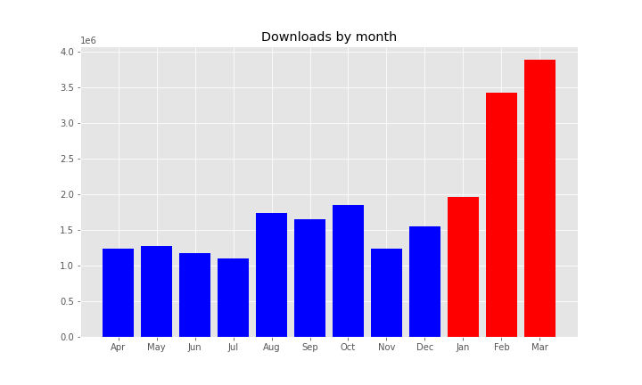
</figure>

We experienced a one-day spike in the previous quarter surpassing 100k downloads in a single day for
the first time. 100k was surpassed 54 out of 90 days this quarter, and all but 3 days following 3
February. The new daily record up to the end of the period is now **168,570** on **24 February**.

The latest version of pip, 21.x, now seems to prefer the "extra index" (i.e. piwheels) to the
"index" (i.e. PyPI), so now we're seeing a significant increase in downloads due to many pure
Python wheels now being served from piwheels which previously would have been served by PyPI.

<figure class="aligncenter size-large">
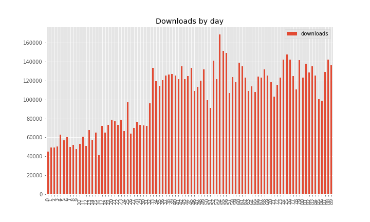
</figure>

<figure class="aligncenter size-large">
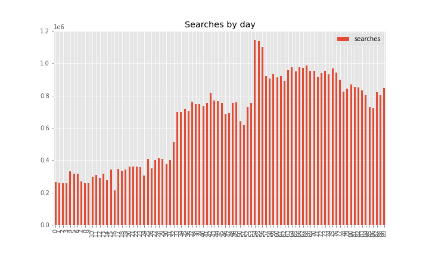
</figure>

Downloads saved around between **10** and **20** years per month. It seems this is falling,
presumably due to more downloads coming from faster platforms (Pi 3/4 vs 1/Zero).

<figure class="wp-block-image size-large">
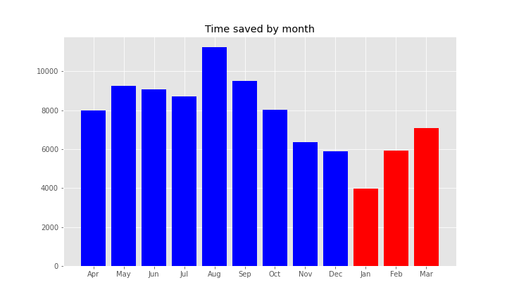
</figure>

The top 10 downloads were:

1.  **[requests](https://www.piwheels.org/project/requests)** (183,869)
2.  **[numpy](https://www.piwheels.org/project/numpy)** (169,759)
3.  **[chardet](https://www.piwheels.org/project/chardet)** (152,524)
4.  **[setuptools](https://www.piwheels.org/project/setuptools)** (139,034)
5.  **[idna](https://www.piwheels.org/project/idna)** (119,761)
6.  **[urllib3](https://www.piwheels.org/project/urllib3)** (115,392)
7.  **[pip](https://www.piwheels.org/project/pip)** (108,285)
8.  **[certifi](https://www.piwheels.org/project/certifi)** (107,014)
9.  **[typing-extensions](https://www.piwheels.org/project/typing-extensions)** (102,449)
10. **[h11](https://www.piwheels.org/project/h11)** (102,242)

The top 10 pip searches were:

1.  **[pip](https://www.piwheels.org/project/pip)** (8,010,081)
2.  **[wheel](https://www.piwheels.org/project/wheel)** (5,111,590)
3.  **[setuptools](https://www.piwheels.org/project/setuptools)** (2,735,718)
4.  **[pyrogram](https://www.piwheels.org/project/pyrogram)** (972,037)
5.  **[aiodns](https://www.piwheels.org/project/aiodns)** (957,426)
6.  **[aiohttp](https://www.piwheels.org/project/aiohttp)** (943,986)
7.  **[six](https://www.piwheels.org/project/six)** (764,481)
8.  **[requests](https://www.piwheels.org/project/requests)** (677,639)
9.  **[future](https://www.piwheels.org/project/future)** (637,936)
10. **[distro](https://www.piwheels.org/project/distro)** (524,132)

The top 10 project page hits were:

1.  **[opencv-python](https://www.piwheels.org/project/opencv-python)** (1,189)
2.  **[opencv-contrib-python](https://www.piwheels.org/project/opencv-contrib-python)** (1,172)
3.  **[numpy](https://www.piwheels.org/project/numpy)** (1,161)
4.  **[scipy](https://www.piwheels.org/project/scipy)** (838)
5.  **[tensorflow](https://www.piwheels.org/project/tensorflow)** (796)
6.  **[cryptography](https://www.piwheels.org/project/cryptography)** (588)
7.  **[pillow](https://www.piwheels.org/project/pillow)** (517)
8.  **[pip](https://www.piwheels.org/project/pip)** (451)
9.  **[qhub-ops](https://www.piwheels.org/project/qhub-ops)** (441)
10. **[grpcio](https://www.piwheels.org/project/grpcio)** (410)

The top 10 project JSON downloads were:

1.  **[numpy](https://www.piwheels.org/project/numpy)** (188)
2.  **[uvloop](https://www.piwheels.org/project/uvloop)** (126)
3.  **[scipy](https://www.piwheels.org/project/scipy)** (78)
4.  **[opencv-python](https://www.piwheels.org/project/opencv-python)** (51)
5.  **[tensorflow](https://www.piwheels.org/project/tensorflow)** (45)
6.  **[cryptography](https://www.piwheels.org/project/cryptography)** (36)
7.  **[cffi](https://www.piwheels.org/project/cffi)** (33)
8.  **[scikit-image](https://www.piwheels.org/project/scikit-image)** (32)
9.  **[urllib3](https://www.piwheels.org/project/urllib3)** (28)
10. **[pycparser](https://www.piwheels.org/project/pycparser)** (27)

The vast majority of JSON downloads are from browsers (or bots) and only a small proportion seem to
be from wget and requests. See the [JSON API](https://www.piwheels.org/json.html) page for more
information on using this API.

## Platforms

Linux makes up over 99.9% of all searches so I've discounted the rest. Raspbian / Raspberry Pi OS
and Debian are now combined (due to Raspberry Pi OS identifying itself as Debian). This group
obviously dominates with nearly 98%. Ubuntu remains in third place with under 2%, although we don't
officially support it.

<figure class="aligncenter size-large">
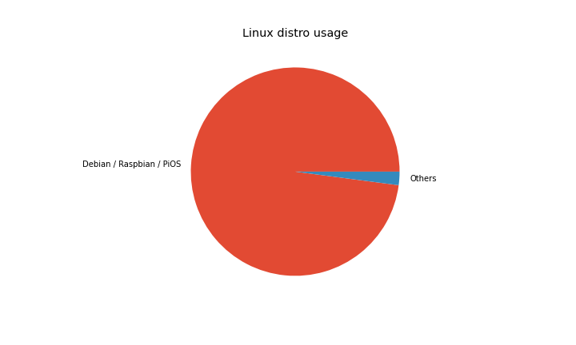
</figure>

Buster accounts for nearly 93% of Raspbian/Debian usage, Stretch accounts for just 7% and there's
practically no Jessie usage:

<figure class="aligncenter size-large">
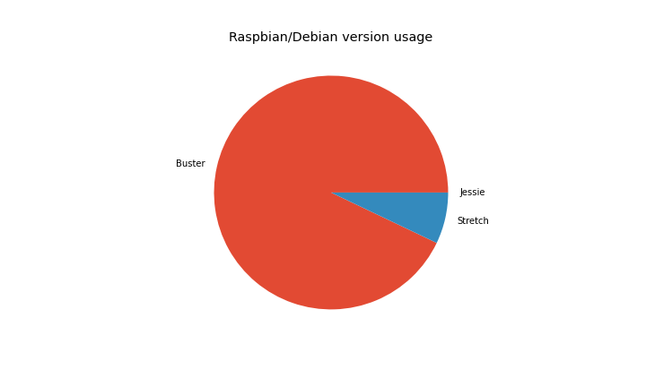
</figure>

armv7l (Pi 2/3/4 platform) is still a majority architecture with 92% of searches from Arm devices,
with armv6l (Pi 1/Zero) taking just 4%. Raspberry Pi released a beta of a 64-bit version of the
official OS last year, which was starting to grow in usage but has dropped slightly. It's currently
at 3.8%, and those users are currently not served by piwheels as we don't yet build aarch64
platform wheels. We actually get more hits from x86_64 users than either armv6l or aarch64.

<figure class="aligncenter size-large">
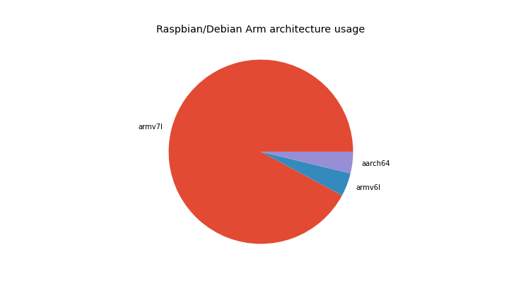
</figure>

Python 3 has a supermajority of usage, and 3.7 (the version provided by the current stable distro)
has the highest share with 68%. Python 2.7 comes second with 22%, followed by 3.8 and 3.9 — both
now overtaken 3.5 (from oldstable). Fortunately, Python 3.4 (in Jessie, now EOL) has an
insignificant usage, but it's a shame there's still so much Python 2 usage. Generally most users
are using the Python provided by the current Debian stable — which is due to change this summer, so
we'll start to see a rise in Python 3.9 usage which could become the leader by the end of the year.

<figure class="aligncenter size-large">
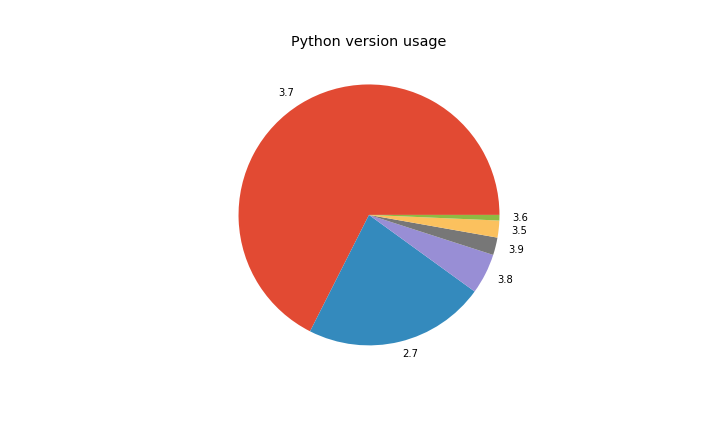
</figure>

We're also logging pip and setuptools versions:

<figure class="aligncenter size-large">
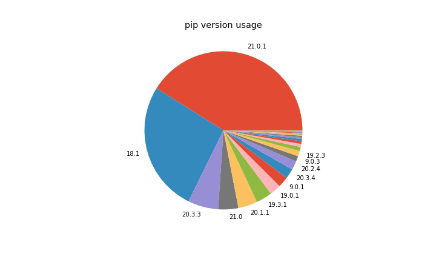
</figure>

Note that 18.1 is pre-installed in Buster, and 9.0.1 is pre-installed in Stretch. 20.1.1 is a
recently released version, so likely the most common for people who update their pip.

<figure class="aligncenter size-large">
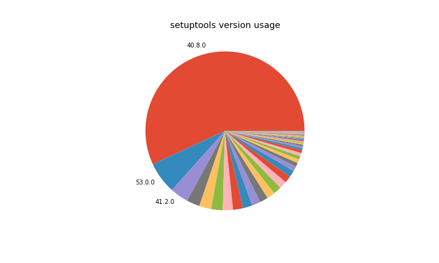
</figure>

Similarly, setuptools 40.8.0 is what's pre-installed in Buster, but the version of pip in Stretch
doesn't send the setuptools version (33.1.1) in the user agent like it does in newer versions.

One new set of stats I've looked at in detail is bandwidth. We see about 5TB of bandwidth each
month, peaking at 6.4TB in March. The breakdown of bandwidth in the period is 84% pip downloads, 2%
pip searches, a tiny amount (0.05%) of website traffic (project pages, JSON, etc) and the rest (14%)
comprising mostly of wheel downloads from browsers (not pip):

<figure class="wp-block-image size-large">
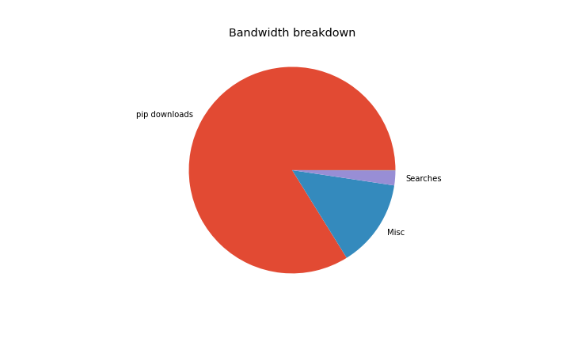
</figure>

And broken down by month:

<figure class="wp-block-image size-large">
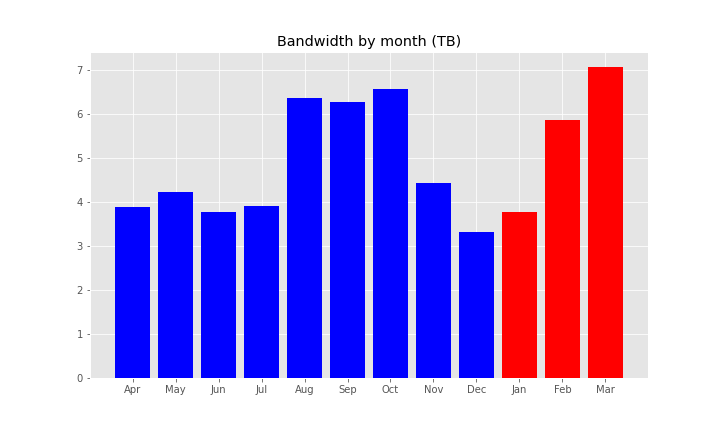
</figure>

Check out the source of this post in a Jupyter notebook:
[github.com/piwheels/stats/blob/master/2021q1.ipynb](https://github.com/piwheels/stats/blob/master/2021q1.ipynb)
