In the period of April — June 2021, **8,471,941** packages were downloaded from piwheels, bringing
the total to **48,609,840**. This has saved **38 years** in the period, and **525 years** in total!
There were **56,200,613** pip searches, **764,031** project page hits, **386,472** web page hits and
**116,486** project JSON downloads in the period.

<figure class="aligncenter size-large">
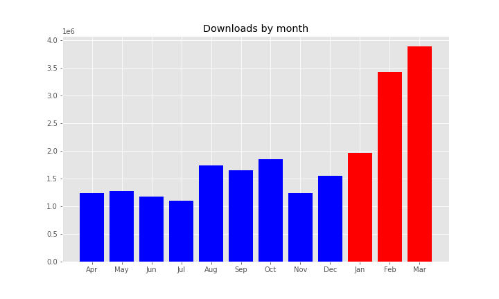
</figure>

We experienced a one-day spike of **168k** downloads st the start of the period but averaged at
**94k** per day:

<figure class="aligncenter size-full">
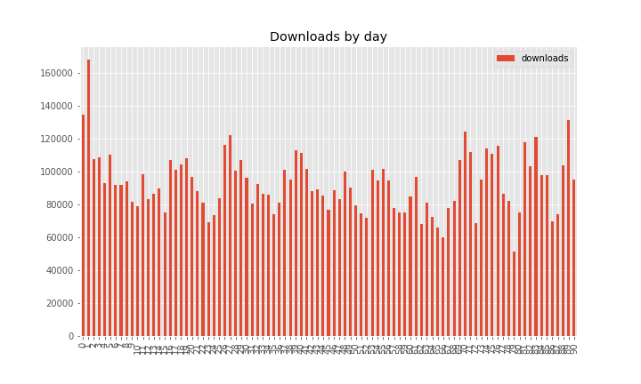
</figure>

<figure class="aligncenter size-full">
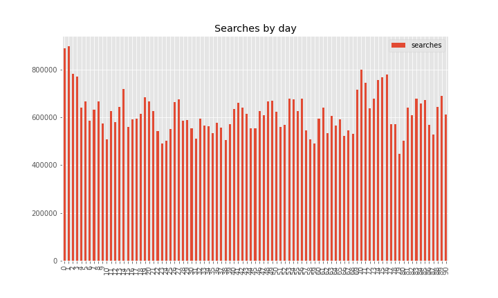
</figure>

Downloads saved around between **11** and **14** years per month. It seems this is falling,
presumably due to more downloads coming from faster platforms (Pi 3/4 vs 1/Zero).

<figure class="aligncenter size-full">
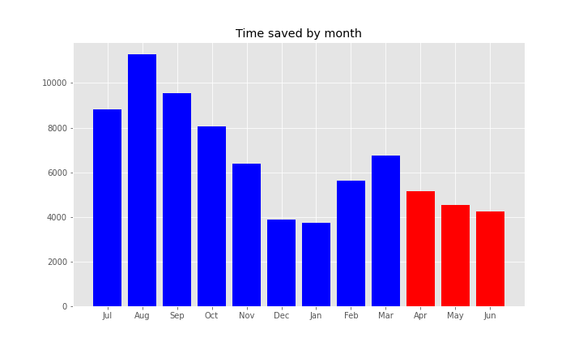
</figure>

The top 10 downloads were:

1.  **[requests](https://www.piwheels.org/project/requests)** (153,175)
2.  **[chardet](https://www.piwheels.org/project/chardet)** (150,367)
3.  **[numpy](https://www.piwheels.org/project/numpy)** (140,902)
4.  **[importlib-metadata](https://www.piwheels.org/project/importlib-metadata)** (131,558)
5.  **[octoprint-pisupport](https://www.piwheels.org/project/octoprint-pisupport)** (124,520)
6.  **[pip](https://www.piwheels.org/project/pip)** (118,897)
7.  **[idna](https://www.piwheels.org/project/idna)** (109,821)
8.  **[h11](https://www.piwheels.org/project/h11)** (104,934)
9.  **[urllib3](https://www.piwheels.org/project/urllib3)** (99,970)
10. **[typing-extensions](https://www.piwheels.org/project/typing-extensions)** (99,920)

The top 10 pip searches were:

1.  **[pip](https://www.piwheels.org/project/pip)** (8,729,381)
2.  **[wheel](https://www.piwheels.org/project/wheel)** (5,982,230)
3.  **[setuptools](https://www.piwheels.org/project/setuptools)** (3,978,520)
4.  **[pyrogram](https://www.piwheels.org/project/pyrogram)** (1,502,564)
5.  **[future](https://www.piwheels.org/project/future)** (751,603)
6.  **[youtube-dl](https://www.piwheels.org/project/youtube-dl)** (749,239)
7.  **[aiohttp](https://www.piwheels.org/project/aiohttp)** (696,422)
8.  **[pyngrok](https://www.piwheels.org/project/pyngrok)** (661,208)
9.  **[aiodns](https://www.piwheels.org/project/aiodns)** (649,962)
10. **[six](https://www.piwheels.org/project/six)** (547,745)

The top 10 project page hits were:

1.  **[opencv-python](https://www.piwheels.org/project/opencv-python)** (1,210)
2.  **[opencv-contrib-python](https://www.piwheels.org/project/opencv-contrib-python)** (1,108)
3.  **[numpy](https://www.piwheels.org/project/numpy)** (981)
4.  **[scipy](https://www.piwheels.org/project/scipy)** (700)
5.  **[tensorflow](https://www.piwheels.org/project/tensorflow)** (686)
6.  **[qhub-jupyterhub-theme](https://www.piwheels.org/project/qhub-jupyterhub-theme)** (493)
7.  **[pillow](https://www.piwheels.org/project/pillow)** (445)
8.  **[cryptography](https://www.piwheels.org/project/cryptography)** (429)
9.  **[pandas](https://www.piwheels.org/project/pandas)** (381)
10. **[pip](https://www.piwheels.org/project/pip)** (335)

The top 10 project JSON downloads were:

1.  **[awscrt](https://www.piwheels.org/project/awscrt)** (12,815)
2.  **[numpy](https://www.piwheels.org/project/numpy)** (220)
3.  **[requirements-parser](https://www.piwheels.org/project/requirements-parser)** (91)
4.  **[scipy](https://www.piwheels.org/project/scipy)** (62)
5.  **[opencv-python](https://www.piwheels.org/project/opencv-python)** (58)
6.  **[requests](https://www.piwheels.org/project/requests)** (46)
7.  **[notion2alfred-snippet](https://www.piwheels.org/project/notion2alfred-snippet)** (43)
8.  **[pyyaml](https://www.piwheels.org/project/pyyaml)** (40)
9.  **[devjohn06test](https://www.piwheels.org/project/devjohn06test)** (38)
10. **[opencv-contrib-python](https://www.piwheels.org/project/opencv-contrib-python)** (37)

See the [JSON API](https://www.piwheels.org/json.html) page for more information on using this API.

## Platforms

Linux makes up over 99.9% of all searches so I've discounted the rest. Raspberry Pi OS and Debian
are now combined (due to Raspberry Pi OS identifying itself as Debian). This group obviously
dominates with nearly 99%. Ubuntu remains in third place with under 1%, although we don't
officially support it.

<figure class="aligncenter size-full">
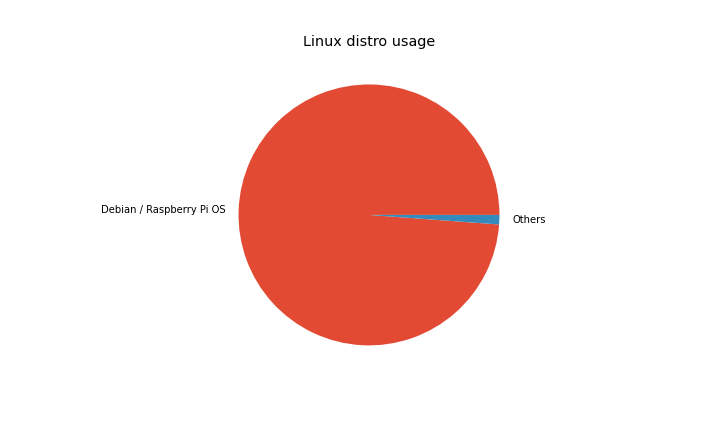
</figure>

Buster accounts for nearly 94% of PiOS/Debian usage, Stretch accounts for just 6% and there's
practically no Jessie usage:

<figure class="aligncenter size-full">
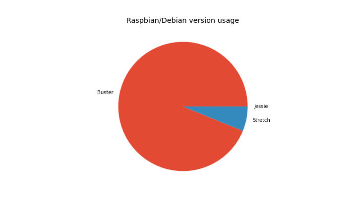
</figure>

armv7l (Pi 2/3/4 platform) is still a majority architecture with 93% of searches from Arm devices
(80% from armv7l). We now get more hits from aarch64 users than x86_64 and armv6l combined,
when it previously trailed behind both. It seems usage of the 64-bit OS image is on the rise,
although we do not as yet provide aarch64 wheels.

<figure class="aligncenter size-full">
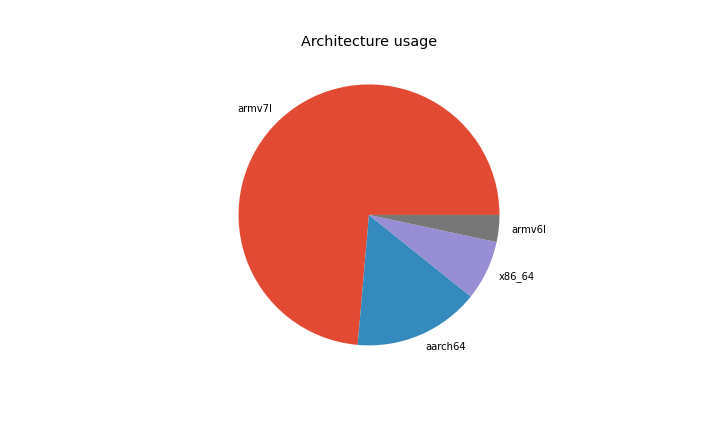
</figure>

Python 3 has a supermajority of usage, and 3.7 (the version provided by the current stable distro)
has the highest share with 71%. Python 2.7 comes second with 15%, followed by 3.8 and 3.9. Generally
most users are using the Python provided by the current Debian stable — which is due to change this
summer, so we'll start to see a rise in Python 3.9 usage which could become the leader by the end
of the year.

<figure class="aligncenter size-full">
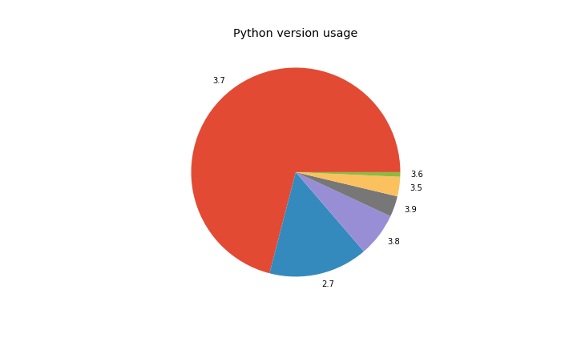
</figure>

We're also logging pip and setuptools versions:

<figure class="aligncenter size-full">
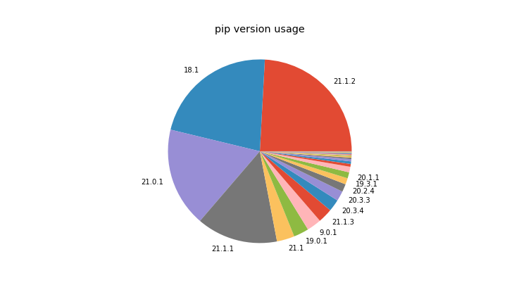
</figure>

Note that 18.1 is pre-installed in Buster, and 9.0.1 is pre-installed in Stretch. 20.1.1 is a
recently released version, so likely the most common for people who update their pip.

<figure class="aligncenter size-full">
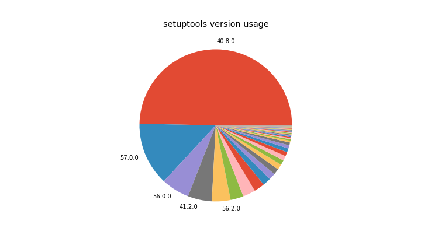
</figure>

Similarly, setuptools 40.8.0 is what's pre-installed in Buster, but the version of pip in Stretch
doesn't send the setuptools version (33.1.1) in the user agent like it does in newer versions.

We see about **5TB** of bandwidth each month, peaking at **5.35TB** in April. The breakdown of
bandwidth in the period is 84% pip downloads, 3% pip searches, a tiny amount (0.07%) of website
traffic (project pages, JSON, etc) and the rest (13%) comprising mostly of wheel downloads from
browsers (not pip):

<figure class="wp-block-image size-full">
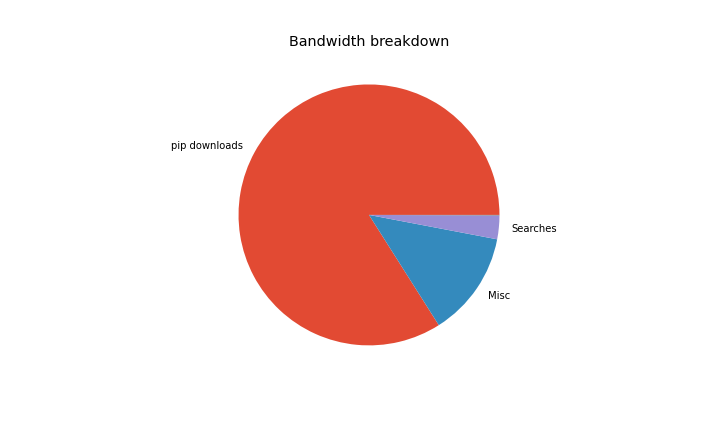
</figure>

And broken down by month:

<figure class="wp-block-image size-full">
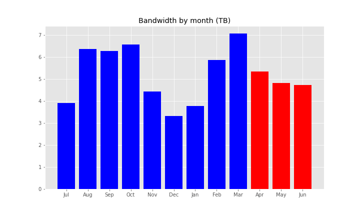
</figure>

Check out the source of this post in a Jupyter notebook:
[github.com/piwheels/stats/blob/master/2021q2.ipynb](https://github.com/piwheels/stats/blob/master/2021q2.ipynb)
