
In the period of July – September 2021, <strong>7,047,854</strong> packages were downloaded from piwheels, bringing the total to <strong>55,657,694</strong>. This has saved <strong>33 years</strong> in the period, and <strong>558 years</strong> in total! There were <strong>48,256,952</strong> pip searches, <strong>875,834</strong> project page hits, <strong>397,834</strong> web page hits and <strong>1,094,432</strong> project JSON downloads in the period.

<figure class="aligncenter size-full">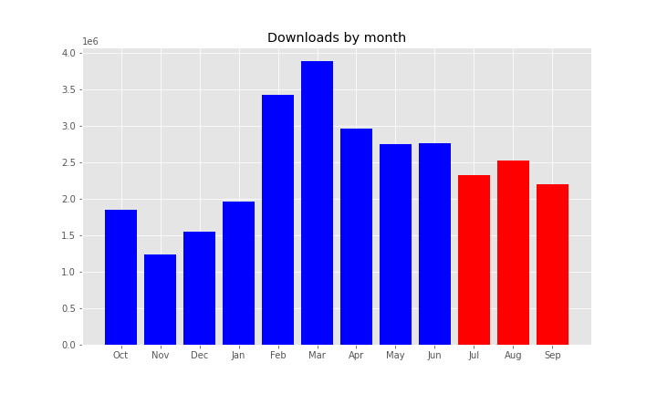</figure>

There were 7 days surpassing <strong>100k</strong> downloads, a peak of <strong>over 120k</strong>, and averaged at <strong>76k</strong> per day:

<figure class="aligncenter size-full">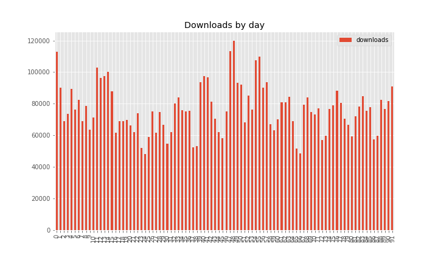</figure>

<figure class="aligncenter size-full">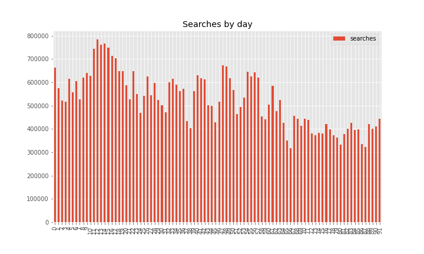</figure>

Downloads saved around between <strong>10</strong> and <strong>11</strong> years per month. It seems this is falling, presumably due to more downloads coming from faster platforms (Pi 3/4 vs 1/Zero).

<figure class="aligncenter size-full">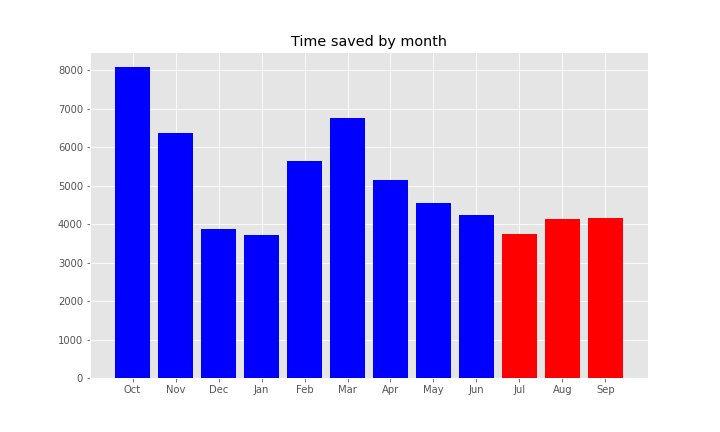</figure>

The top 10 downloads were:

<ol class="wp-block-list"><li><strong><a href="https://www.piwheels.org/project/requests">requests</a></strong> (116,496)</li><li><strong><a href="https://www.piwheels.org/project/six">six</a></strong> (102,660)</li><li><strong><a href="https://www.piwheels.org/project/numpy">numpy</a></strong> (100,423)</li><li><strong><a href="https://www.piwheels.org/project/pip">pip</a></strong> (98,708)</li><li><strong><a href="https://www.piwheels.org/project/idna">idna</a></strong> (94,551)</li><li><strong><a href="https://www.piwheels.org/project/importlib-metadata">importlib-metadata</a></strong> (93,747)</li><li><strong><a href="https://www.piwheels.org/project/urllib3">urllib3</a></strong> (91,259)</li><li><strong><a href="https://www.piwheels.org/project/certifi">certifi</a></strong> (87,703)</li><li><strong><a href="https://www.piwheels.org/project/typing-extensions">typing-extensions</a></strong> (85,543)</li><li><strong><a href="https://www.piwheels.org/project/pillow">pillow</a></strong> (83,796)</li></ol>

The top 10 pip searches were:

<ol class="wp-block-list"><li><strong><a href="https://www.piwheels.org/project/pip">pip</a></strong> (7,423,597)</li><li><strong><a href="https://www.piwheels.org/project/wheel">wheel</a></strong> (4,427,701)</li><li><strong><a href="https://www.piwheels.org/project/setuptools">setuptools</a></strong> (3,375,412)</li><li><strong><a href="https://www.piwheels.org/project/pyrogram">pyrogram</a></strong> (1,762,252)</li><li><strong><a href="https://www.piwheels.org/project/future">future</a></strong> (742,655)</li><li><strong><a href="https://www.piwheels.org/project/youtube-dl">youtube-dl</a></strong> (664,821)</li><li><strong><a href="https://www.piwheels.org/project/pyngrok">pyngrok</a></strong> (645,709)</li><li><strong><a href="https://www.piwheels.org/project/speedtest-cli">speedtest-cli</a></strong> (399,889)</li><li><strong><a href="https://www.piwheels.org/project/six">six</a></strong> (379,356)</li><li><strong><a href="https://www.piwheels.org/project/requests">requests</a></strong> (377,486)</li></ol>

The top 10 project page hits were:

<ol class="wp-block-list"><li><strong><a href="https://www.piwheels.org/project/lilurl">lilurl</a></strong> (2,401)</li><li><strong><a href="https://www.piwheels.org/project/numpy">numpy</a></strong> (1,354)</li><li><strong><a href="https://www.piwheels.org/project/opencv-python">opencv-python</a></strong> (1,102)</li><li><strong><a href="https://www.piwheels.org/project/opencv-contrib-python">opencv-contrib-python</a></strong> (1,044)</li><li><strong><a href="https://www.piwheels.org/project/scipy">scipy</a></strong> (1,006)</li><li><strong><a href="https://www.piwheels.org/project/scikit-image">scikit-image</a></strong> (653)</li><li><strong><a href="https://www.piwheels.org/project/tensorflow">tensorflow</a></strong> (559)</li><li><strong><a href="https://www.piwheels.org/project/imagecodecs">imagecodecs</a></strong> (523)</li><li><strong><a href="https://www.piwheels.org/project/cryptography">cryptography</a></strong> (474)</li><li><strong><a href="https://www.piwheels.org/project/pandas">pandas</a></strong> (437)</li></ol>

The top 10 project JSON downloads were:

<ol class="wp-block-list"><li><strong><a href="https://www.piwheels.org/project/awscrt">awscrt</a></strong> (20,679)</li><li><strong><a href="https://www.piwheels.org/project/numpy">numpy</a></strong> (458)</li><li><strong><a href="https://www.piwheels.org/project/opencv-contrib-python">opencv-contrib-python</a></strong> (107)</li><li><strong><a href="https://www.piwheels.org/project/v2ray-runtime-windows">v2ray-runtime-windows</a></strong> (104)</li><li><strong><a href="https://www.piwheels.org/project/requests-toolkit">requests-toolkit</a></strong> (103)</li><li><strong><a href="https://www.piwheels.org/project/github-http-api">github-http-api</a></strong> (96)</li><li><strong><a href="https://www.piwheels.org/project/bevy-events">bevy-events</a></strong> (95)</li><li><strong><a href="https://www.piwheels.org/project/newrelic-plugins-agent">newrelic-plugins-agent</a></strong> (95)</li><li><strong><a href="https://www.piwheels.org/project/v2ray-runtime">v2ray-runtime</a></strong> (92)</li><li><strong><a href="https://www.piwheels.org/project/protobuf">protobuf</a></strong> (91)</li></ol>

See the <a href="https://www.piwheels.org/json.html">JSON API</a> page for more information on using this API.

<h2 class="wp-block-heading">Platforms</h2>

Linux makes up over 99.9% of all searches so I've discounted the rest. Raspberry Pi OS and Debian are now combined (due to Raspberry Pi OS identifying itself as Debian). This group obviously dominates with over 99%. Ubuntu remains in third place with only 0.6%, although we don't officially support it.

<figure class="aligncenter size-full">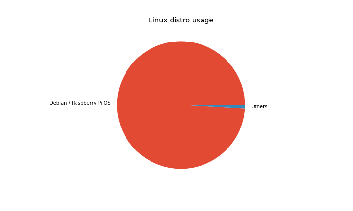</figure>

Buster accounts for 93% of PiOS/Debian usage and Stretch accounts for just 7%:

<figure class="aligncenter size-full">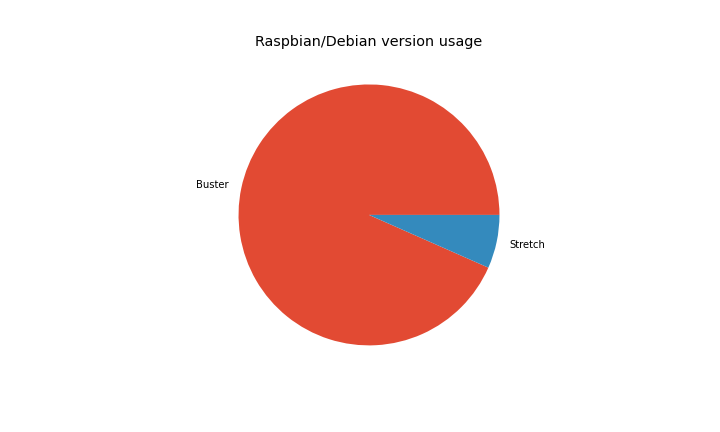</figure>

armv7l (Pi 2/3/4 platform) is still a majority architecture with 93% of searches from Arm devices (76% of which is from armv7l). We now get more hits from aarch64 users than x86_64 and armv6l combined. It seems usage of the 64-bit OS image is on the rise (now 20% of Arm usage), although we do not as yet provide aarch64 wheels.

<figure class="aligncenter size-full">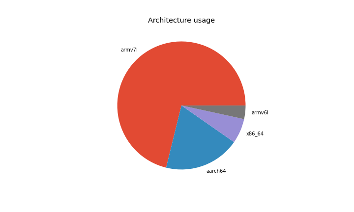</figure>

Python 3 has a supermajority of usage, and 3.7 (the version provided by the current stable distro) has the highest share with 69%. Python 2.7 comes second with 15%, followed by 3.8 and 3.9. Generally most users are using the Python provided by the current Debian stable – which was due to change this summer, so we'll start to see a rise in Python 3.9 usage as soon as Raspberry Pi OS Bullseye is released for which could become the leader by the end of the year.

<figure class="aligncenter size-full">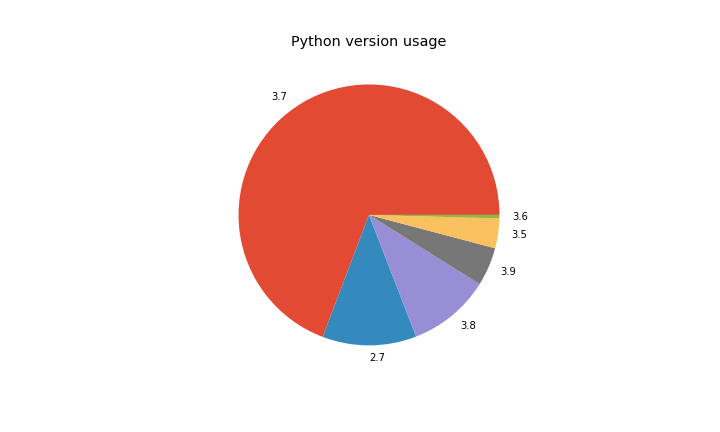</figure>

We're also logging pip and setuptools versions:

<figure class="aligncenter size-full"></figure>

Note that 18.1 is pre-installed in Buster, and 9.0.1 is pre-installed in Stretch. 20.1.1 is a recently released version, so likely the most common for people who update their pip.

<figure class="aligncenter size-full">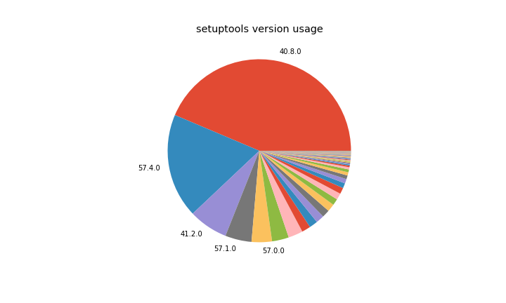</figure>

Similarly, setuptools 40.8.0 is what's pre-installed in Buster, but the version of pip in Stretch doesn't send the setuptools version (33.1.1) in the user agent like it does in newer versions.

We see about <strong>4TB</strong> of bandwidth each month, peaking at <strong>4.2TB</strong> in April. The breakdown of bandwidth in the period is 76% pip downloads, 3% pip searches, a tiny amount (0.13%) of website traffic (project pages, JSON, etc) and the rest (surprisingly high, 20%) comprising mostly of wheel downloads from browsers (not pip):

<figure class="wp-block-image size-full">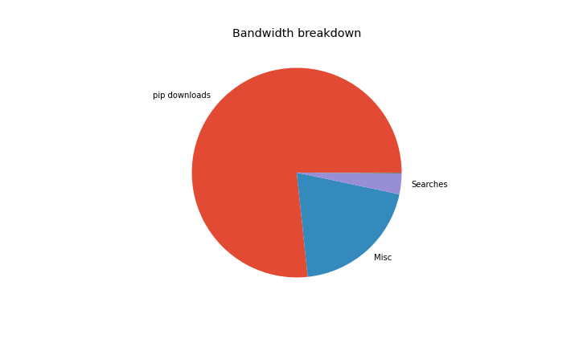</figure>

And broken down by month:

<figure class="wp-block-image size-full">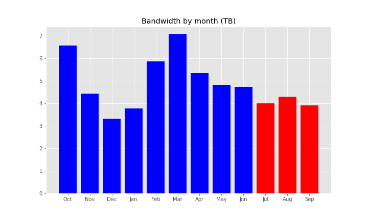</figure>

Check out the source of this post in a Jupyter notebook: <a href="https://github.com/piwheels/stats/blob/master/2021q3.ipynb">github.com/piwheels/stats/blob/master/2021q3.ipynb</a>

