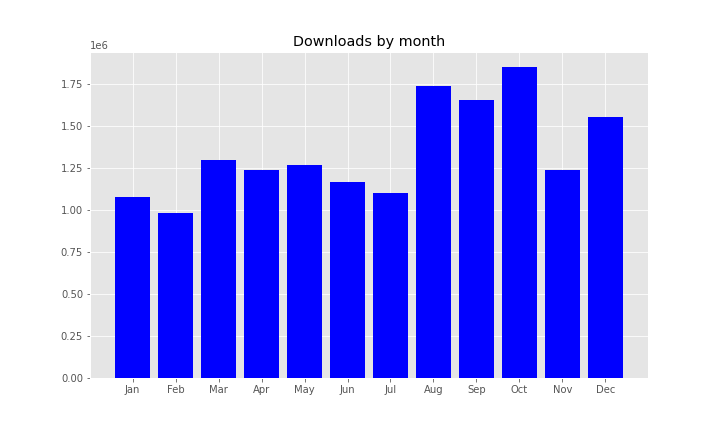
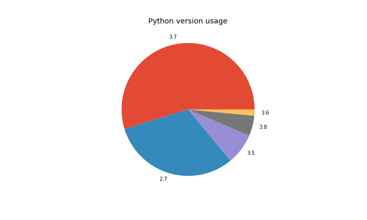
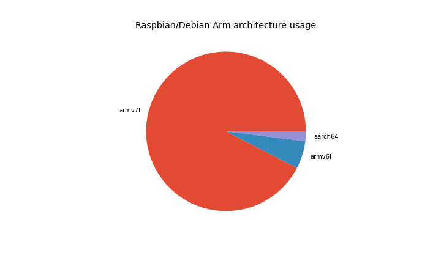
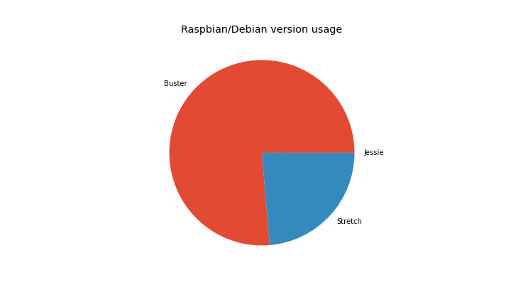
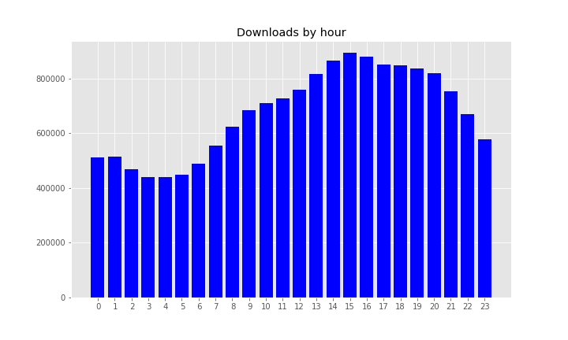

In 2020, a total of <strong>16,184,523</strong> packages were downloaded, taking the total to <strong>30,815,907</strong>. This saved <strong>269 years 3 months</strong> during 2020, taking us to over <strong>441 years</strong> saved overall. <strong>52TB</strong> of files were downloaded, taking the total to <strong>103TB</strong>.

<ul class="wp-block-list"><li>Average daily downloads:<ul><li>2019: <strong>25,257</strong></li><li>2020: <strong>44,220</strong></li></ul></li><li>Average monthly downloads:<ul><li>2019: <strong>768,235</strong></li><li>2020: <strong>1,326,600</strong></li></ul></li><li>Most downloads in one day:<ul><li>2019: <strong>39,153</strong> on 4 December</li><li>2020: <strong>105,826</strong> on 15 December</li></ul></li><li>Most downloads in one month:<ul><li>2019: <strong>1,017,563</strong> in December (<strong>32,824</strong> daily average) / <strong>1,014,577</strong> in November (<strong>33,819</strong> daily average)</li><li>2020: <strong>1,850,781</strong> in October (<strong>59,702</strong> daily average)</li></ul></li><li>Bandwidth used from downloads:<ul><li>2019: <strong>37TB</strong></li><li>2020: <strong>52TB</strong></li></ul></li></ul>

Apart from February (short month, slightly under), each month had over <strong>1 million downloads</strong>. Four of the last five months had over <strong>1.5 million</strong>.

<figure class="aligncenter size-large"></figure>

15 December 2020 was the biggest day on record, with <strong><strong>105,826</strong></strong> downloads.

The month of October recorded the most downloads at <strong>1,850,781</strong>.

<h2 class="wp-block-heading">Top 30 packages</h2>

Incredibly, numpy was downloaded over a million times this year!

<ol class="wp-block-list"><li><strong><a href="https://www.piwheels.org/project/numpy">numpy</a></strong> (1,004,056)</li><li><strong><a href="https://www.piwheels.org/project/dogpile-cache">dogpile-cache</a></strong> (389,999)</li><li><strong><a href="https://www.piwheels.org/project/webrtcvad-wheels">webrtcvad-wheels</a></strong> (356,793)</li><li><strong><a href="https://www.piwheels.org/project/pyyaml">pyyaml</a></strong> (351,503)</li><li><strong><a href="https://www.piwheels.org/project/sentry-sdk">sentry-sdk</a></strong> (350,834)</li><li><strong><a href="https://www.piwheels.org/project/semantic-version">semantic-version</a></strong> (314,402)</li><li><strong><a href="https://www.piwheels.org/project/cffi">cffi</a></strong> (301,478)</li><li><strong><a href="https://www.piwheels.org/project/markdown">markdown</a></strong> (284,277)</li><li><strong><a href="https://www.piwheels.org/project/flask-login">flask-login</a></strong> (266,479)</li><li><strong><a href="https://www.piwheels.org/project/pycparser">pycparser</a></strong> (259,366)</li><li><strong><a href="https://www.piwheels.org/project/requests">requests</a></strong> (210,274)</li><li><strong><a href="https://www.piwheels.org/project/markupsafe">markupsafe</a></strong> (206,343)</li><li><strong><a href="https://www.piwheels.org/project/cryptography">cryptography</a></strong> (198,981)</li><li><strong><a href="https://www.piwheels.org/project/paho-mqtt">paho-mqtt</a></strong> (198,747)</li><li><strong><a href="https://www.piwheels.org/project/octoprint-firmwarecheck">octoprint-firmwarecheck</a></strong> (184,992)</li><li><strong><a href="https://www.piwheels.org/project/filetype">filetype</a></strong> (181,539)</li><li><strong><a href="https://www.piwheels.org/project/opencv-python">opencv-python</a></strong> (179,079)</li><li><strong><a href="https://www.piwheels.org/project/pyusb">pyusb</a></strong> (170,359)</li><li><strong><a href="https://www.piwheels.org/project/zope-component">zope-component</a></strong> (165,536)</li><li><strong><a href="https://www.piwheels.org/project/adafruit-pureio">adafruit-pureio</a></strong> (162,949)</li><li><strong><a href="https://www.piwheels.org/project/docopt">docopt</a></strong> (161,961)</li><li><strong><a href="https://www.piwheels.org/project/pillow">pillow</a></strong> (160,590)</li><li><strong><a href="https://www.piwheels.org/project/rpi-gpio">rpi-gpio</a></strong> (150,513)</li><li><strong><a href="https://www.piwheels.org/project/pynacl">pynacl</a></strong> (148,723)</li><li><strong><a href="https://www.piwheels.org/project/future">future</a></strong> (145,075)</li><li><strong><a href="https://www.piwheels.org/project/adafruit-platformdetect">adafruit-platformdetect</a></strong> (143,978)</li><li><strong><a href="https://www.piwheels.org/project/tornado">tornado</a></strong> (141,605)</li><li><strong><a href="https://www.piwheels.org/project/adafruit-blinka">adafruit-blinka</a></strong> (140,604)</li><li><strong><a href="https://www.piwheels.org/project/bcrypt">bcrypt</a></strong> (138,836)</li><li><strong><a href="https://www.piwheels.org/project/sysv-ipc">sysv-ipc</a></strong> (136,934)</li></ol>
<h2 class="wp-block-heading">Python version usage</h2>

Most searches are from Python 3.7, the default in Debian Buster (55%). Second is Python 2.7 with 31%, followed by 3.5 (the default in Stretch) with 7.5%:

<figure class="wp-block-image size-large"></figure>
<h2 class="wp-block-heading">Architectures</h2>

armv7l (Pi 2/3/4 platform) is still a majority architecture with 91% of searches from Arm devices, with armv6l (Pi 1/Zero) taking under 5%:

<figure class="wp-block-image size-large"></figure>

Raspberry Pi released a beta of a 64-bit version of the official OS earlier in the year, and that's starting to grow in usage. It's currently up to 4.2%, and those users are currently not served by piwheels as we don't build aarch64 platform wheels.

<h2 class="wp-block-heading">Operating systems</h2>

The vast majority of downloads are from Raspbian / Pi OS (over 98%). Of these, 76% are Buster, 24% are Stretch and practically none are Jessie:

<figure class="wp-block-image size-large"></figure>
<h2 class="wp-block-heading">Downloads through the day</h2>

Our busiest hour has moved earlier in the day, now between 3pm-4pm. All afternoon/evening UTC we are at our busiest:

<figure class="wp-block-image size-large"></figure>
<h2 class="wp-block-heading">2020 features</h2>

We have been working on a lot of new features throughout the year, including <a href="https://blog.piwheels.org/new-features-deletion-yanking-and-more/">deletion and yanking</a>, <a href="https://blog.piwheels.org/canonicalise-all-the-things/">canonicalising package names</a>, <a href="https://blog.piwheels.org/requires-python-support-new-project-page-layout-and-a-new-json-api/">Requires-Python support, new project page layout and a new JSON API</a>. I've also produced quarterly stats: <a href="https://blog.piwheels.org/piwheels-stats-2020q1/">2020Q1</a>, <a href="https://blog.piwheels.org/piwheels-stats-2020q2/">2020Q2</a>, <a href="https://blog.piwheels.org/piwheels-stats-2020q3/">2020Q3</a> and <a href="https://blog.piwheels.org/piwheels-stats-2020q4/">2020Q4</a>.

<h2 class="wp-block-heading">2021 vision</h2>

There's a new Debian release scheduled this summer, so we will be introducing a new Python version when Debian Bullseye arrives in the summer. We'll also aim to start work on aarch64 support.

If you're interested in following piwheels project updates, we tweet daily and monthly stats at <a href="https://twitter.com/piwheels">@piwheels</a>. You can also follow me <a href="https://twitter.com/ben_nuttall">@ben_nuttall</a> and Dave <a href="https://twitter.com/waveform80">@waveform80</a>.

<em>The piwheels project wouldn't be possible without considerable support from </em><a href="https://www.mythic-beasts.com/"><em>Mythic Beasts</em></a><em>, who provide storage, bandwidth and cloud Pis. The Pi platform is so straightforward, it's been a pleasure to use, allowing us to scale up builder Pis with ease. We highly recommend using this (very affordable) service for real </em><a href="https://www.mythic-beasts.com/order/rpi"><em>Pi testing</em></a><em> for your projects.</em>

I've also been working on a Python library and command line interface to the Mythic Beasts Pi Cloud service, called <strong>hostedpi</strong>, which is out in beta now and will be fully released soon. You can find it on <a href="https://github.com/piwheels/hostedpi">GitHub</a>, <a href="https://hostedpi.readthedocs.io/en/latest/">readthedocs</a>, <a href="https://pypi.org/project/hostedpi/">PyPI</a> and (of course) <a href="https://www.piwheels.org/project/hostedpi/">piwheels</a>.

