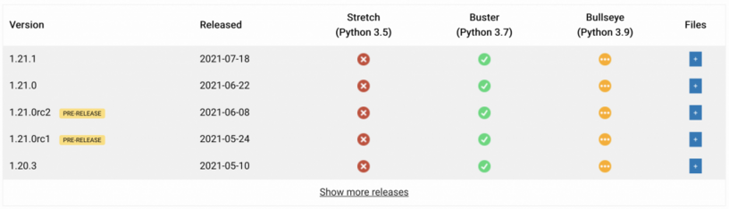

Debian 11 (Bullseye) <s>is due to be released shortly</s> is now released, and Raspberry Pi OS
<s>will follow suit</s> [is also
released](https://www.raspberrypi.com/news/raspberry-pi-os-debian-bullseye/). Bullseye comes with
Python 3.9, so we needed to rebuild all platform wheels for the new ABI.

We've added a Bullseye column to the versions table on project pages to show the status of each
build:

<figure class="block-image">

</figure>

When piwheels started, we built for Jessie (Python 3.4), and moved onto Stretch (Python 3.5) when it
was released. We stopped building on Jessie when it reached EOL, and we'll continue to iterate like
this. Although Python 3.5 itself is EOL, Debian Stretch still has another year of support so we'll
continue building on it until then:

<figure class="block-image">

</figure>

We employed a scaled-up approach to clearing the cp39 backlog, provisioning 22 Raspberry Pi 4s to
work their way through attempting to build wheels of everything in the queue. Once it cleared those
we dropped back to around 5 Pis per ABI in order to keep up with new releases.

<figure class="block-image">

<figcaption>The piwheels monitor once the queue had cleared</figcaption>
</figure>

Thanks to [Mythic Beasts](https://www.mythic-beasts.com/) for supporting us through this process.

We now have a total of **43,966** cp34m wheels, **68,818** cp35m wheels, **81,293** cp37m wheels and
**69,769** cp39 wheels.

Python package builds are getting more complex, with maintainers now using golang and rust in their
builds as well as C/C++. Maintainers are increasingly specifying build requirements, meaning
installing tools with pip in order to start the build. We recently changed the pip command we use to
build to allow pip to install build requirements from piwheels while building source attained from
PyPI — otherwise they were ending up building several packages from source before even getting
started trying to build the intended package. Maintainers are also increasingly utilising tools like
poetry and whey to specify custom build systems which are difficult to debug.

Some build scan take several hours — particularly packages like spacy and opencv. A recent build of
spacy-nightly on Bullseye took 3 hours 55 mins, a previous build of opencv-contrib-python-headless
on Buster took 5 hours 13 mins, and spacy-train-tools on Buster took 6 hours 46 mins!

## Project page updates

We use a GitHub repo to manage issues with packages we have on piwheels, when people find that
packages are missing or don't work as expected. Previously we used issue templates on GitHub, but
often people failed to complete them properly. Fortunately, GitHub just rolled out [issue
forms](https://github.blog/changelog/2021-06-23-issues-forms-beta-for-public-repositories/), so
we've added them and integrated the project pages so that clicking on one of the new issue buttons
completes the form, allowing people to give extra information and not be able to continue without
filling out all the required fields.

<figure class="block-image">

</figure>

Clicking new issue on the numpy page brings you here, form filled in automatically:

<figure class="block-image">

</figure>

We also added support for Twitter cards on project pages, so when people tweet links to projects,
it'll show the piwheels logo and the project description:

<figure class="block-embed">
<blockquote>

<a href="https://twitter.com/waveform80?ref_src=twsrc%5Etfw">@waveform80</a> we got twitter cards
<a href="https://t.co/DZUM4M6vJq">https://t.co/DZUM4M6vJq</a>

— Ben Nuttall (@ben_nuttall) <a
href="https://twitter.com/ben_nuttall/status/1417972828863873024?ref_src=twsrc%5Etfw">July 21,
2021</a>

</blockquote>
</figure>

We also recently surpassed **50 million downloads**, and have saved over **500 years** of build
time!
