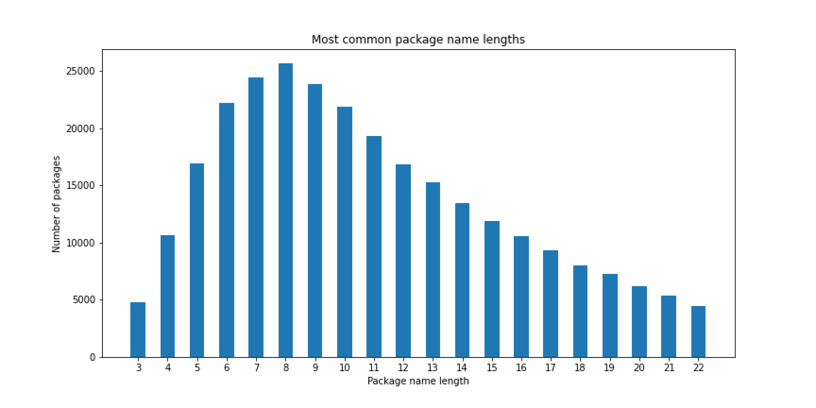
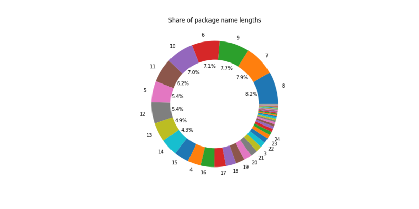
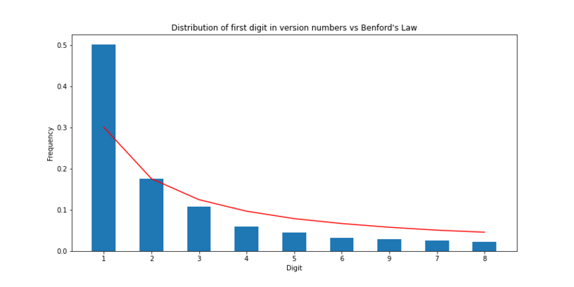
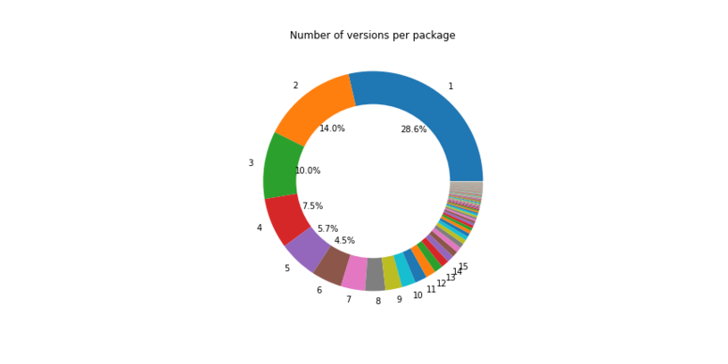
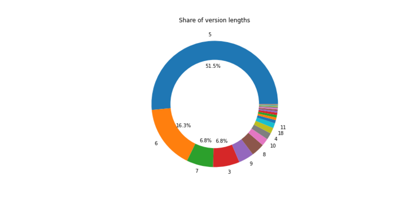

<em>The title is a reference to the mostly forgotten nickname of the excellent <a href="https://pypi.org/">Python Package Index</a> —</em> <em>Cheese Shop — which refers to the Monty Python <a href="https://www.youtube.com/watch?v=Hz1JWzyvv8A">Cheese Shop sketch</a>.</em>

I often find myself staring at the piwheels monitor, and occasionally a strange package name or an unusually longer version number pops up:

<figure class="aligncenter size-large"></figure>

I've been doing a lot of auditing piwheels vs PyPI lately, making sure we have the right set of packages and versions, pruning stuff that should have been deleted and adding in any that somehow got missed. And I came across lots of interesting oddities, so I thought I'd do some analysis and exploration and share the results here.

The following analysis is of a set of packages and version obtained from PyPI a few days ago, and at the time there were:

<ul class="wp-block-list"><li><strong>311,063 packages</strong></li><li><strong>2,766,603 versions</strong></li></ul>
<h2 class="wp-block-heading">Longest package names</h2>

The most common length of package name is <strong>8</strong> characters (like <a href="https://pypi.org/project/gpiozero/"><strong>gpiozero</strong></a>):

<figure class="aligncenter size-full"></figure>

The least common package name lengths are <strong>72</strong>, <strong>73</strong>, <strong>74</strong>, <strong>75</strong>, <strong>80</strong>, <strong>82</strong>, <strong>83</strong>, <strong>90</strong>, <strong>92</strong> — all of which occur once.

The longest package names are:

<ul class="wp-block-list"><li><a href="https://pypi.org/project/testtesttesttesttesttesttesttesttesttesttesttesttesttesttesttesttesttesttesttesttesttesttest/"><strong>testtesttesttesttesttesttesttesttesttesttesttesttesttesttesttesttesttesttesttesttesttesttest</strong></a> (92)</li><li><a href="https://pypi.org/project/wix-protos-com.wix.ecom.shipments.localdelivery-wix-ecommerce-shipments-local-delivery-web/"><strong>wix-protos-com-wix-ecom-shipments-localdelivery-wix-ecommerce-shipments-local-delivery-web</strong></a> (90)</li><li><a href="https://pypi.org/project/wix-protos-multilingual-localizationimporterexporter-localization-importer-exporter/"><strong>wix-protos-multilingual-localizationimporterexporter-localization-importer-exporter</strong></a> (83)</li><li><a href="https://pypi.org/project/wix-protos-ecom-shipments-localdelivery-wix-ecommerce-shipments-local-delivery-web/"><strong>wix-protos-ecom-shipments-localdelivery-wix-ecommerce-shipments-local-delivery-web</strong></a> (82)</li></ul>

<figure class="aligncenter size-full"></figure>

<figure class="aligncenter size-large"></figure>

<h2 class="wp-block-heading">Starting characters</h2>

The most common starting character for a package name is <strong>p</strong> (14%), due to lots of packages being named "py"-something or "python"-something. Second is <strong>d</strong> (9%) due to "django-" packages. The distribution for the rest of the character set is:

<figure class="aligncenter size-full"></figure>

The least common starting character is <strong>9</strong>. Only five packages start with a 9:

<ul class="wp-block-list"><li><strong><a href="https://pypi.org/project/91act-platform">91act-platform</a></strong></li><li><strong><a href="https://pypi.org/project/99d4aa80-d846-424f-873b-a02c7215fc54">99d4aa80-d846-424f-873b-a02c7215fc54</a></strong></li><li><strong><a href="https://pypi.org/project/908dist">908dist</a></strong></li><li><strong><a href="https://pypi.org/project/91downloader">91downloader</a></strong></li><li><strong><a href="https://pypi.org/project/9">9</a></strong></li></ul>

Looking at the first two characters, the most common are <strong>py</strong>, <strong>dj</strong>, <strong>od</strong>, <strong>co</strong> and <strong>re</strong>:

<figure class="aligncenter size-full"></figure>

Looking at the first three characters, <strong>dja</strong> takes over <strong>py</strong>:

<figure class="aligncenter size-full"></figure>

<h2 class="wp-block-heading">Benford's Law</h2>

<a href="https://en.wikipedia.org/wiki/Benford%27s_law">Benford's Law</a> states that in many naturally occurring collections of numbers, the leading digit is likely to be small, and hence the distribution of each subsequent digit is less likely. I wondered if this could be seen within package version numbers. Taking the numeric versions, and looking at the first non-zero digit, the distribution is reasonably compliant with Benford's Law:

<figure class="aligncenter size-full"></figure>

However, looking at the distribution of all digits (not just the first), this follows the pattern laid out by Benford's Law much more closely:

<figure class="aligncenter size-full"></figure>

In both cases, 1 is more common that expected, 2 seems to be perfectly aligned, but 9 is slightly more common than expected, more so in the first digit example.

<h2 class="wp-block-heading">Number of versions per package</h2>

I excluded packages which had no versions (because they don't have JSON endpoints on PyPI). As for the rest of them, over a quarter only have a single version. The frequency drops steadily as the number of versions rises:

<figure class="aligncenter size-full"></figure>

The package with the most versions is <strong><a href="https://pypi.org/project/pulumi/">pulumi</a></strong> with <strong>2,566</strong> versions!

<h2 class="wp-block-heading">Version length</h2>

A PyPI package version doesn't have to be strictly numeric – they're usually in the form 1.2.3 or similar, sometimes with characters appended to indicate alpha, beta, dev or release candidate, but they can be <em>any</em> string.

<ul class="wp-block-list"><li>The most common version length is <strong>5</strong>, which matches the "<strong>1.2.3</strong>" format.</li><li>The single most common version is "<strong>0.1.0</strong>" which occurs <strong>57,258</strong> times</li><li>There are <strong>233,734</strong> distinct versions</li><li>The longest version is a version of package <a href="https://pypi.org/project/lyricsprocessor"><strong>lyricsprocessor</strong></a>, with the version number <a href="https://pypi.org/project/lyricsprocessor/0.1.40404040404040404040404040404040404040404040404040404040404040404040404040404040/"><strong>0.1.40404040404040404040404040404040404040404040404040404040404040404040404040404040</strong></a> (84 chars)</li><li>The next longest are all from package <a href="https://pypi.org/project/softwarefabrica.django.utils/"><strong>softwarefabrica-django-utils</strong></a> which exclusively has versions of 70 characters e.g. <a href="https://pypi.org/project/softwarefabrica.django.utils/1.0dev-BZR-r115-panta-elasticworld.org-20100520155735-sf3yrsr0pvyvlm8m/"><strong>1.0dev-BZR-r115-panta-elasticworld.org-20100520155735-sf3yrsr0pvyvlm8m</strong></a></li></ul>

<figure class="aligncenter size-full"></figure>

<figure class="aligncenter size-large"></figure>

At one point in PyPI's history, someone accidentally submitted the description of their package as the version name, so there was a version of package <strong><a href="https://pypi.org/project/sysv-ipc/">sysv-ipc</a></strong> called:

<pre class="wp-block-preformatted">Sysv_ipc gives Python programs access to System V semaphores, shared memory and message queues. Most (all?) Unixes (including OS X) support System V IPC. Windows+Cygwin 1.7 might also work. 

Sample code is included.

This extension is released under the GPL. 

You might also be interested in the similar POSIX IPC module at: http://semanchuk.com/philip/posix_ipc/</pre>

Yes, that entire block of text. The version has now been deleted.

<figure class="aligncenter size-large"><figcaption>The truncated version number appearing on piwheels, prior to its deletion</figcaption></figure>

Other times this kind of thing has happened by accident include the first version of <strong><a href="https://pypi.org/project/omnijson/">omnijson</a></strong> which was called "<strong><a href="https://pypi.org/project/omnijson/Kenneth%20Reitz/">Kenneth Reitz</a></strong>" and is still live:

<figure class="aligncenter size-full"></figure>

<h2 class="wp-block-heading">Whitespace significance?</h2>

I recently noticed a version which seemed to have whitespace at the end of it, and had a look to see if there were others. There are 16 versions on PyPI which end in a newline character. Of these 16, 12 have registered the stripped equivalent too:

<ul class="wp-block-list"><li><strong>bugzilla</strong> '1.0\n'</li><li><strong>bugzilla</strong> '1.0.0\n'</li><li><strong>django-filtered-form</strong> '1.0.1\n'</li><li><strong>django-mongokit</strong> '0.2.3\n'</li><li><strong>docbook</strong> '1.0.11\n'</li><li><strong>git-plus</strong> '0.2.1.beta\n'</li><li><strong>lcinvestor</strong> '2.2.1\n'</li><li><strong>lendingclub</strong> '0.1.7\n'</li><li><strong>pythonwpy</strong> '0.3.0\n'</li><li><strong>pythonwpy</strong> '0.3.3\n'</li><li><strong>rabbit-qurator</strong> 'v1.0.0\n'</li><li><strong>rtmidi2</strong> '0.5.2\n'</li></ul>

Visually, on PyPI, these look identical:

<figure class="aligncenter size-full"><figcaption><a href="https://pypi.org/project/bugzilla/#history">Bugzilla</a> v1 – but which one??</figcaption></figure>

<h2 class="wp-block-heading">Non-numeric version names</h2>

Since version numbers tend to be numeric, surely the most interesting ones are those without any numbers in them.

<ul class="wp-block-list"><li>There are <strong>166</strong> packages which have non-numeric versions</li><li>There are a total of <strong>171</strong> non-numeric versions</li><li>The longest non-numeric version is <a href="https://pypi.org/project/jw.util/"><strong>jw-util</strong></a> version "<strong><a href="https://pypi.org/project/jw.util/-class.-jw.util.version.Version-/">-class.-jw.util.version.Version-</a></strong>"</li></ul>

This version number of <strong>jw-util</strong> seems to have been another accident:

<figure class="aligncenter size-full"></figure>

Since the version included a tarball in its <a href="https://pypi.org/project/jw.util/-class.-jw.util.version.Version-/#files">release</a>, you can inspect how this accident occurred. Lots of complicated code for calculating what the version number should be … gone wrong. The version string is actually the <a href="https://docs.python.org/3/library/functions.html#repr">repr</a> of the Version class, not the string representation of the instance, as intended. Normally it would appear as <code>&lt;__class__.jw.util.version.Version&gt;</code> but it's been canonicalised, replacing the angle brackets and double underscores with single hyphens.

Interestingly (if you've made it this far, I think you're the kind of person who'll find this interesting), of the 166 packages with non-numeric versions, all but five of them have only a single non-numeric version, and those five only have two such versions each. Those are:

<ul class="wp-block-list"><li><a href="https://pypi.org/project/confine-controller"><strong>confine-controller</strong></a> 'dev' and 'beta'</li><li><a href="https://pypi.org/project/pycli"><strong>pycli</strong></a> 'devel' and 'dev'</li><li><a href="https://pypi.org/project/pyircserver"><strong>pyircserver</strong></a> 'PreAlpha' and 'Alpha'</li><li><strong><a href="https://pypi.org/project/amoi">amoi</a></strong> 'lol' and '.lol.'</li><li><strong><a href="https://pypi.org/project/dstufft-testpkg">dstufft-testpkg</a></strong> 'dog' and 'watwatwat'</li></ul>
<h2 class="wp-block-heading">Queen's English</h2>

Using the system dictionaries, I wondered how many package names were dictionary words:

<ul class="wp-block-list"><li><strong>11,131</strong> packages are a single word found in the US English dictionary</li><li><strong>11,031</strong> packages are are a single word found in the British English dictionary</li><li>Only <strong>39</strong> of the British English dictionary packages do not appear in the US dictionary, so for fun, let's see what those are:<ul><li><strong><a href="https://pypi.org/project/acclimatise">acclimatise</a></strong></li><li><strong><a href="https://pypi.org/project/aluminium">aluminium</a></strong></li><li><strong><a href="https://pypi.org/project/analyse">analyse</a></strong></li><li><strong><a href="https://pypi.org/project/armoury">armoury</a></strong></li><li><strong><a href="https://pypi.org/project/behaviour">behaviour</a></strong></li><li><strong><a href="https://pypi.org/project/caesium">caesium</a></strong></li><li><strong><a href="https://pypi.org/project/colour">colour</a></strong></li><li><strong><a href="https://pypi.org/project/colouration">colouration</a></strong></li><li><strong><a href="https://pypi.org/project/coloured">coloured</a></strong></li><li><strong><a href="https://pypi.org/project/colourful">colourful</a></strong></li><li><strong><a href="https://pypi.org/project/colourless">colourless</a></strong></li><li><strong><a href="https://pypi.org/project/colours">colours</a></strong></li><li><strong><a href="https://pypi.org/project/connexion">connexion</a></strong></li><li><strong><a href="https://pypi.org/project/decentralise">decentralise</a></strong></li><li><strong><a href="https://pypi.org/project/draughts">draughts</a></strong></li><li><strong><a href="https://pypi.org/project/draughtsman">draughtsman</a></strong></li><li><strong><a href="https://pypi.org/project/fibre">fibre</a></strong></li><li><strong><a href="https://pypi.org/project/gramme">gramme</a></strong></li><li><strong><a href="https://pypi.org/project/harbour">harbour</a></strong></li><li><strong><a href="https://pypi.org/project/inflexion">inflexion</a></strong></li><li><strong><a href="https://pypi.org/project/labours">labours</a></strong></li><li><strong><a href="https://pypi.org/project/liquorice">liquorice</a></strong></li><li><strong><a href="https://pypi.org/project/memorised">memorised</a></strong></li><li><strong><a href="https://pypi.org/project/mitre">mitre</a></strong></li><li><strong><a href="https://pypi.org/project/motorise">motorise</a></strong></li><li><strong><a href="https://pypi.org/project/mould">mould</a></strong></li><li><strong><a href="https://pypi.org/project/moult">moult</a></strong></li><li><strong><a href="https://pypi.org/project/mums">mums</a></strong></li><li><strong><a href="https://pypi.org/project/normalise">normalise</a></strong></li><li><strong><a href="https://pypi.org/project/optimisation">optimisation</a></strong></li><li><strong><a href="https://pypi.org/project/optimise">optimise</a></strong></li><li><strong><a href="https://pypi.org/project/optimiser">optimiser</a></strong></li><li><strong><a href="https://pypi.org/project/organise">organise</a></strong></li><li><strong><a href="https://pypi.org/project/pyjamas">pyjamas</a></strong></li><li><strong><a href="https://pypi.org/project/sceptre">sceptre</a></strong></li><li><strong><a href="https://pypi.org/project/spectre">spectre</a></strong></li><li><strong><a href="https://pypi.org/project/spectres">spectres</a></strong></li><li><strong><a href="https://pypi.org/project/summarise">summarise</a></strong></li><li><strong><a href="https://pypi.org/project/tricolour">tricolour</a></strong></li></ul></li></ul>

You can view the notebook to see the workings around this analysis on <a href="https://github.com/piwheels/stats/blob/master/pypi.ipynb"><strong>GitHub</strong></a>, including how I obtained the data from PyPI using the XMLRPC and JSON APIs.

