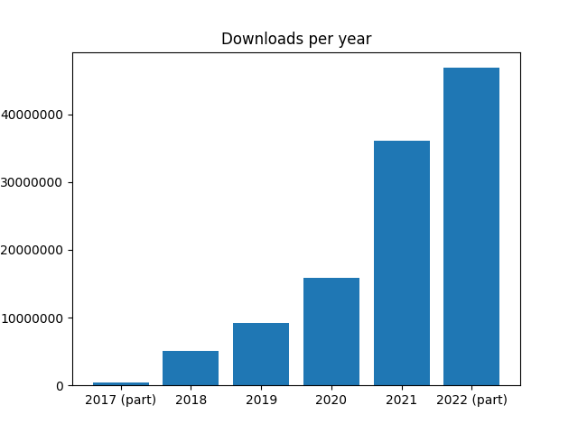
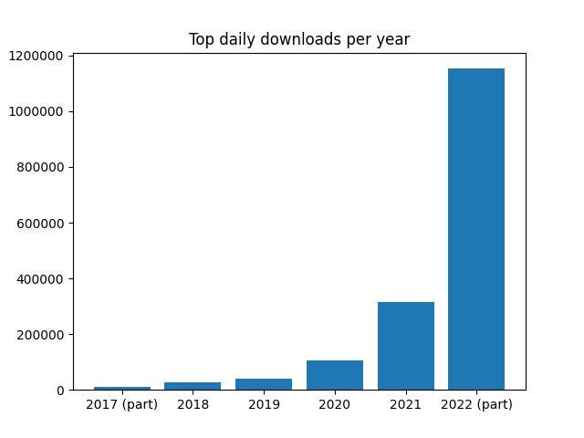

Following a substantial record breaking spike in downloads, we recently passed the **100,000,000**
mark. That's the total number of wheel files served from piwheels to date.

<figure class="block-embed">
<blockquote>

Now passed 100,000,000 downloads

— piwheels.org (@piwheels) <a
href="https://twitter.com/piwheels/status/1571839180380020738?ref_src=twsrc%5Etfw">September 19,
2022</a>

</blockquote>
</figure>

When we reached 10 million in 3 years, reaching 100 million seemed impossible, but downloads
significantly increased year-on-year, so here we are:

<figure class="block-image">

</figure>

## The daily record

Also, the daily record keeps getting beaten. Last month, the previous record of 314,030 was smashed
when we passed 500,000 for the first time. Since then, that record has been doubled — we've now
passed 1,000,000.

<figure class="block-embed">
<blockquote>

Yesterday, 1,060,767 packages were downloaded from <a
href="https://t.co/cXm1GPsEZt">https://t.co/cXm1GPsEZt</a> (a new daily record), saving users over
344 days of build time <a href="https://t.co/7SszRFiM3b">pic.twitter.com/7SszRFiM3b</a>

— piwheels.org (@piwheels) <a
href="https://twitter.com/piwheels/status/1577224587934195712?ref_src=twsrc%5Etfw">October 4,
2022</a>

</blockquote>
</figure>

<figure class="block-image">

</figure>

## Raspberry Pi web hosting: does it scale?

The [piwheels website](https://piwheels.org/) is hosted on a single Raspberry Pi 4 with 4GB RAM.
It's in the [Mythic Beasts Pi Cloud](https://www.mythic-beasts.com/order/rpi), where the Pis are
netbooted from a hard disk drive, so the filesystem is over NFS.

It runs the piwheels master software, which controls what the other Pis build, manages file
transfers and more. I'd describe that as quite a complex system (feel free to inspect it yourself
on [GitHub](https://github.com/piwheels/piwheels/tree/master/piwheels)), but the "website" part of
it is as simple as possible — which is why it scales to demand so well.

Rather than running a web application to serve dynamic content for each request, we have the
piwheels system write out the HTML indexes according to [PEP 503 — Simple Repository
API](https://peps.python.org/pep-0503/).

As long as the Pi has power, network connectivity and can handle the load, the piwheels repository
remains accessible. If the piwheels master software falls over for whatever reason, the website
carries on serving files as before.

It'll be interesting to see how long the current trend pans out, and we'll see if we can figure
out what's driving it. If the annual growth keeps on, maybe we'll hit the one billion mark some
day...
