
In the period of October – December 2021, <strong>11,942,250</strong> packages were downloaded from piwheels, bringing the total to <strong>67,608,247</strong>. This has saved <strong>43 years</strong> in the period, and <strong>601 years</strong> in total! There were <strong>58,871,182</strong> pip searches, <strong>886,179</strong> project page hits, <strong>420,490</strong> web page hits and <strong>294,252</strong> project JSON downloads in the period.

<figure class="aligncenter size-full">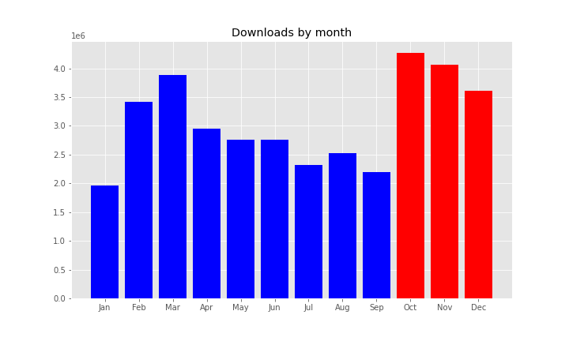</figure>

In the previous quarter, only 7 days surpassed <strong>100k</strong> downloads. In this period, most days did. 5 days surpassed <strong>200k</strong>, 3 surpassed <strong>250k</strong>, and one surpassed <strong>300k</strong>.

<figure class="aligncenter size-full"></figure>

<figure class="aligncenter size-full">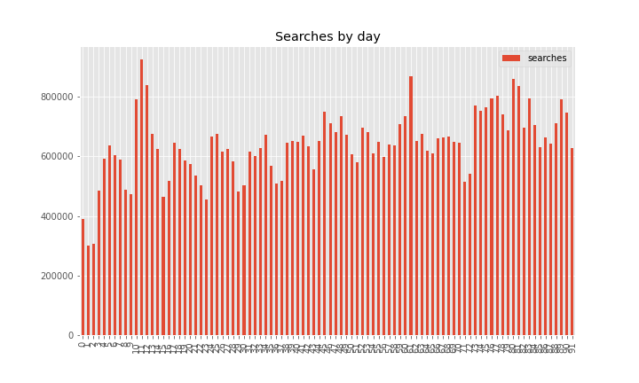</figure>

Downloads saved around between <strong>13</strong> and <strong>17</strong> years per month:

<figure class="aligncenter size-full">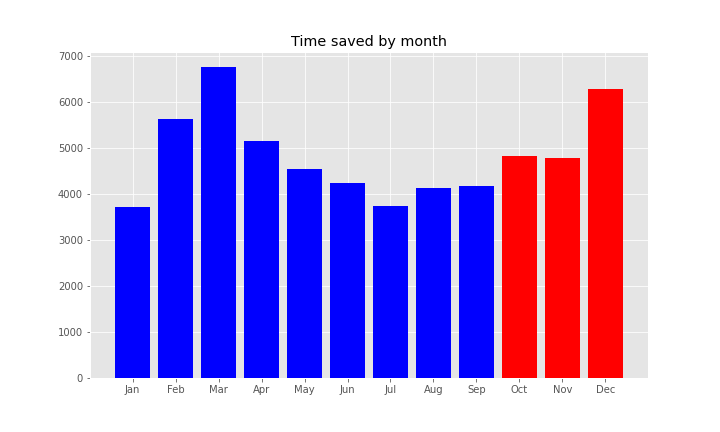</figure>

The top 10 downloads were:

<ol class="wp-block-list"><li><strong><a href="https://www.piwheels.org/project/requests">requests</a></strong> (230,601)</li><li><strong><a href="https://www.piwheels.org/project/setuptools">setuptools</a></strong> (214,607)</li><li><strong><a href="https://www.piwheels.org/project/charset-normalizer">charset-normalizer</a></strong> (187,981)</li><li><strong><a href="https://www.piwheels.org/project/pyyaml">pyyaml</a></strong> (187,863)</li><li><strong><a href="https://www.piwheels.org/project/websocket-client">websocket-client</a></strong> (180,099)</li><li><strong><a href="https://www.piwheels.org/project/octoprint-firmwarecheck">octoprint-firmwarecheck</a></strong> (151,629)</li><li><strong><a href="https://www.piwheels.org/project/jinja2">jinja2</a></strong> (150,724)</li><li><strong><a href="https://www.piwheels.org/project/wheel">wheel</a></strong> (139,357)</li><li><strong><a href="https://www.piwheels.org/project/numpy">numpy</a></strong> (135,584)</li><li><strong><a href="https://www.piwheels.org/project/pigpio-dht">pigpio-dht</a></strong> (134,810)</li></ol>

The top 10 pip searches were:

<ol class="wp-block-list"><li><strong><a href="https://www.piwheels.org/project/pip">pip</a></strong> (4,755,985)</li><li><strong><a href="https://www.piwheels.org/project/wheel">wheel</a></strong> (3,410,977)</li><li><strong><a href="https://www.piwheels.org/project/setuptools">setuptools</a></strong> (1,717,821)</li><li><strong><a href="https://www.piwheels.org/project/future">future</a></strong> (946,503)</li><li><strong><a href="https://www.piwheels.org/project/pyngrok">pyngrok</a></strong> (835,140)</li><li><strong><a href="https://www.piwheels.org/project/youtube-dl">youtube-dl</a></strong> (678,269)</li><li><strong><a href="https://www.piwheels.org/project/requests">requests</a></strong> (631,481)</li><li><strong><a href="https://www.piwheels.org/project/six">six</a></strong> (527,637)</li><li><strong><a href="https://www.piwheels.org/project/pyyaml">pyyaml</a></strong> (525,629)</li><li><strong><a href="https://www.piwheels.org/project/urllib3">urllib3</a></strong> (512,396)</li></ol>

The top 10 project page hits were:

<ol class="wp-block-list"><li><strong><a href="https://www.piwheels.org/project/opencv-python">opencv-python</a></strong> (2,354)</li><li><strong><a href="https://www.piwheels.org/project/opencv-contrib-python">opencv-contrib-python</a></strong> (1,876)</li><li><strong><a href="https://www.piwheels.org/project/numpy">numpy</a></strong> (1,217)</li><li><strong><a href="https://www.piwheels.org/project/tensorflow">tensorflow</a></strong> (729)</li><li><strong><a href="https://www.piwheels.org/project/scipy">scipy</a></strong> (662)</li><li><strong><a href="https://www.piwheels.org/project/cryptography">cryptography</a></strong> (616)</li><li><strong><a href="https://www.piwheels.org/project/pandas">pandas</a></strong> (516)</li><li><strong><a href="https://www.piwheels.org/project/pillow">pillow</a></strong> (438)</li><li><strong><a href="https://www.piwheels.org/project/grpcio">grpcio</a></strong> (399)</li><li><strong><a href="https://www.piwheels.org/project/pyyaml">pyyaml</a></strong> (362)</li></ol>

The top 10 project JSON downloads were:

<ol class="wp-block-list"><li><strong><a href="https://www.piwheels.org/project/awscrt">awscrt</a></strong> (21,132)</li><li><strong><a href="https://www.piwheels.org/project/numpy">numpy</a></strong> (157)</li><li><strong><a href="https://www.piwheels.org/project/opencv-contrib-python">opencv-contrib-python</a></strong> (131)</li><li><strong><a href="https://www.piwheels.org/project/pyzmq">pyzmq</a></strong> (113)</li><li><strong><a href="https://www.piwheels.org/project/opencv-python">opencv-python</a></strong> (101)</li><li><strong><a href="https://www.piwheels.org/project/protobuf">protobuf</a></strong> (88)</li><li><strong><a href="https://www.piwheels.org/project/scipy">scipy</a></strong> (77)</li><li><strong><a href="https://www.piwheels.org/project/obs-streamdeck-controls">obs-streamdeck-controls</a></strong> (72)</li><li><strong><a href="https://www.piwheels.org/project/pname">pname</a></strong> (69)</li><li><strong><a href="https://www.piwheels.org/project/keras-models">keras-models</a></strong> (66)</li></ol>

See the <a href="https://www.piwheels.org/json.html">JSON API</a> page for more information on using this API.

<h2 class="wp-block-heading">Platforms</h2>

Linux makes up over 99.9% of all searches so I've discounted the rest. Raspberry Pi OS and Debian are now combined (due to Raspberry Pi OS identifying itself as Debian). This group obviously dominates with over 98%. Ubuntu remains in third place with only 0.7%, although we don't officially support it.

<figure class="aligncenter size-full">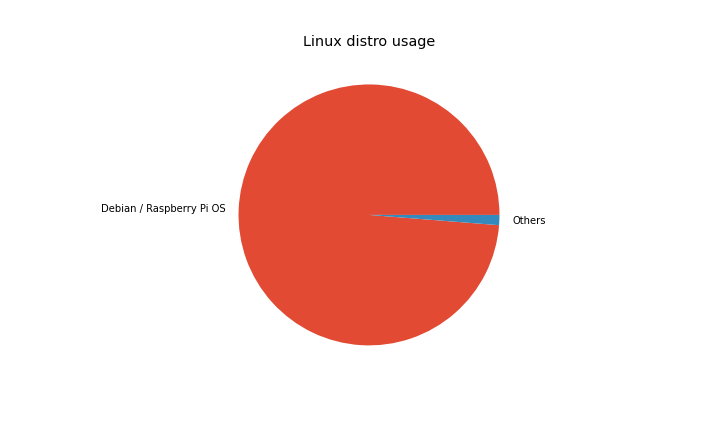</figure>

The latest OS release, Bullseye, has taken a sizeable chunk of the share (25%), but it's far from taking over Buster (68%), due to <a href="https://www.raspberrypi.com/news/new-old-functionality-with-raspberry-pi-os-legacy/">compatibility issues</a> with e.g. picamera. Stretch has dropped to under 7% and there's practically no Jessie usage.

<figure class="aligncenter size-full">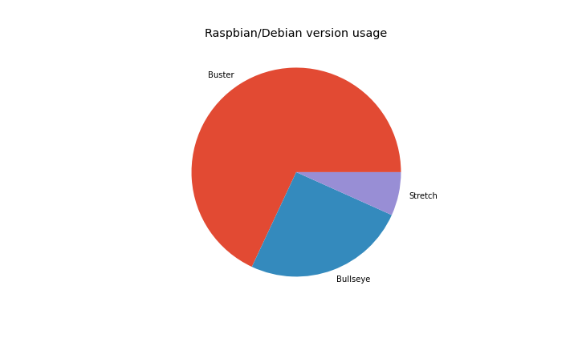</figure>

armv7l (Pi 2/3/4 – and now Zero 2) is still a majority architecture with 95% of searches from Arm devices (89% of which is from armv7l). Last quarter we saw more hits from aarch64 users than x86_64 and armv6l combined, but this spike has diminished, although aarch64 still (just) beats armv6l, with 4.6% to 3.5%:

<figure class="aligncenter size-full">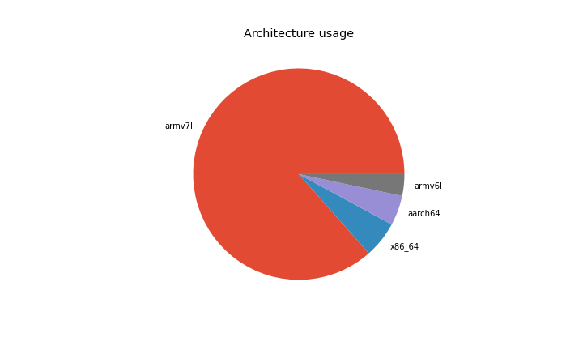</figure>

Python 3 has an overwhelming majority of usage (88%), and 3.7 (the version provided by Buster) has the highest share with 54%. Bullseye's Python 3.9 now comes second with 24% and Python 2.7 comes third with 15%:

<figure class="aligncenter size-full">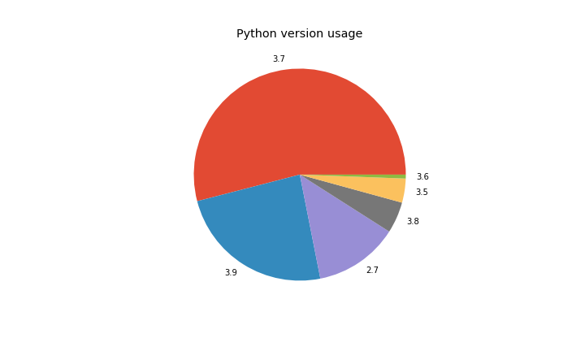</figure>

We're also logging pip and setuptools versions:

<figure class="aligncenter size-full">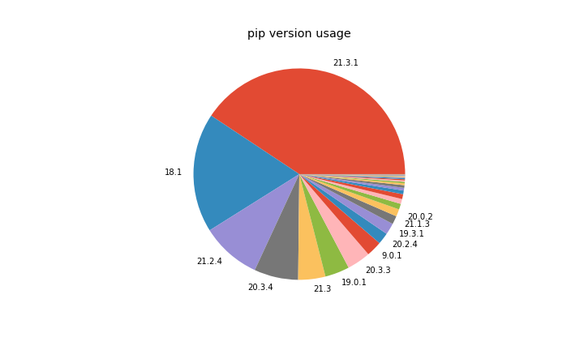</figure>

<figure class="aligncenter size-full">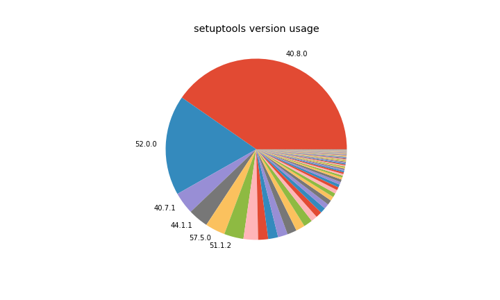</figure>

We see over <strong>5TB</strong> of bandwidth each month, peaking at <strong>5.54TB</strong> in November. The breakdown of bandwidth in the period is 79% pip downloads, 2.5% pip searches, a tiny amount (0.09%) of website traffic (project pages, JSON, etc) and the rest (surprisingly high, 17.5%) comprising mostly of direct wheel downloads not from pip (e.g. browsers):

<figure class="wp-block-image size-full">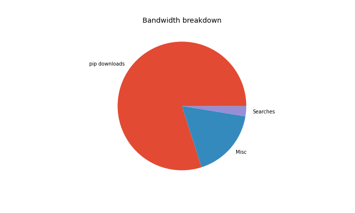</figure>

And broken down by month:

<figure class="wp-block-image size-full">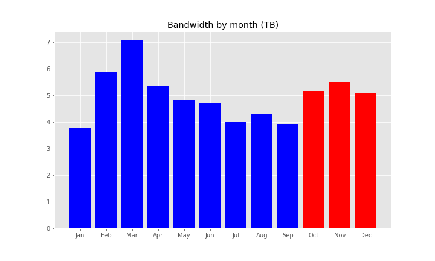</figure>

Check out the source of this post in a Jupyter notebook: <a href="https://github.com/piwheels/stats/blob/master/2021q4.ipynb">github.com/piwheels/stats/blob/master/2021q4.ipynb</a>

