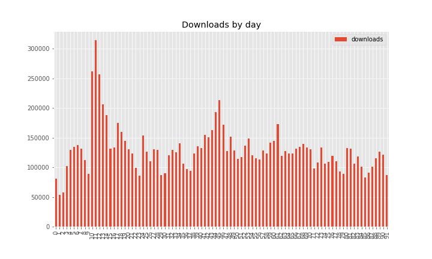

In the period of October — December 2021, **11,942,250** packages were downloaded from piwheels,
bringing the total to **67,608,247**. This has saved **43 years** in the period, and **601 years**
in total! There were **58,871,182** pip searches, **886,179** project page hits, **420,490** web
page hits and **294,252** project JSON downloads in the period.

<figure class="block-image">

</figure>

In the previous quarter, only 7 days surpassed **100k** downloads. In this period, most days did. 5
days surpassed **200k**, 3 surpassed **250k**, and one surpassed **300k**.

<figure class="block-image">

</figure>

<figure class="block-image">

</figure>

Downloads saved around between **13** and **17** years per month:

<figure class="block-image">

</figure>

The top 10 downloads were:

1.  **[requests](https://www.piwheels.org/project/requests)** (230,601)
2.  **[setuptools](https://www.piwheels.org/project/setuptools)** (214,607)
3.  **[charset-normalizer](https://www.piwheels.org/project/charset-normalizer)** (187,981)
4.  **[pyyaml](https://www.piwheels.org/project/pyyaml)** (187,863)
5.  **[websocket-client](https://www.piwheels.org/project/websocket-client)** (180,099)
6.  **[octoprint-firmwarecheck](https://www.piwheels.org/project/octoprint-firmwarecheck)**
    (151,629)
7.  **[jinja2](https://www.piwheels.org/project/jinja2)** (150,724)
8.  **[wheel](https://www.piwheels.org/project/wheel)** (139,357)
9.  **[numpy](https://www.piwheels.org/project/numpy)** (135,584)
10. **[pigpio-dht](https://www.piwheels.org/project/pigpio-dht)** (134,810)

The top 10 pip searches were:

1.  **[pip](https://www.piwheels.org/project/pip)** (4,755,985)
2.  **[wheel](https://www.piwheels.org/project/wheel)** (3,410,977)
3.  **[setuptools](https://www.piwheels.org/project/setuptools)** (1,717,821)
4.  **[future](https://www.piwheels.org/project/future)** (946,503)
5.  **[pyngrok](https://www.piwheels.org/project/pyngrok)** (835,140)
6.  **[youtube-dl](https://www.piwheels.org/project/youtube-dl)** (678,269)
7.  **[requests](https://www.piwheels.org/project/requests)** (631,481)
8.  **[six](https://www.piwheels.org/project/six)** (527,637)
9.  **[pyyaml](https://www.piwheels.org/project/pyyaml)** (525,629)
10. **[urllib3](https://www.piwheels.org/project/urllib3)** (512,396)

The top 10 project page hits were:

1.  **[opencv-python](https://www.piwheels.org/project/opencv-python)** (2,354)
2.  **[opencv-contrib-python](https://www.piwheels.org/project/opencv-contrib-python)** (1,876)
3.  **[numpy](https://www.piwheels.org/project/numpy)** (1,217)
4.  **[tensorflow](https://www.piwheels.org/project/tensorflow)** (729)
5.  **[scipy](https://www.piwheels.org/project/scipy)** (662)
6.  **[cryptography](https://www.piwheels.org/project/cryptography)** (616)
7.  **[pandas](https://www.piwheels.org/project/pandas)** (516)
8.  **[pillow](https://www.piwheels.org/project/pillow)** (438)
9.  **[grpcio](https://www.piwheels.org/project/grpcio)** (399)
10. **[pyyaml](https://www.piwheels.org/project/pyyaml)** (362)

The top 10 project JSON downloads were:

1.  **[awscrt](https://www.piwheels.org/project/awscrt)** (21,132)
2.  **[numpy](https://www.piwheels.org/project/numpy)** (157)
3.  **[opencv-contrib-python](https://www.piwheels.org/project/opencv-contrib-python)** (131)
4.  **[pyzmq](https://www.piwheels.org/project/pyzmq)** (113)
5.  **[opencv-python](https://www.piwheels.org/project/opencv-python)** (101)
6.  **[protobuf](https://www.piwheels.org/project/protobuf)** (88)
7.  **[scipy](https://www.piwheels.org/project/scipy)** (77)
8.  **[obs-streamdeck-controls](https://www.piwheels.org/project/obs-streamdeck-controls)** (72)
9.  **[pname](https://www.piwheels.org/project/pname)** (69)
10. **[keras-models](https://www.piwheels.org/project/keras-models)** (66)

See the [JSON API](https://www.piwheels.org/json.html) page for more information on using this API.

## Platforms

Linux makes up over 99.9% of all searches so I've discounted the rest. Raspberry Pi OS and Debian
are now combined (due to Raspberry Pi OS identifying itself as Debian). This group obviously
dominates with over 98%. Ubuntu remains in third place with only 0.7%, although we don't officially
support it.

<figure class="block-image">

</figure>

The latest OS release, Bullseye, has taken a sizeable chunk of the share (25%), but it's far from
taking over Buster (68%), due to [compatibility
issues](https://www.raspberrypi.com/news/new-old-functionality-with-raspberry-pi-os-legacy/) with
e.g. picamera. Stretch has dropped to under 7% and there's practically no Jessie usage.

<figure class="block-image">

</figure>

armv7l (Pi 2/3/4 — and now Zero 2) is still a majority architecture with 95% of searches from Arm
devices (89% of which is from armv7l). Last quarter we saw more hits from aarch64 users than x86_64
and armv6l combined, but this spike has diminished, although aarch64 still (just) beats armv6l, with
4.6% to 3.5%:

<figure class="block-image">

</figure>

Python 3 has an overwhelming majority of usage (88%), and 3.7 (the version provided by Buster) has
the highest share with 54%. Bullseye's Python 3.9 now comes second with 24% and Python 2.7 comes
third with 15%:

<figure class="block-image">

</figure>

We're also logging pip and setuptools versions:

<figure class="block-image">

</figure>

<figure class="block-image">

</figure>

We see over **5TB** of bandwidth each month, peaking at **5.54TB** in November. The breakdown of
bandwidth in the period is 79% pip downloads, 2.5% pip searches, a tiny amount (0.09%) of website
traffic (project pages, JSON, etc) and the rest (surprisingly high, 17.5%) comprising mostly of
direct wheel downloads not from pip (e.g. browsers):

<figure class="block-image">

</figure>

And broken down by month:

<figure class="block-image">

</figure>

Check out the source of this post in a Jupyter notebook:
[github.com/piwheels/stats/blob/master/2021q4.ipynb](https://github.com/piwheels/stats/blob/master/2021q4.ipynb)
