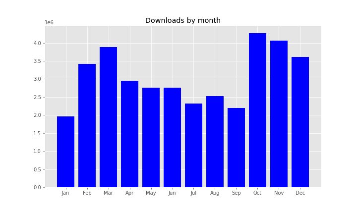
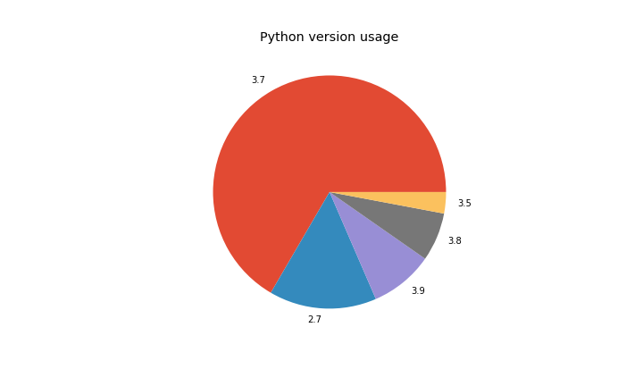
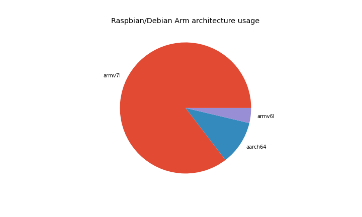
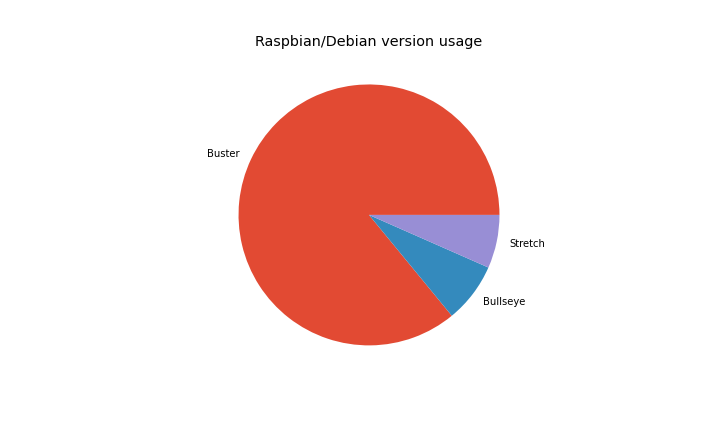
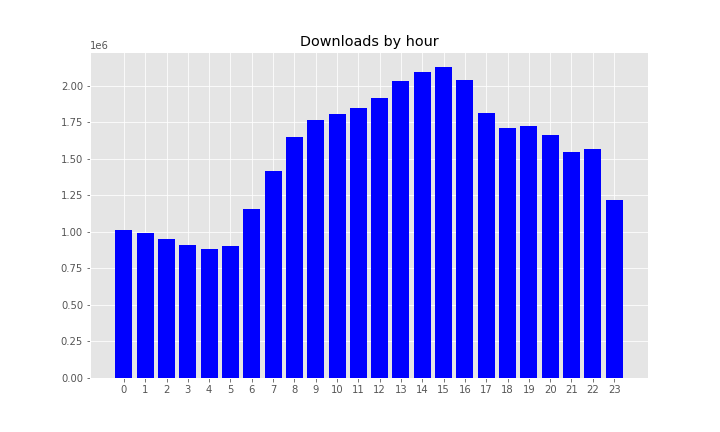
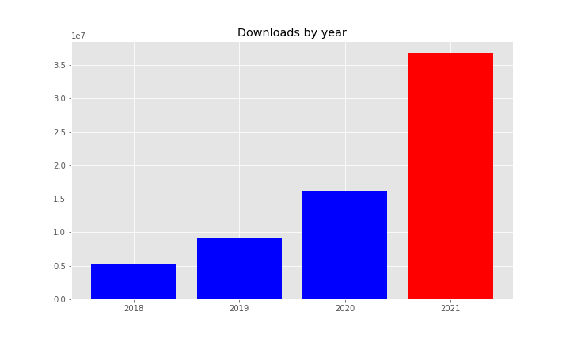

In 2020, a total of <strong>36,724,799</strong> packages were downloaded, taking the total to <strong>67,695,042</strong>. This saved <strong>159 years</strong> during 2020, taking us to over <strong>600 years</strong> saved overall. <strong>50TB</strong> of files were downloaded, taking the total to <strong>153TB</strong>.

<ul class="wp-block-list"><li>Average daily downloads:<ul><li>2020: <strong>44,220</strong></li><li>2021: <strong>100,615</strong></li></ul></li><li>Average monthly downloads:<ul><li>2020: <strong>1,326,600</strong></li><li>2021: <strong>3,060,399</strong></li></ul></li><li>Most downloads in one day:<ul><li>2020: <strong>105,826</strong> on 15 December</li><li>2021: <strong>314,030</strong></li></ul></li><li>Most downloads in one month:<ul><li>2020: <strong>1,850,781</strong> in October (<strong>59,702</strong> daily average)</li><li>2021: <strong>4,263,286</strong> in October (<strong>137,525</strong> daily average)</li></ul></li><li>Bandwidth used from downloads:<ul><li>2020: <strong>52TB</strong></li><li>2021: <strong>50TB</strong></li></ul></li></ul>

Apart from January, each month had over <strong>2 million downloads</strong>. The last three months all passed <strong>3.5 million</strong>.

<figure class="aligncenter size-full"></figure>

12 October 2021 was the biggest day on record, with <strong><strong>314,030</strong></strong> downloads.

The month of October recorded the most downloads at <strong>4,263,286</strong>.

<h2 class="wp-block-heading">Top 30 packages</h2>
<ol class="wp-block-list"><li><strong><a href="https://www.piwheels.org/project/requests">requests</a></strong> (684,141)</li><li><strong><a href="https://www.piwheels.org/project/numpy">numpy</a></strong> (546,668)</li><li><strong><a href="https://www.piwheels.org/project/setuptools">setuptools</a></strong> (524,595)</li><li><strong><a href="https://www.piwheels.org/project/pip">pip</a></strong> (460,168)</li><li><strong><a href="https://www.piwheels.org/project/idna">idna</a></strong> (443,288)</li><li><strong><a href="https://www.piwheels.org/project/urllib3">urllib3</a></strong> (425,864)</li><li><strong><a href="https://www.piwheels.org/project/chardet">chardet</a></strong> (420,834)</li><li><strong><a href="https://www.piwheels.org/project/certifi">certifi</a></strong> (407,524)</li><li><strong><a href="https://www.piwheels.org/project/websocket-client">websocket-client</a></strong> (404,080)</li><li><strong><a href="https://www.piwheels.org/project/six">six</a></strong> (403,825)</li><li><strong><a href="https://www.piwheels.org/project/importlib-metadata">importlib-metadata</a></strong> (392,717)</li><li><strong><a href="https://www.piwheels.org/project/pillow">pillow</a></strong> (388,883)</li><li><strong><a href="https://www.piwheels.org/project/typing-extensions">typing-extensions</a></strong> (387,626)</li><li><strong><a href="https://www.piwheels.org/project/pyyaml">pyyaml</a></strong> (368,142)</li><li><strong><a href="https://www.piwheels.org/project/attrs">attrs</a></strong> (348,164)</li><li><strong><a href="https://www.piwheels.org/project/cffi">cffi</a></strong> (337,885)</li><li><strong><a href="https://www.piwheels.org/project/click">click</a></strong> (337,042)</li><li><strong><a href="https://www.piwheels.org/project/wheel">wheel</a></strong> (329,901)</li><li><strong><a href="https://www.piwheels.org/project/jinja2">jinja2</a></strong> (316,285)</li><li><strong><a href="https://www.piwheels.org/project/h11">h11</a></strong> (315,878)</li><li><strong><a href="https://www.piwheels.org/project/octoprint-pisupport">octoprint-pisupport</a></strong> (309,915)</li><li><strong><a href="https://www.piwheels.org/project/octoprint-firmwarecheck">octoprint-firmwarecheck</a></strong> (307,221)</li><li><strong><a href="https://www.piwheels.org/project/markupsafe">markupsafe</a></strong> (277,070)</li><li><strong><a href="https://www.piwheels.org/project/zipp">zipp</a></strong> (276,298)</li><li><strong><a href="https://www.piwheels.org/project/python-dateutil">python-dateutil</a></strong> (264,416)</li><li><strong><a href="https://www.piwheels.org/project/charset-normalizer">charset-normalizer</a></strong> (256,203)</li><li><strong><a href="https://www.piwheels.org/project/tornado">tornado</a></strong> (243,797)</li><li><strong><a href="https://www.piwheels.org/project/pycparser">pycparser</a></strong> (239,223)</li><li><strong><a href="https://www.piwheels.org/project/async-timeout">async-timeout</a></strong> (238,955)</li><li><strong><a href="https://www.piwheels.org/project/immutabledict">immutabledict</a></strong> (231,729)</li></ol>
<h2 class="wp-block-heading">Python version usage</h2>

Most searches are from Python 3.7, the default in Debian Buster (67%). Second is Python 2.7 with 15%, followed by 3.9 (the default in Bullseye, which was only released in the summer) with 9%:

<figure class="wp-block-image size-full"></figure>
<h2 class="wp-block-heading">Architectures</h2>

armv7l (Pi 2/3/4 and Zero 2 platform) is still a majority architecture with 85% of searches from Arm devices, with aarch64 rising beyond 10% and armv6l (Pi 1/Zero) dropping below 4%:

<figure class="wp-block-image size-full"></figure>
<h2 class="wp-block-heading">Operating systems</h2>

The vast majority of downloads are from Raspberry Pi OS (over 98%). Of these, 86% are Buster, 7.5% are Bullseye (released in the summer), 6.6% are Stretch.

<figure class="wp-block-image size-full"></figure>
<h2 class="wp-block-heading">Downloads through the day</h2>

Our busiest hour is still between 3pm-4pm. All afternoon/evening UTC we are at our busiest:

<figure class="wp-block-image size-full"></figure>
<h2 class="wp-block-heading"> Year-on-year</h2>

We have been nearly doubling every year, but this year we more than doubled downloads:

<figure class="wp-block-image size-full"></figure>

Check out the source of this post in a Jupyter notebook: <a href="https://github.com/piwheels/stats/blob/master/2021.ipynb">https://github.com/piwheels/stats/blob/master/2021.ipynb</a>

If you're interested in following piwheels project updates, we tweet daily and monthly stats at <a href="https://twitter.com/piwheels">@piwheels</a>. You can also follow me <a href="https://twitter.com/ben_nuttall">@ben_nuttall</a> and Dave <a href="https://twitter.com/waveform80">@waveform80</a>.

<em>The piwheels project wouldn't be possible without considerable support from </em><a href="https://www.mythic-beasts.com/"><em>Mythic Beasts</em></a><em>, who provide storage, bandwidth and cloud Pis. The Pi platform is so straightforward, it's been a pleasure to use, allowing us to scale up builder Pis with ease. We highly recommend using this (very affordable) service for real </em><a href="https://www.mythic-beasts.com/order/rpi"><em>Pi testing</em></a><em> for your projects.</em>

