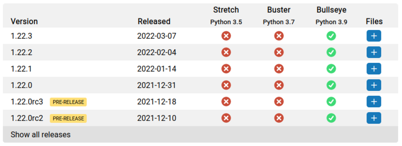

When I first started the piwheels project in April 2017, I created [Issue
#1](https://github.com/piwheels/piwheels/issues/1) comprising a list of features I thought were
necessary for the project to be "feature complete", and until now, the issue remained open with a
single checkbox remaining: *be able to publicly provide output from failed build attempts.*

When a piwheels build fails, anyone interested in resolving the failed build will need to see the
output from when that command was run, whether that be the maintainers of piwheels, the maintainers
of the package that failed to build, or any user of that package. Since the beginning we've stored
the build output in our database along with other build information, but access to it has been
limited to the two of us, often using pastebin to share with others.

Now, these output logs are browsable by anyone, and they're easily accessible via our [project
pages](https://www.piwheels.org/project/numpy/). Just click on the build status icon:

<figure class="wp-block-image size-full">

</figure>

For example:
**[https://www.piwheels.org/logs/0000/0789/0007.txt](https://www.piwheels.org/logs/0000/0789/0007.txt)**

We have refreshed the design of the site, removing JavaScript libraries which slowed down page load
time, improving the user experience on mobile, and we've [optimised the
SQL](https://github.com/piwheels/piwheels/blob/master/piwheels/initdb/sql/update_piwheels_0.19_to_0.20.sql#L9:L174)
to make rewriting pages much faster.

We've also introduced a banner system, alerting users browsing the website to any temporary notices
we have. Currently we're using it to inform people that [piwheels doesn't yet support
aarch64](https://github.com/piwheels/packages/issues/119):

<figure class="wp-block-image size-large">

</figure>
