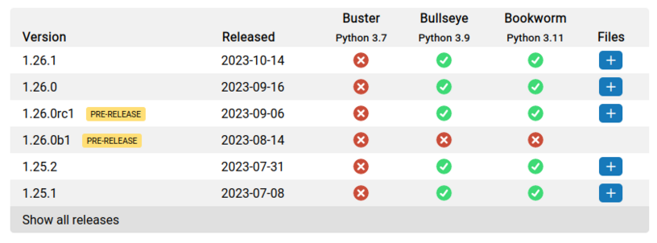

Now that the Raspberry Pi 5 is <a href="https://www.raspberrypi.com/news/introducing-raspberry-pi-5/">announced</a> and <a href="https://www.raspberrypi.com/news/raspberry-pi-5-available-now/">available</a>, an Raspberry Pi OS release based on Debian Bookworm has been released, which includes Python 3.11. We've built wheels for cp311 and all <a href="https://www.piwheels.org/packages.html">project pages</a> should now show the availability for each version:

<figure class="aligncenter size-full"></figure>

The big change in Bookworm is that you can no longer install packages system-wide using pip:

<pre class="wp-block-preformatted">pi@raspberrypi:~$ sudo pip3 install gpiozero
error: externally-managed-environment

× This environment is externally managed
╰─&gt; To install Python packages system-wide, try apt install
    python3-xyz, where xyz is the package you are trying to
    install.
    
    If you wish to install a non-Debian-packaged Python package,
    create a virtual environment using python3 -m venv path/to/venv.
    Then use path/to/venv/bin/python and path/to/venv/bin/pip. Make
    sure you have python3-full installed.
    
    If you wish to install a non-Debian packaged Python application,
    it may be easiest to use pipx install xyz, which will manage a
    virtual environment for you. Make sure you have pipx installed.
    
    See /usr/share/doc/python3.11/README.venv for more information.

note: If you believe this is a mistake, please contact your Python installation or OS distribution provider. You can override this, at the risk of breaking your Python installation or OS, by passing --break-system-packages.
hint: See PEP 668 for the detailed specification.</pre>
<h2 class="wp-block-heading">Using a virtual environment</h2>

It's recommended to use a virtual environment. We've added an <a href="https://www.piwheels.org/faq.html#venv">FAQ</a> for this and updated project pages to use the sudo-less command, adding a note about virtual environments and linking to this FAQ.

To create a virtual environment:

<pre class="wp-block-preformatted">$ sudo apt install virtualenv python3-virtualenv -y
$ virtualenv -p /usr/bin/python3 testpip</pre>

Enable it:

<pre class="wp-block-preformatted">$ source testpip/bin/activate</pre>

Now you can use <code>pip</code> or <code>pip3</code> to install packages into your environment:

<pre class="wp-block-preformatted">(testpip) $ pip3 install numpy</pre>
