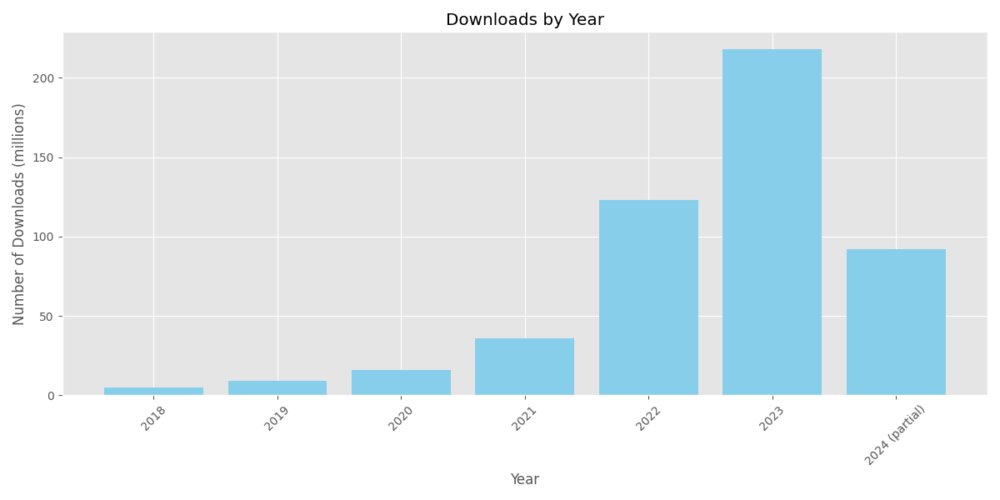

piwheels has now passed 500,000,000 downloads!

<figure class="block-embed">
<blockquote>

Now passed 500,000,000 downloads

— piwheels.org (@piwheels) <a
href="https://twitter.com/piwheels/status/1806297312639025661?ref_src=twsrc%5Etfw">June 27,
2024</a>

</blockquote>
</figure>

Here are the downloads each year, including the first six months of 2024:

<figure class="block-image">

</figure>

It will be interesting to see if/when we reach 1 billion!
