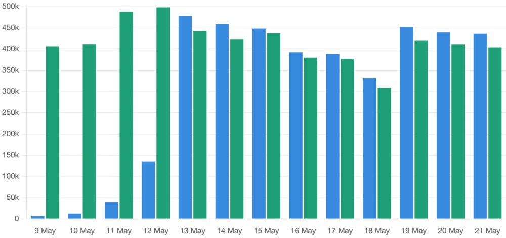

Wheel files include a metadata file containing information about the package: its dependencies,
Python version requirements, and compatibility tags (such as ABI and platform). pip uses this
metadata to determine whether a wheel is suitable for the system it's being installed on.

[PEP-658](https://peps.python.org/pep-0658/) allows repositories to provide these metadata
files alongside wheels, so that installers can use the metadata to discard candidates without
downloading the whole wheel, making indexes more efficient for users.

We recently rolled out support for PEP-658. In order roll this out safely, we needed to do this in
two phases:

1. Write the metadata file for all 7.5M existing wheels, and ensure that metadata files are written
   for new wheels ([PR #393](https://github.com/piwheels/piwheels/pull/393))

2. Add the `dist-info-metadata` attribute to each wheel's link tag in the simple index
    ([PR #394](https://github.com/piwheels/piwheels/pull/394))

It was tantamount that we did it in this order, because the spec says that if you include the
`dist-info-metadata` attribute, the metadata file MUST be present, otherwise pip will fail.

The PR which added code to write out the metadata file included an update to our
`piw-audit-packages` command line tool to flag when a metadata file is missing, and to write it by
extracting the metadata file from the wheel (which is essentially just a zip file).

We ran the `piw-audit-packages` command to backfill the missing metadata files for all existing
wheels, while any new wheels would have their metadata file written automatically. Once the backfill
was complete, we were able introduce the `dist-info-metadata` addition to the simple index template.
We rewrote indexes for 100 random packages and monitored Apache logs to observe metadata file
downloads and ensure no 404s occurred. After about a week with plenty of downloads of these 100
packages (and any which had been rewritten due to new wheel builds), and no 404s, we began
systematically rewriting indexes for all packages, which is naturally slow, allowing us to observe
the rollout cautiously.

We also added a log handler to count metadata downloads
([PR#408](https://github.com/piwheels/piwheels/pull/408)). The rollout completed successfully and we've
been serving around 425,000 metadata file downloads per day, alongside around 410,000 wheel
downloads:

<figure class="block-image">
<ul style="list-style:none;padding:0;display:flex;gap:1rem;">
  <li>Metadata</li>
  <li>Wheel</li>
</ul>

<figcaption>Metadata downloads vs wheel downloads</figcaption>
</figure>

Unfortunately, this will (slightly) slow down our progress towards reaching 1 billion wheel
downloads, but it will make pip more efficient and effective for Raspberry Pi users.