Back in 2021 I did some analysis of PyPI package names and version strings in the post [The rinds of
the Cheese Shop menu](/2021/08/the-rinds-of-the-cheese-shop-menu/). Five years on, let's see
how things have changed.

At the time of writing, PyPI contains:

- **736,344 packages** with at least one version (up from 311,063 in 2021 — nearly 2.4×)
- **8,234,245 versions** (up from 2,766,603 — nearly 3×)

The index has grown dramatically. Let's dig in.

## Longest package names

The most common length of package name is still **8** characters — the same as in 2021 (like
[**gpiozero**](https://pypi.org/project/gpiozero/)).

The least common lengths are **77**, **79**, **80**, **83**, **91**, **92**, **99**, **113**,
**114**, **122**, and **188** — each occurring exactly once.

The longest package names have changed quite a bit since 2021. The new list reads more like a
stream of consciousness than a software registry:

- [**zzz...zzz**](https://pypi.org/project/zzzzzzzzzzzzzzzzzzzzzzzzzzzzzzzzzzzzzzzzzzzzzzzzzzzzzzzzzzzzzzzzzzzzzzzzzzzzzzzzzzzzzzzzzzzzzzzzzzzzzzzzzzzzzzzzzzzzzzzzzzzzzzzzzzzzzzzzzzzzzzzzzzzzzzzzzzzzzzzzzzzzzzzzzzzzzzzzzzzzzzzzzzzz/)
  (188)
- [**program-to-get-any-string-as-user-input-and-output-code-for-the-string-reverse-the-string-and-code-using-alphabet-position**](https://pypi.org/project/program-to-get-any-string-as-user-input-and-output-code-for-the-string-reverse-the-string-and-code-using-alphabet-position/)
  (122)
- [**red-does-not-support-this-version-of-python-please-follow-one-of-the-install-guides-at-docs-discord-red**](https://pypi.org/project/red-does-not-support-this-version-of-python-please-follow-one-of-the-install-guides-at-docs-discord-red/)
  (103) — a package that exists solely to tell you it doesn't support your Python version

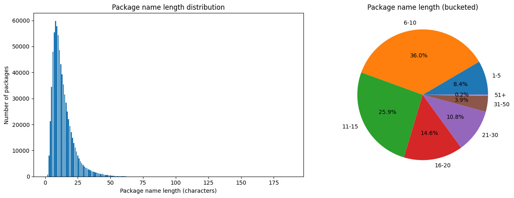

## Shortest package names

At the other end of the scale, there are **24** single-character packages. There are **706**
two-character packages, and **7,685** three-character ones.

## Package name separators

PyPI canonicalises package names, normalising hyphens, underscores, and dots all to hyphens.
So the only separator that appears in a canonicalised name is the hyphen.

Of the 736,344 packages, **53.7%** (395,184) contain at least one hyphen, while **46.3%**
(341,160) have no separator at all.

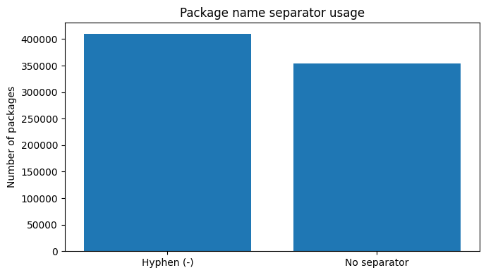

## Starting characters

The most common starting character is **p** (12.5%), thanks to the dominance of `py-` and
`python-` prefixed packages. The least common is **9** with just 16 packages.

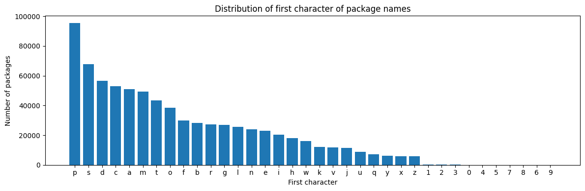

Looking at the first two characters, the top five are **py**, **od**, **dj**, **co**, and **re**.
**od** (for `odoo`) has pushed its way into second place since 2021, when it didn't feature at all.

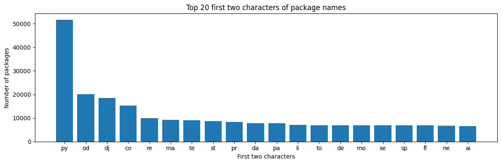

Looking at the first three characters, **odo** has overtaken **dja** into second place behind
**pyt**:

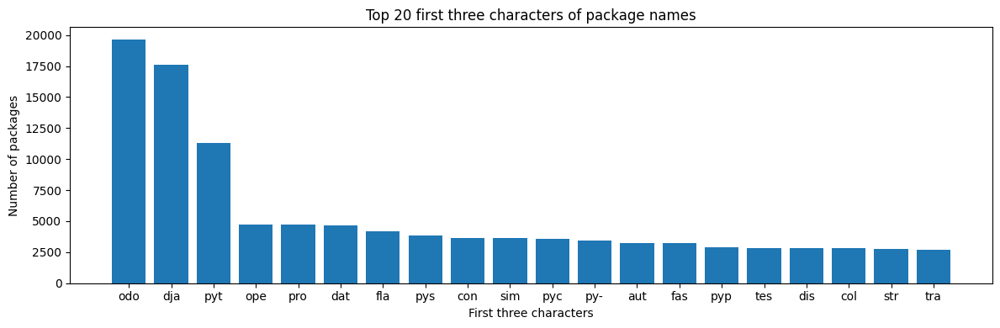

## Common prefixes

What are the most popular hyphenated prefixes?

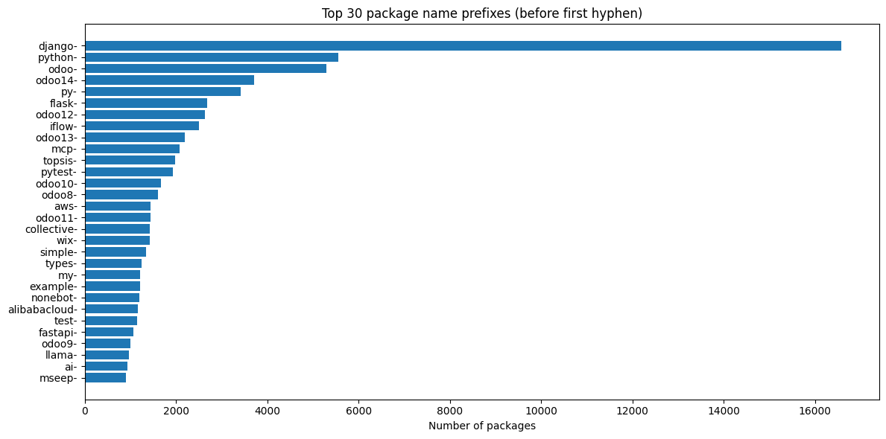

**django-** remains by far the most common prefix with **16,046** packages. But the most striking
story is **odoo**: counting `odoo-` and all its versioned variants (`odoo14-`, `odoo13-`,
`odoo12-`, `odoo11-`, `odoo10-`, `odoo9-`, `odoo8-`) together gives over **20,000** packages with
an odoo prefix.

New entrants since 2021 reflecting the AI ecosystem boom:

| Prefix | Packages |
|---|---|
| `mcp-` | 2,016 |
| `fastapi-` | 1,053 |
| `llama-` | 961 |
| `ai-` | 898 |

## Common suffixes

Flipping the analysis around, the most common suffixes tell a story about how packages are
categorised by purpose:

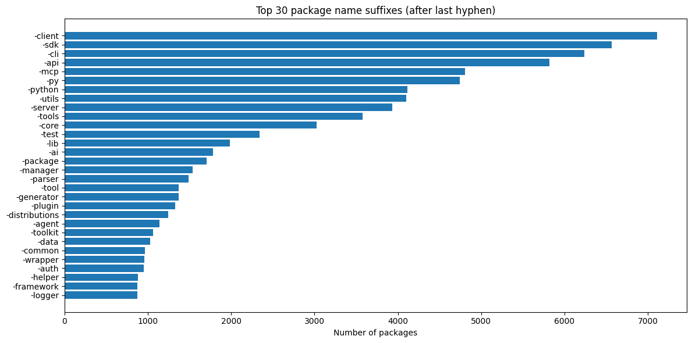

`-client` (6,898), `-sdk` (6,315), and `-cli` (6,099) top the list. `-mcp` sits in fifth place
with 4,730 packages — another sign of the AI era — while `-ai` (1,721) and `-agent` (1,089) are
also well represented.

## Most common words in package names

Splitting package names on hyphens, underscores, and dots, the most common individual words are:

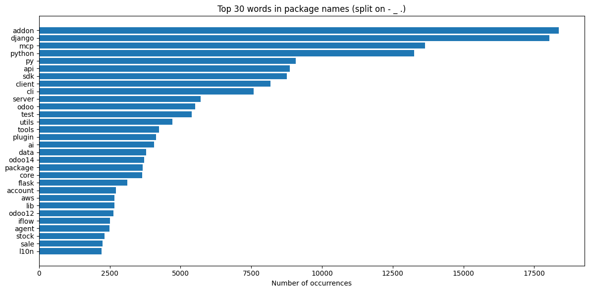

`addon` (18,357) edges out `django` (17,464) at the top — most addon packages are Odoo addons.
`mcp` (13,420) is in third place, ahead of `python` (12,648). `ai` (3,914) and `agent` (2,391)
make strong showings that wouldn't have featured in 2021.

## Benford's Law

[Benford's Law](https://en.wikipedia.org/wiki/Benford%27s_law) states that in many naturally
occurring collections of numbers, the leading digit is likely to be small. Testing this against
version numbers, the pattern holds in 2026 much as it did in 2021 — the first non-zero digit of
version numbers broadly follows the expected distribution, with the fit becoming closer still when
looking at all digits:

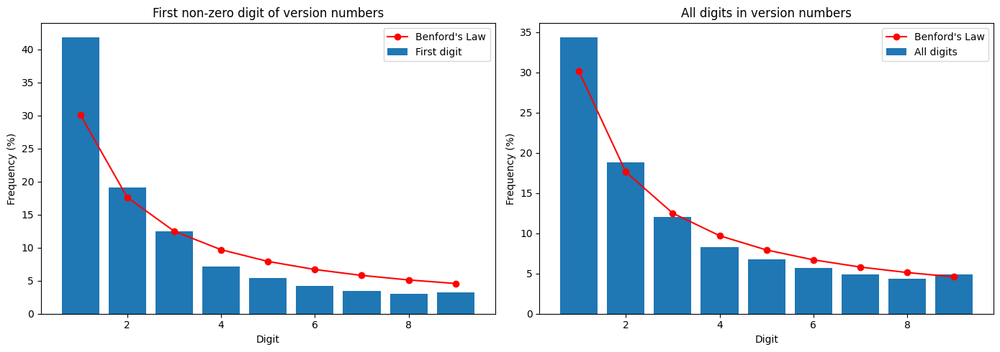

As in 2021, 1 is slightly over-represented and 9 slightly over-represented compared to expectation.

## Number of versions per package

Over a quarter of packages (**29.3%**, or 216,019) have only a single version.

The package with the most versions is
[**spanishconjugator**](https://pypi.org/project/spanishconjugator/) with a remarkable **9,475
versions**, more than three times the 2021 record holder
([pulumi](https://pypi.org/project/pulumi/), with 2,566).

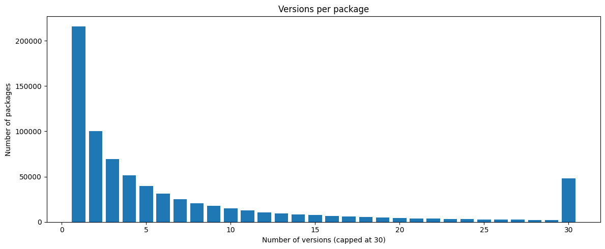

## Version length

- The most common version length is **5**, matching the `1.2.3` format — same as 2021
- The most common version string is still **`0.1.0`**, now occurring **195,112** times (up from
  57,258 in 2021)
- There are **666,778** distinct version strings (up from 233,734)

The longest version belongs to **[elvisgogo](https://pypi.org/project/elvisgogo/)** at 138
characters:

```
99999999999999999999999999999999999999999999999999999999999999999999999999999999999999999999111111111111111111111111111111111100000000.6.0
```

[**lyricsprocessor**](https://pypi.org/project/lyricsprocessor/) retains its 84-character
`0.1.404040...` version in second place, still going strong five years later.

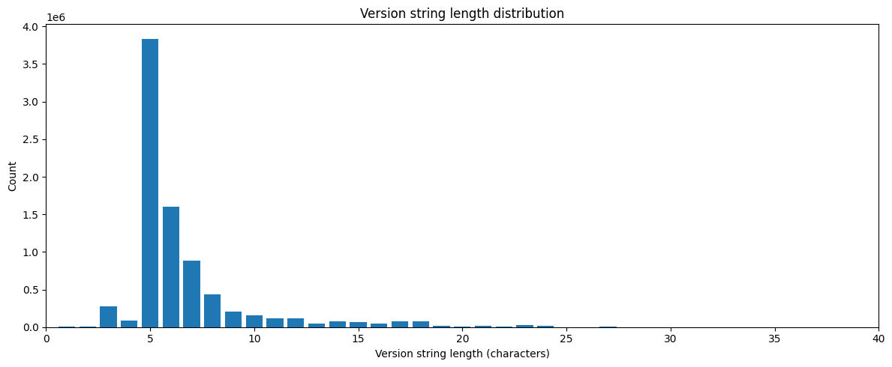

## Version schemes

77.2% of all versions use the canonical three-part `1.2.3` scheme:

| Scheme | Count | Share |
|---|---|---|
| Three-part `1.2.3` | 6,359,721 | 77.2% |
| Other | 1,141,819 | 13.9% |
| Two-part `1.2` | 386,866 | 4.7% |
| Four-part `1.2.3.4` | 293,295 | 3.6% |
| Single `1` | 29,570 | 0.4% |
| Date-based `2024.x` | 22,974 | 0.3% |

Over half of all versions — **52.3%** — still carry major version 0, indicating the package is
considered pre-stable by its author.

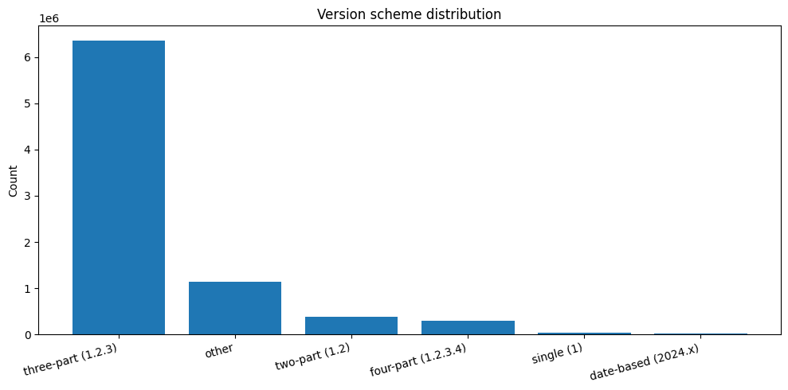

## Pre-release versions

More than one in eight versions (**12.7%**, or 1,044,068) carry a pre-release tag. `dev` is the
most common:

| Tag | Count | Share |
|---|---|---|
| `dev` | 445,007 | 5.40% |
| `alpha` | 226,588 | 2.75% |
| `beta` | 155,743 | 1.89% |
| `rc` | 150,236 | 1.82% |
| `post` | 101,526 | 1.23% |

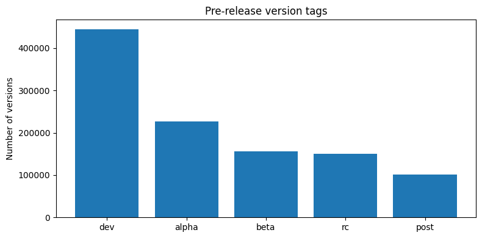

## Non-numeric versions

- There are **68** packages with entirely non-numeric versions (down from 166 in 2021, suggesting
  PyPI has cleaned up many old oddities)
- Only one package has more than one non-numeric version:
  [**dstufft-testpkg**](https://pypi.org/project/dstufft-testpkg/), still proudly offering
  versions `dog` and `watwatwat` after all these years
- The longest non-numeric version is still [**jw-util**](https://pypi.org/project/jw.util/)'s
  [`-class.-jw.util.version.Version-`](https://pypi.org/project/jw.util/-class.-jw.util.version.Version-/)
  (32 chars) — an accidental `repr()` of a Version class that has somehow survived since 2014

## King's English

Using the system dictionaries, how many package names are real words?

- **17,271** packages appear in the US English dictionary (up from 11,131)
- **17,108** packages appear in the British English dictionary (up from 11,031)
- **53** packages appear only in the British dictionary (up from 39)

New British-only arrivals since 2021 include **calibre**, **candour**, **equaliser**,
**gaol**, **kerb**, **manoeuvre**, **maths**, **rigour**, **sceptic**, **serialise**,
**visualise**, and **waggon**.

## Claude

This blog post was (in part) an experiment to see if I could get Claude to generate an updated
version of the 2021 blog post from new data. The post was manually reviewed and edited before being
published. See the repo for further info:
[github.com/piwheels/stats-2026](https://github.com/piwheels/stats-2026)