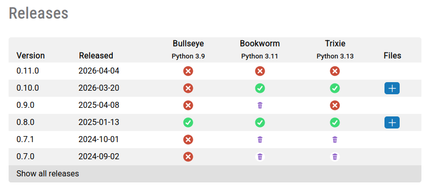

Since piwheels generally aims to provide wheels for every release on PyPI, for every supported ABI,
we end up building and hosting a lot of wheels that are rarely or never downloaded.

We already introduced a second-tier HDD-backed archive storage for files which have not been
downloaded recently. This allowed us to keep the regularly downloaded files on SSD (mounted directly
to the Raspberry Pi 4 running piwheels.org), and move everything else onto HDD as described in our
earlier post [File URLs subject to change](/2025/07/notice-file-urls-subject-to-change/).

Now, for the first time ever, we're going to be deleting some files from
piwheels — but only those which have *never* been downloaded, and were built prior to 2026.

Releases with deleted files will be shown on project pages with a new deleted icon:

This allows us to delete files from specific ABI builds, rather than a whole version, so if a cp313
wheel is popular but a cp39 one is not, we can just delete the cp39 one.

If you notice we've deleted a file that you'd like to be able to download, and it's for a currently
available ABI, open an issue using the link on the project page and we'll aim to restore it if
possible. Note that deleted files for outdated ABIs will not likely be retrievable.

PyPI has grown massively since we started this project in 2017, from around 100,000 projects to over
800,000. We've been building wheels for six different ABIs, and while we've stopped building for
ABIs once the Debian version goes EOL (as Bullseye does soon), we've never deleted files from old
ABIs, so our disk space requirements have only risen over time.

Our amazing hosts [Mythic Beasts](https://www.mythic-beasts.com/) have supported us all the way,
providing Pis, VMs and huge disk space allocations. We have to do our best to keep the project
manageable and sustainable.